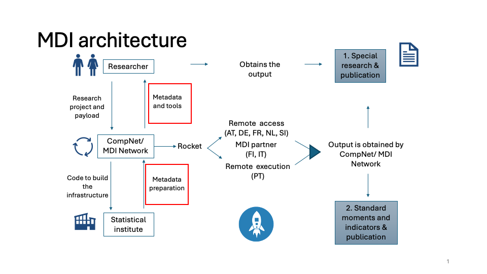

# MDI Users Guide
Eric Bartelsman and MDI team
2025-10-02

- [Overview of MDI](#overview-of-mdi)
- [Introduction to MDI](#introduction-to-mdi)
  - [Overview of MDI](#overview-of-mdi-1)
  - [Stakeholders in the MDI
    Ecosystem](#stakeholders-in-the-mdi-ecosystem)
- [Stakeholder NSI and Partners](#stakeholder-nsi-and-partners)
  - [The MDI at an NSI site](#the-mdi-at-an-nsi-site)
    - [Importing to, and exporting from, the NSI
      site](#importing-to-and-exporting-from-the-nsi-site)
  - [Initial set-up of MDI at the NSI
    (launch_v2.x)](#initial-set-up-of-mdi-at-the-nsi-launch_v2.x)
  - [The directories at the NSI site MDI
    installation](#the-directories-at-the-nsi-site-mdi-installation)
    - [Files in
      /home/runner/work/MDI_testing/MDI_testing](#files-in-homerunnerworkmdi_testingmdi_testing)
    - [subdirectories of `docs` (not shown here. MDI
      documentation)](#subdirectories-of-docs-not-shown-here.-mdi-documentation)
    - [directory `launchpad` (with files to launch
      MDI)](#directory-launchpad-with-files-to-launch-mdi)
    - [subdirectories of `rocket` (with code, and (meta)data to support
      MDI)](#subdirectories-of-rocket-with-code-and-metadata-to-support-mdi)
    - [subdirectories of `payload` (with analytical code and MD
      (meta)data)](#subdirectories-of-payload-with-analytical-code-and-md-metadata)
  - [Preparing NSI metadata](#preparing-nsi-metadata)
  - [Launching the rocket and delivering
    output](#launching-the-rocket-and-delivering-output)
  - [Mechanics of countdown, liftoff, rocket,
    payload](#mechanics-of-countdown-liftoff-rocket-payload)
  - [Specifications for the NSI
    Metadata](#specifications-for-the-nsi-metadata)
    - [1. List of NSI dataFiles –
      *NSI*\_datafiles.csv](#list-of-nsi-datafiles-nsi_datafiles.csv)
    - [2. File-specific metadata –
      *NSI*\_varnames.csv](#file-specific-metadata-nsi_varnames.csv)
    - [3. Codebook for categorical variables –
      *NSI*\_codebook.csv](#codebook-for-categorical-variables-nsi_codebook.csv)
    - [4. Classification lists –
      *NSI_classvar*\_class.csv](#classification-lists-nsi_classvar_class.csv)
    - [5. Time concordances for classifications –
      *NSI_classvar*t0\_*classvar*t1_timeconc.csv](#time-concordances-for-classifications-nsi_classvart0_classvart1_timeconc.csv)
  - [Specifications for the MD
    Metadata](#specifications-for-the-md-metadata)
    - [1. List of micro-dataset (MD) panels –
      MD_datafiles.csv](#list-of-micro-dataset-md-panels-md_datafiles.csv)
    - [2. Micro-dataset (MD) variables –
      MD_varnames.csv](#micro-dataset-md-variables-md_varnames.csv)
    - [3. Classification lists –
      MD\_*classvar*\_class.csv](#classification-lists-md_classvar_class.csv)
    - [4. Hierarchy files for classifications –
      MD\_*classvar*\_hier.csv](#hierarchy-files-for-classifications-md_classvar_hier.csv)
    - [5. Codebook for categorical variables –
      MD_codebook.csv](#codebook-for-categorical-variables-md_codebook.csv)
  - [Specifications for metadata needed for the NSI to MD
    harmonization](#specifications-for-metadata-needed-for-the-nsi-to-md-harmonization)
    - [1. Concordance file –
      *NSI*\_MD_conc.csv](#concordance-file-nsi_md_conc.csv)
    - [2. *NSI*\_MD_codeconc.csv](#nsi_md_codeconc.csv)
- [MDI Staff + Module Writers](#mdi-staff-module-writers)
  - [Setup for Researcher](#setup-for-researcher)
  - [MDI Rtools](#mdi-rtools)
  - [Test Server and mockdata
    environment](#test-server-and-mockdata-environment)
    - [Access to the test server](#access-to-the-test-server)
    - [Test Server Sysadmin tasks](#test-server-sysadmin-tasks)
- [Module Writers (MDI Users)](#module-writers-mdi-users)
  - [Overview of MDI](#overview-of-mdi-2)
  - [Writing Modules for MDI
    Launcher](#writing-modules-for-mdi-launcher)
    - [Key Steps in Module
      Development](#key-steps-in-module-development)
  - [Practical module writing](#practical-module-writing)
  - [Importing Data](#importing-data)
  - [Manipulating Data](#manipulating-data)
  - [Aggregating and exporting](#aggregating-and-exporting)
  - [Analysis of MDI Module Output](#analysis-of-mdi-module-output)
    - [Stacking metadata output files](#stacking-metadata-output-files)
- [Work at NSI](#work-at-nsi)
  - [Some more details of steps at
    NSI](#some-more-details-of-steps-at-nsi)
- [Preparation for each Launch](#preparation-for-each-launch)
  - [The Harmonzied MD Longitudinal Firm
    Panels](#the-harmonzied-md-longitudinal-firm-panels)
- [MDI Infra Tasks](#mdi-infra-tasks)
  - [Preparation for Launch and Mission
    Control](#preparation-for-launch-and-mission-control)
    - [Pre-launch Testing](#pre-launch-testing)
    - [Lockdown of version](#lockdown-of-version)
    - [Interaction NSI - MDI during
      launch](#interaction-nsi---mdi-during-launch)
  - [Work on MDI tools](#work-on-mdi-tools)
  - [Mockdata](#mockdata)
    - [break tasks into small progs (scripts) and tools
      (functions)](#break-tasks-into-small-progs-scripts-and-tools-functions)
  - [names_select_Module](#names_select_module)
  - [mdi_mergeDTs()](#mdi_mergedts)
  - [NSI_initialise()](#nsi_initialise)
  - [mdi_export()](#mdi_export)

# Overview of MDI


# Introduction to MDI

## Overview of MDI

The Microdata Infrastructure (MDI) is designed with the dual goal of
harmonizing firm-level data across countries and simplifying the
research process for conducting cross-country analysis for a wide
variety of research “themes”. At its core, MDI offers a standardized
environment where researchers can run identical analysis at multiple
NSIs where the data are made comparable and accessible through a unified
framework. The infrastructure supports a range of functionalities from
data importation and harmonization to sophisticated analytical outputs,
all within a controlled environment to maintain data confidentiality.

## Stakeholders in the MDI Ecosystem

- National Statistical Institutes (NSIs) and other Partners
  - NSI remote execution
  - NSI remote access
  - Partners with country-specific (remote) access

NSIs provide the underlying data and support remote execution and/or
access to confidential firm-level data. They vary in legal access rules,
available data, and technical setups but are the backbone of the
standardized MDI research environment.

- Module writers (MDI users)
  - Productivity Boards
  - External Academic and Policy
  - MDI ‘Theme’ research staff

MDI Users includes productivity boards, external academic and policy
researchers, and MDI ‘Thematic’ research staff. They are responsible for
creating research modules that leverage MDI’s capabilities for
cross-country data analysis.

- MDI staff
  - Country specialists
  - Thematic research personnel
  - Infrastructure support teams

MDI staff ensure the development and smooth operation of the MDI
environment, assist NSIs in data preparation and documentation, and
assist module writers (MDI Users) with knowledge of data, tools, and
research themes.

# Stakeholder NSI and Partners


## The MDI at an NSI site

- NSIs differ in legal access rules and technical setup for research use
  of firm-level data. The MDI facilitates access by providing a one-stop
  method for researchers to run their analysis as `payload` in an *MDI
  rocket* in multiple countries. MDI staff negotiates access contracts
  with each NSI according to national rules.
- NSIs differ in available data files (registers, surveys,
  administrative data sources) and specifications. The MDI provides
  researchers with a selection of micro-data (*MD*) panel datasets and
  variables that look identical across countries to computer code. The
  statistical and economic concepts are harmonized and the construction
  of the MD panels and variables from the underlying NSI sources are
  transparently documented.
- MDI metadata describe in each country the available files (surveys or
  register data), variables, and classification lists and are used to
  map all underlying data to the specification of harmonized MD
  firm-level panels
- At every NSI (including the `mock data site`), the MDI environment
  looks the same to the code in the `rocket` and its `payload`
- The rocket runs at the NSI in the MDI environment; reads data and
  metadata; and creates harmonized microdata (MD) panels.
- The \`payload’ consists of research modules written in R with
  standardized tools and launch specific metadata. The payload code will
  generate statistical and analytical output in each country that can
  pass statistical disclosure. The output can therefore can be used for
  further cross-country analysis.

### Importing to, and exporting from, the NSI site

- Whenever an import or export operation needs to be carried out from/to
  an environment, one should keep in mind how long it takes to do so and
  whether it involves a monetary cost
- The following table summarizes this information:

<div id="dknknrsztg" style="padding-left:0px;padding-right:0px;padding-top:10px;padding-bottom:10px;overflow-x:auto;overflow-y:auto;width:auto;height:auto;">
<style>#dknknrsztg table {
  font-family: system-ui, 'Segoe UI', Roboto, Helvetica, Arial, sans-serif, 'Apple Color Emoji', 'Segoe UI Emoji', 'Segoe UI Symbol', 'Noto Color Emoji';
  -webkit-font-smoothing: antialiased;
  -moz-osx-font-smoothing: grayscale;
}
&#10;#dknknrsztg thead, #dknknrsztg tbody, #dknknrsztg tfoot, #dknknrsztg tr, #dknknrsztg td, #dknknrsztg th {
  border-style: none;
}
&#10;#dknknrsztg p {
  margin: 0;
  padding: 0;
}
&#10;#dknknrsztg .gt_table {
  display: table;
  border-collapse: collapse;
  line-height: normal;
  margin-left: auto;
  margin-right: auto;
  color: #333333;
  font-size: 16px;
  font-weight: normal;
  font-style: normal;
  background-color: #FFFFFF;
  width: auto;
  border-top-style: solid;
  border-top-width: 2px;
  border-top-color: #A8A8A8;
  border-right-style: none;
  border-right-width: 2px;
  border-right-color: #D3D3D3;
  border-bottom-style: solid;
  border-bottom-width: 2px;
  border-bottom-color: #A8A8A8;
  border-left-style: none;
  border-left-width: 2px;
  border-left-color: #D3D3D3;
}
&#10;#dknknrsztg .gt_caption {
  padding-top: 4px;
  padding-bottom: 4px;
}
&#10;#dknknrsztg .gt_title {
  color: #333333;
  font-size: 125%;
  font-weight: initial;
  padding-top: 4px;
  padding-bottom: 4px;
  padding-left: 5px;
  padding-right: 5px;
  border-bottom-color: #FFFFFF;
  border-bottom-width: 0;
}
&#10;#dknknrsztg .gt_subtitle {
  color: #333333;
  font-size: 85%;
  font-weight: initial;
  padding-top: 3px;
  padding-bottom: 5px;
  padding-left: 5px;
  padding-right: 5px;
  border-top-color: #FFFFFF;
  border-top-width: 0;
}
&#10;#dknknrsztg .gt_heading {
  background-color: #FFFFFF;
  text-align: center;
  border-bottom-color: #FFFFFF;
  border-left-style: none;
  border-left-width: 1px;
  border-left-color: #D3D3D3;
  border-right-style: none;
  border-right-width: 1px;
  border-right-color: #D3D3D3;
}
&#10;#dknknrsztg .gt_bottom_border {
  border-bottom-style: solid;
  border-bottom-width: 2px;
  border-bottom-color: #D3D3D3;
}
&#10;#dknknrsztg .gt_col_headings {
  border-top-style: solid;
  border-top-width: 2px;
  border-top-color: #D3D3D3;
  border-bottom-style: solid;
  border-bottom-width: 2px;
  border-bottom-color: #D3D3D3;
  border-left-style: none;
  border-left-width: 1px;
  border-left-color: #D3D3D3;
  border-right-style: none;
  border-right-width: 1px;
  border-right-color: #D3D3D3;
}
&#10;#dknknrsztg .gt_col_heading {
  color: #333333;
  background-color: #FFFFFF;
  font-size: 100%;
  font-weight: normal;
  text-transform: inherit;
  border-left-style: none;
  border-left-width: 1px;
  border-left-color: #D3D3D3;
  border-right-style: none;
  border-right-width: 1px;
  border-right-color: #D3D3D3;
  vertical-align: bottom;
  padding-top: 5px;
  padding-bottom: 6px;
  padding-left: 5px;
  padding-right: 5px;
  overflow-x: hidden;
}
&#10;#dknknrsztg .gt_column_spanner_outer {
  color: #333333;
  background-color: #FFFFFF;
  font-size: 100%;
  font-weight: normal;
  text-transform: inherit;
  padding-top: 0;
  padding-bottom: 0;
  padding-left: 4px;
  padding-right: 4px;
}
&#10;#dknknrsztg .gt_column_spanner_outer:first-child {
  padding-left: 0;
}
&#10;#dknknrsztg .gt_column_spanner_outer:last-child {
  padding-right: 0;
}
&#10;#dknknrsztg .gt_column_spanner {
  border-bottom-style: solid;
  border-bottom-width: 2px;
  border-bottom-color: #D3D3D3;
  vertical-align: bottom;
  padding-top: 5px;
  padding-bottom: 5px;
  overflow-x: hidden;
  display: inline-block;
  width: 100%;
}
&#10;#dknknrsztg .gt_spanner_row {
  border-bottom-style: hidden;
}
&#10;#dknknrsztg .gt_group_heading {
  padding-top: 8px;
  padding-bottom: 8px;
  padding-left: 5px;
  padding-right: 5px;
  color: #333333;
  background-color: #FFFFFF;
  font-size: 100%;
  font-weight: initial;
  text-transform: inherit;
  border-top-style: solid;
  border-top-width: 2px;
  border-top-color: #D3D3D3;
  border-bottom-style: solid;
  border-bottom-width: 2px;
  border-bottom-color: #D3D3D3;
  border-left-style: none;
  border-left-width: 1px;
  border-left-color: #D3D3D3;
  border-right-style: none;
  border-right-width: 1px;
  border-right-color: #D3D3D3;
  vertical-align: middle;
  text-align: left;
}
&#10;#dknknrsztg .gt_empty_group_heading {
  padding: 0.5px;
  color: #333333;
  background-color: #FFFFFF;
  font-size: 100%;
  font-weight: initial;
  border-top-style: solid;
  border-top-width: 2px;
  border-top-color: #D3D3D3;
  border-bottom-style: solid;
  border-bottom-width: 2px;
  border-bottom-color: #D3D3D3;
  vertical-align: middle;
}
&#10;#dknknrsztg .gt_from_md > :first-child {
  margin-top: 0;
}
&#10;#dknknrsztg .gt_from_md > :last-child {
  margin-bottom: 0;
}
&#10;#dknknrsztg .gt_row {
  padding-top: 8px;
  padding-bottom: 8px;
  padding-left: 5px;
  padding-right: 5px;
  margin: 10px;
  border-top-style: solid;
  border-top-width: 1px;
  border-top-color: #D3D3D3;
  border-left-style: none;
  border-left-width: 1px;
  border-left-color: #D3D3D3;
  border-right-style: none;
  border-right-width: 1px;
  border-right-color: #D3D3D3;
  vertical-align: middle;
  overflow-x: hidden;
}
&#10;#dknknrsztg .gt_stub {
  color: #333333;
  background-color: #FFFFFF;
  font-size: 100%;
  font-weight: initial;
  text-transform: inherit;
  border-right-style: solid;
  border-right-width: 2px;
  border-right-color: #D3D3D3;
  padding-left: 5px;
  padding-right: 5px;
}
&#10;#dknknrsztg .gt_stub_row_group {
  color: #333333;
  background-color: #FFFFFF;
  font-size: 100%;
  font-weight: initial;
  text-transform: inherit;
  border-right-style: solid;
  border-right-width: 2px;
  border-right-color: #D3D3D3;
  padding-left: 5px;
  padding-right: 5px;
  vertical-align: top;
}
&#10;#dknknrsztg .gt_row_group_first td {
  border-top-width: 2px;
}
&#10;#dknknrsztg .gt_row_group_first th {
  border-top-width: 2px;
}
&#10;#dknknrsztg .gt_summary_row {
  color: #333333;
  background-color: #FFFFFF;
  text-transform: inherit;
  padding-top: 8px;
  padding-bottom: 8px;
  padding-left: 5px;
  padding-right: 5px;
}
&#10;#dknknrsztg .gt_first_summary_row {
  border-top-style: solid;
  border-top-color: #D3D3D3;
}
&#10;#dknknrsztg .gt_first_summary_row.thick {
  border-top-width: 2px;
}
&#10;#dknknrsztg .gt_last_summary_row {
  padding-top: 8px;
  padding-bottom: 8px;
  padding-left: 5px;
  padding-right: 5px;
  border-bottom-style: solid;
  border-bottom-width: 2px;
  border-bottom-color: #D3D3D3;
}
&#10;#dknknrsztg .gt_grand_summary_row {
  color: #333333;
  background-color: #FFFFFF;
  text-transform: inherit;
  padding-top: 8px;
  padding-bottom: 8px;
  padding-left: 5px;
  padding-right: 5px;
}
&#10;#dknknrsztg .gt_first_grand_summary_row {
  padding-top: 8px;
  padding-bottom: 8px;
  padding-left: 5px;
  padding-right: 5px;
  border-top-style: double;
  border-top-width: 6px;
  border-top-color: #D3D3D3;
}
&#10;#dknknrsztg .gt_last_grand_summary_row_top {
  padding-top: 8px;
  padding-bottom: 8px;
  padding-left: 5px;
  padding-right: 5px;
  border-bottom-style: double;
  border-bottom-width: 6px;
  border-bottom-color: #D3D3D3;
}
&#10;#dknknrsztg .gt_striped {
  background-color: rgba(128, 128, 128, 0.05);
}
&#10;#dknknrsztg .gt_table_body {
  border-top-style: solid;
  border-top-width: 2px;
  border-top-color: #D3D3D3;
  border-bottom-style: solid;
  border-bottom-width: 2px;
  border-bottom-color: #D3D3D3;
}
&#10;#dknknrsztg .gt_footnotes {
  color: #333333;
  background-color: #FFFFFF;
  border-bottom-style: none;
  border-bottom-width: 2px;
  border-bottom-color: #D3D3D3;
  border-left-style: none;
  border-left-width: 2px;
  border-left-color: #D3D3D3;
  border-right-style: none;
  border-right-width: 2px;
  border-right-color: #D3D3D3;
}
&#10;#dknknrsztg .gt_footnote {
  margin: 0px;
  font-size: 90%;
  padding-top: 4px;
  padding-bottom: 4px;
  padding-left: 5px;
  padding-right: 5px;
}
&#10;#dknknrsztg .gt_sourcenotes {
  color: #333333;
  background-color: #FFFFFF;
  border-bottom-style: none;
  border-bottom-width: 2px;
  border-bottom-color: #D3D3D3;
  border-left-style: none;
  border-left-width: 2px;
  border-left-color: #D3D3D3;
  border-right-style: none;
  border-right-width: 2px;
  border-right-color: #D3D3D3;
}
&#10;#dknknrsztg .gt_sourcenote {
  font-size: 90%;
  padding-top: 4px;
  padding-bottom: 4px;
  padding-left: 5px;
  padding-right: 5px;
}
&#10;#dknknrsztg .gt_left {
  text-align: left;
}
&#10;#dknknrsztg .gt_center {
  text-align: center;
}
&#10;#dknknrsztg .gt_right {
  text-align: right;
  font-variant-numeric: tabular-nums;
}
&#10;#dknknrsztg .gt_font_normal {
  font-weight: normal;
}
&#10;#dknknrsztg .gt_font_bold {
  font-weight: bold;
}
&#10;#dknknrsztg .gt_font_italic {
  font-style: italic;
}
&#10;#dknknrsztg .gt_super {
  font-size: 65%;
}
&#10;#dknknrsztg .gt_footnote_marks {
  font-size: 75%;
  vertical-align: 0.4em;
  position: initial;
}
&#10;#dknknrsztg .gt_asterisk {
  font-size: 100%;
  vertical-align: 0;
}
&#10;#dknknrsztg .gt_indent_1 {
  text-indent: 5px;
}
&#10;#dknknrsztg .gt_indent_2 {
  text-indent: 10px;
}
&#10;#dknknrsztg .gt_indent_3 {
  text-indent: 15px;
}
&#10;#dknknrsztg .gt_indent_4 {
  text-indent: 20px;
}
&#10;#dknknrsztg .gt_indent_5 {
  text-indent: 25px;
}
&#10;#dknknrsztg .katex-display {
  display: inline-flex !important;
  margin-bottom: 0.75em !important;
}
&#10;#dknknrsztg div.Reactable > div.rt-table > div.rt-thead > div.rt-tr.rt-tr-group-header > div.rt-th-group:after {
  height: 0px !important;
}
</style>
<table class="gt_table" data-quarto-disable-processing="false" data-quarto-bootstrap="false">
  <thead>
    <tr class="gt_col_headings">
      <th class="gt_col_heading gt_columns_bottom_border gt_left" rowspan="1" colspan="1" scope="col" id="Country">Country</th>
      <th class="gt_col_heading gt_columns_bottom_border gt_left" rowspan="1" colspan="1" scope="col" id="Type">Type</th>
      <th class="gt_col_heading gt_columns_bottom_border gt_left" rowspan="1" colspan="1" scope="col" id="Time">Time</th>
      <th class="gt_col_heading gt_columns_bottom_border gt_left" rowspan="1" colspan="1" scope="col" id="Cost">Cost</th>
    </tr>
  </thead>
  <tbody class="gt_table_body">
    <tr><td headers="Country" class="gt_row gt_left">NL</td>
<td headers="Type" class="gt_row gt_left">Import code/ metadata</td>
<td headers="Time" class="gt_row gt_left">1-2 days</td>
<td headers="Cost" class="gt_row gt_left">free of charge</td></tr>
    <tr><td headers="Country" class="gt_row gt_left">NL</td>
<td headers="Type" class="gt_row gt_left">Import data</td>
<td headers="Time" class="gt_row gt_left">1-2 days</td>
<td headers="Cost" class="gt_row gt_left">free of charge</td></tr>
    <tr><td headers="Country" class="gt_row gt_left">NL</td>
<td headers="Type" class="gt_row gt_left">Export code/ metadata</td>
<td headers="Time" class="gt_row gt_left">1-2 days</td>
<td headers="Cost" class="gt_row gt_left">free of charge</td></tr>
    <tr><td headers="Country" class="gt_row gt_left">NL</td>
<td headers="Type" class="gt_row gt_left">Light export results/ analysis</td>
<td headers="Time" class="gt_row gt_left">1-2 days</td>
<td headers="Cost" class="gt_row gt_left">125 Euro</td></tr>
    <tr><td headers="Country" class="gt_row gt_left">NL</td>
<td headers="Type" class="gt_row gt_left">Other export results/ analysis</td>
<td headers="Time" class="gt_row gt_left">1-2 days</td>
<td headers="Cost" class="gt_row gt_left">250 Euro</td></tr>
    <tr><td headers="Country" class="gt_row gt_left">SI</td>
<td headers="Type" class="gt_row gt_left">Import code/ metadata</td>
<td headers="Time" class="gt_row gt_left">1 day</td>
<td headers="Cost" class="gt_row gt_left">free of charge</td></tr>
    <tr><td headers="Country" class="gt_row gt_left">SI</td>
<td headers="Type" class="gt_row gt_left">Import data</td>
<td headers="Time" class="gt_row gt_left">1 day</td>
<td headers="Cost" class="gt_row gt_left">free of charge</td></tr>
    <tr><td headers="Country" class="gt_row gt_left">SI</td>
<td headers="Type" class="gt_row gt_left">Export code/ metadata</td>
<td headers="Time" class="gt_row gt_left">20-30 days</td>
<td headers="Cost" class="gt_row gt_left">free of charge</td></tr>
    <tr><td headers="Country" class="gt_row gt_left">SI</td>
<td headers="Type" class="gt_row gt_left">Light export results/ analysis</td>
<td headers="Time" class="gt_row gt_left">10-20 days</td>
<td headers="Cost" class="gt_row gt_left">free of charge</td></tr>
    <tr><td headers="Country" class="gt_row gt_left">SI</td>
<td headers="Type" class="gt_row gt_left">Other export results/ analysis</td>
<td headers="Time" class="gt_row gt_left">10 days</td>
<td headers="Cost" class="gt_row gt_left">free of charge</td></tr>
    <tr><td headers="Country" class="gt_row gt_left">FR</td>
<td headers="Type" class="gt_row gt_left">Import code/ metadata</td>
<td headers="Time" class="gt_row gt_left">1-2 days</td>
<td headers="Cost" class="gt_row gt_left">free of charge</td></tr>
    <tr><td headers="Country" class="gt_row gt_left">FR</td>
<td headers="Type" class="gt_row gt_left">Import data</td>
<td headers="Time" class="gt_row gt_left">1-2 days</td>
<td headers="Cost" class="gt_row gt_left">free of charge</td></tr>
    <tr><td headers="Country" class="gt_row gt_left">FR</td>
<td headers="Type" class="gt_row gt_left">Export code/ metadata</td>
<td headers="Time" class="gt_row gt_left">1-2 days</td>
<td headers="Cost" class="gt_row gt_left">318 Euro for a 10 unit output package</td></tr>
    <tr><td headers="Country" class="gt_row gt_left">FR</td>
<td headers="Type" class="gt_row gt_left">Light export results/ analysis</td>
<td headers="Time" class="gt_row gt_left">1-2 days</td>
<td headers="Cost" class="gt_row gt_left">318 Euro for a 10 unit output package</td></tr>
    <tr><td headers="Country" class="gt_row gt_left">FR</td>
<td headers="Type" class="gt_row gt_left">Other export results/ analysis</td>
<td headers="Time" class="gt_row gt_left">1-2 days</td>
<td headers="Cost" class="gt_row gt_left">318 Euro for a 10 unit output package</td></tr>
    <tr><td headers="Country" class="gt_row gt_left">PT</td>
<td headers="Type" class="gt_row gt_left">Import code/ metadata</td>
<td headers="Time" class="gt_row gt_left">few days</td>
<td headers="Cost" class="gt_row gt_left">free of charge</td></tr>
    <tr><td headers="Country" class="gt_row gt_left">PT</td>
<td headers="Type" class="gt_row gt_left">Light export results/ analysis</td>
<td headers="Time" class="gt_row gt_left">few days</td>
<td headers="Cost" class="gt_row gt_left">free of charge</td></tr>
    <tr><td headers="Country" class="gt_row gt_left">PT</td>
<td headers="Type" class="gt_row gt_left">Other export results/ analysis</td>
<td headers="Time" class="gt_row gt_left">few days</td>
<td headers="Cost" class="gt_row gt_left">free of charge</td></tr>
    <tr><td headers="Country" class="gt_row gt_left">FI</td>
<td headers="Type" class="gt_row gt_left">Import code/ metadata</td>
<td headers="Time" class="gt_row gt_left">2-3 days</td>
<td headers="Cost" class="gt_row gt_left">free of charge</td></tr>
    <tr><td headers="Country" class="gt_row gt_left">FI</td>
<td headers="Type" class="gt_row gt_left">Light export results/ analysis</td>
<td headers="Time" class="gt_row gt_left">2-3 days</td>
<td headers="Cost" class="gt_row gt_left">free of charge</td></tr>
    <tr><td headers="Country" class="gt_row gt_left">FI</td>
<td headers="Type" class="gt_row gt_left">Other export results/ analysis</td>
<td headers="Time" class="gt_row gt_left">2-3 days</td>
<td headers="Cost" class="gt_row gt_left">free of charge</td></tr>
    <tr><td headers="Country" class="gt_row gt_left">AT</td>
<td headers="Type" class="gt_row gt_left">Import files</td>
<td headers="Time" class="gt_row gt_left">21-45 days</td>
<td headers="Cost" class="gt_row gt_left">most cases 1h * 118 Euro</td></tr>
    <tr><td headers="Country" class="gt_row gt_left">AT</td>
<td headers="Type" class="gt_row gt_left">Export files</td>
<td headers="Time" class="gt_row gt_left">21-45 days</td>
<td headers="Cost" class="gt_row gt_left">most cases 1h * 118 Euro</td></tr>
  </tbody>
  &#10;  
</table>
</div>

- In general, the files to be downloaded from MDI to the NSI, are stored
  in a TEAMS directory accessible to that NSI tema. The files are on the
  ‘download’ directory of a sharepoint file that you can share to your
  own machine, for example:
  “../OneDrive-SharedLibraries-IWHEconomicStudiesLab/MDI Data Providers
  Forum - PT”
- Each NSI also gets an MDI TEAMS directory ‘upload’ to upload output
  from the rocket.

## Initial set-up of MDI at the NSI (launch_v2.x)

- For the *first time* using MDI, find a directory to place all the MDI
  files and subdirectories. The person setting up the MDI and running
  MDI `rockets` need to have read and write access to the directories
  and their subdirectories
- Install the four MDI directories–to be found on the MDI TEAMS cloud
  directory—under the main ‘root’ directory chosen for MDI:
  - docs (documentation of the MDI system, including this MDI Manual)
  - rocket (code to support and control MDI rocket launches, NSI
    metadata, auxilliary data)
  - payload (Research modules, includes metadata: NSI-specific NSI_MD
    concordances)
  - launchpad (NSI specific information to control MDI code and rocket
    launches)
- Make sure the user and the R programs have read access to the
  directory with raw data files
- Prepare a read/write directory for output files (pre-disclosure)
  create by the MDI R-code. After disclosure the files in this directory
  can be uploaded to the MDI TEAMS cloud directory available to the NSI
  staff.
- Fill in all the parameters needed in the file `launchpad/countdown.R`,
  including paths to relevant directories.

## The directories at the NSI site MDI installation

### Files in /home/runner/work/MDI_testing/MDI_testing

    .
    ├── docs
    ├── launchpad
    ├── mockdata
    ├── payload
    └── rocket

### subdirectories of `docs` (not shown here. MDI documentation)

### directory `launchpad` (with files to launch MDI)

    launchpad
    ├── README.md
    ├── countdown.R
    ├── countdown_JW.R
    ├── interactive_MDI.R
    ├── liftoff.R
    ├── pre_launch_checker.R
    ├── prepare_NSI.R
    └── report_file_changes.R

### subdirectories of `rocket` (with code, and (meta)data to support MDI)

    rocket
    ├── CompNet
    ├── MDIprogs
    │   └── metadata_tools
    ├── NSImetadata
    │   ├── AT
    │   ├── DE
    │   ├── FI
    │   ├── FR
    │   ├── NL
    │   ├── Official
    │   ├── PT
    │   │   └── Other
    │   └── SI
    ├── Rtools
    │   ├── R
    │   ├── Rpackages
    │   └── man
    ├── auxdata
    └── control

### subdirectories of `payload` (with analytical code and MD (meta)data)

    payload
    ├── Launch_v2.0
    │   ├── MDmetadata
    │   │   ├── DE
    │   │   ├── NL
    │   │   └── SI
    │   └── Rmodules
    │       └── MP
    └── Launch_v2.1
        ├── MDmetadata
        │   ├── DE
        │   ├── FI
        │   ├── FR
        │   ├── NL
        │   ├── PT
        │   └── SI
        └── Rmodules
            ├── CN
            ├── EN
            ├── FD
            │   └── auxdata
            ├── M0
            ├── MP
            └── TC

## Preparing NSI metadata

- The NSI provides metadata of available firm-level data files.
- The NSI and MDI staff construct metadata to harmonize and link the raw
  files to the firm-level panel (*MD*) datasets, whose standards are
  described in the metadata of MD panels and variables provided by MDI.
- To aid in preparation of metadata, run `countdown.R` and choose
  program `prepare_nsi.R` (but not before filling out local information
  in the file `launchpad/countdown.R`). The preliminary metadata files
  are written to the dirOUTPUT directory and need to be editted. The
  instruction are given below in the section Metadata. The completed
  metadatafiles should be uploaed to the TEAMS directory and will, after
  processing and checking by the MDI team, be added to the NSImetadata
  directory for that country. The NSI can then download an updated
  version of the rocket, including the new metadata.

## Launching the rocket and delivering output

- When a new launch date is set, the NSI needs to download the latest
  version of the docs and rocket directories from the MDI Teams cloud
  site (if there are new versions available), and overwrite the old
  versions.

- The new ‘payload’ subdirectory `launch_v2.x` directory needs to be
  downloaded and placed under the payload directory of the main MDI root
  directory.

- The file `countdown.R` should be copied to the user’s directory and
  edited. Running `countdown.R` will allow user to choose further path
  of execution.

- Two folders need to created (with no constraints on how to name them –
  they can be stored to a directory of preference to the user):

  - Output folder
  - Folder for temporary files

- The following fields need to be manually specified, based on the
  directory system of the environment:

  - `dirMDI`: path to the MDI folder
  - `CountryCode`: 2-letter ISO 3166 code of the country of reference
  - `dirINPUTDATA`: path to the generic folder where the raw data is
    stored
  - `dirOUTPUT`: path to the output folder
  - `dirTMPSAVE`: path to the folder for temporary files
  - **Disclosure parameters**
    - `MDIminNumObs`: minimum number of firm-level observations
      underlying computation of cell of output file
    - `MDIdomSh`: maximum share of top X firms to meet dominance
      criterion
    - `MDIdomNr`: the X in top X firms.

- The program `pre_launch_checker.R` (run `countdown.R` and choose this
  program) needs to be run before anything else. It performs various
  checks on the NSI metadata to avoid errors later on. The results of
  the checks can be found in the file `pre_launch_checker_results.txt`
  in the output directory. It shows possible errors that should be
  adjusted in the NSI metadata. Additionally, two concordance files
  (NSI_pcc8t0_pcc8t1_conc.csv and NSI_MD_nace_conc.csv) are created
  using existing concordance files and updating them with the data at
  the NSI. These concordance table might contain empty values, if no
  value was previously defined. Missing values need to be filled in
  manually. When the concordance files are ready to be used, they need
  to be moved to the directory indicated in
  `pre_launch_checker_results.txt`

- The program `liftoff.R`, chosen after running `countdown.R`, will run
  the MDI rocket and analytical modules. Iterations with the MDI staff
  may be needed for fixes and patches to the rocket and payload, until
  the final results are written to the `dirOUTPUT` directory.

- The files in `dirOUTPUT` need to be checked for disclosure

- The files in `dirOUTPUT` can be uploaded to the MDI Teams upload
  directory.

## Mechanics of countdown, liftoff, rocket, payload

- Copy `countdown.R` from MDI/launchpad/ to your own working directory.
  Fill in all parameters.
- Run `countdown.R` and choose which program to run:
- Run `pre_launch_checker.R` which you should run whenever a new version
  of the MDI system has been installed. It checks for consistency
  between NSI metadata known to MDI and the information in the data at
  the NSI site.
- Run `liftoff.R`, which calls control/rocket.R
  - `rocket.R` calls
    - load_MDIenvironment.R
    - document_output.R (generates information to document details of
      launch and output files)
    - read_MDmetadata.R
    - read_NSImetadata.R (EB: \_datafiles, maybe others….)
    - read_auxdata.R (deflators for now, maybe WIOD, downstream, maybe
      these go in modules)
    - read_firmdata.R (based on selectnames for all modules….)
    - payload/launch_v2.x/run_modules.R executes the payload modules
    - cleanup.R cleans up the environment
- Run `prepare_NSI.R` which sets up the NSI environment to generate
  metadata
- Run `interactive_MDI` which you should run whenever working with the
  MDI system (other than liftoff or prepare).

## Specifications for the NSI Metadata

This section summarizes the structure and content of the NSI metadata
files. Specifically the metadata documents, in a machine and human
readable form, the available data files, the description of the rows of
the file (units of observation), the name and description of the
variables (columns) in each file, the valid values (class and domain)
for that variable in each row. The following paragraphs provide guidance
on preparing the country specific metadata files.

Once created, the NSI metadata files need to be uploaded to the TEAMS
directory. After the NSI downloads the rocket, the metadata files of the
NSI will be in the `rocket/NSImetadata/*NSI*/` directory of the MDI
infrastructure. The MDI program called `pre_launch_checker.R`, to be run
whenever MDI is updated, will flag inconsistencies and other problems in
the metadata.

There are various types of (human- and machince-readable) metadata files
prepared by the NSI: 1. A file that lists the available NSI firm-level
datafiles (\_datafiles) 2. Files that document the variables and their
descriptions for each raw datafile listed above (\_varnames). 3. Files
that map categorical answers to their description (\_codebook). 4. Files
that describe classification variables on the datasets (\_class,
e.g. industry or product codes).

Together with the MDI team, the NSI also creates metadata to aid in
harmonizing the NSI data to the MD specification. The MDI team provides,
possibly specific to each launch, the metadata describing the MD
datasets and its variables. Further, the MDI team, together with the
NSI, provide concordances that are used to harmonize the NSI data files
to the common format.

In the filenames for the metadata, the acronym *NSI* is used. This
should be substituted with the 2-letter country code for the country in
question (using the ISO3166-2 standard, e.g. `NSI = PT`). For the MDI
metadata, the two letters `MD` are used, and for the `mock data` test
site, the letters `TS` are used.

### 1. List of NSI dataFiles – *NSI*\_datafiles.csv

This file contains the list of all available raw data files on a
country’s environment. The file has the following columns:

    [1] NSI_dataset,NSI_datafile,yearvar,year_start,year_end,format,path,details

where,

- `NSI_dataset` is the ‘generic’ name of the NSI datafile
- `NSI_datafile` is the name of the file in the NSI environment
- `yearvar` gives name of year variable if `NSI_datafile` is a panel,
  empty otherwise
- `year_start` is the starting year of the data file
- `year_end` is the last year of the data file (if empty or NA, the file
  is a panel and includes a variable ‘year’)
- `format` is the file extension (csv, sas, stata, etc) of the file
  (i.e. also the storage format of the data)
- `path` indicates path of the datafile relative to the NSI data
  directory (given by the parameter `dirINPUTDATA` in
  launchpad/countdown.R)
- `details` contains additional notes on the file

An example (for NSI=FI, 2018) of the metadata for the raw data files
(the columns `yearvar`, `year_end`, `path` and `details` are omitted for
viewing):

<div id="mwcgxgvcjw" style="padding-left:0px;padding-right:0px;padding-top:10px;padding-bottom:10px;overflow-x:auto;overflow-y:auto;width:auto;height:auto;">
<style>#mwcgxgvcjw table {
  font-family: system-ui, 'Segoe UI', Roboto, Helvetica, Arial, sans-serif, 'Apple Color Emoji', 'Segoe UI Emoji', 'Segoe UI Symbol', 'Noto Color Emoji';
  -webkit-font-smoothing: antialiased;
  -moz-osx-font-smoothing: grayscale;
}
&#10;#mwcgxgvcjw thead, #mwcgxgvcjw tbody, #mwcgxgvcjw tfoot, #mwcgxgvcjw tr, #mwcgxgvcjw td, #mwcgxgvcjw th {
  border-style: none;
}
&#10;#mwcgxgvcjw p {
  margin: 0;
  padding: 0;
}
&#10;#mwcgxgvcjw .gt_table {
  display: table;
  border-collapse: collapse;
  line-height: normal;
  margin-left: auto;
  margin-right: auto;
  color: #333333;
  font-size: 16px;
  font-weight: normal;
  font-style: normal;
  background-color: #FFFFFF;
  width: auto;
  border-top-style: solid;
  border-top-width: 2px;
  border-top-color: #A8A8A8;
  border-right-style: none;
  border-right-width: 2px;
  border-right-color: #D3D3D3;
  border-bottom-style: solid;
  border-bottom-width: 2px;
  border-bottom-color: #A8A8A8;
  border-left-style: none;
  border-left-width: 2px;
  border-left-color: #D3D3D3;
}
&#10;#mwcgxgvcjw .gt_caption {
  padding-top: 4px;
  padding-bottom: 4px;
}
&#10;#mwcgxgvcjw .gt_title {
  color: #333333;
  font-size: 125%;
  font-weight: initial;
  padding-top: 4px;
  padding-bottom: 4px;
  padding-left: 5px;
  padding-right: 5px;
  border-bottom-color: #FFFFFF;
  border-bottom-width: 0;
}
&#10;#mwcgxgvcjw .gt_subtitle {
  color: #333333;
  font-size: 85%;
  font-weight: initial;
  padding-top: 3px;
  padding-bottom: 5px;
  padding-left: 5px;
  padding-right: 5px;
  border-top-color: #FFFFFF;
  border-top-width: 0;
}
&#10;#mwcgxgvcjw .gt_heading {
  background-color: #FFFFFF;
  text-align: center;
  border-bottom-color: #FFFFFF;
  border-left-style: none;
  border-left-width: 1px;
  border-left-color: #D3D3D3;
  border-right-style: none;
  border-right-width: 1px;
  border-right-color: #D3D3D3;
}
&#10;#mwcgxgvcjw .gt_bottom_border {
  border-bottom-style: solid;
  border-bottom-width: 2px;
  border-bottom-color: #D3D3D3;
}
&#10;#mwcgxgvcjw .gt_col_headings {
  border-top-style: solid;
  border-top-width: 2px;
  border-top-color: #D3D3D3;
  border-bottom-style: solid;
  border-bottom-width: 2px;
  border-bottom-color: #D3D3D3;
  border-left-style: none;
  border-left-width: 1px;
  border-left-color: #D3D3D3;
  border-right-style: none;
  border-right-width: 1px;
  border-right-color: #D3D3D3;
}
&#10;#mwcgxgvcjw .gt_col_heading {
  color: #333333;
  background-color: #FFFFFF;
  font-size: 100%;
  font-weight: normal;
  text-transform: inherit;
  border-left-style: none;
  border-left-width: 1px;
  border-left-color: #D3D3D3;
  border-right-style: none;
  border-right-width: 1px;
  border-right-color: #D3D3D3;
  vertical-align: bottom;
  padding-top: 5px;
  padding-bottom: 6px;
  padding-left: 5px;
  padding-right: 5px;
  overflow-x: hidden;
}
&#10;#mwcgxgvcjw .gt_column_spanner_outer {
  color: #333333;
  background-color: #FFFFFF;
  font-size: 100%;
  font-weight: normal;
  text-transform: inherit;
  padding-top: 0;
  padding-bottom: 0;
  padding-left: 4px;
  padding-right: 4px;
}
&#10;#mwcgxgvcjw .gt_column_spanner_outer:first-child {
  padding-left: 0;
}
&#10;#mwcgxgvcjw .gt_column_spanner_outer:last-child {
  padding-right: 0;
}
&#10;#mwcgxgvcjw .gt_column_spanner {
  border-bottom-style: solid;
  border-bottom-width: 2px;
  border-bottom-color: #D3D3D3;
  vertical-align: bottom;
  padding-top: 5px;
  padding-bottom: 5px;
  overflow-x: hidden;
  display: inline-block;
  width: 100%;
}
&#10;#mwcgxgvcjw .gt_spanner_row {
  border-bottom-style: hidden;
}
&#10;#mwcgxgvcjw .gt_group_heading {
  padding-top: 8px;
  padding-bottom: 8px;
  padding-left: 5px;
  padding-right: 5px;
  color: #333333;
  background-color: #FFFFFF;
  font-size: 100%;
  font-weight: initial;
  text-transform: inherit;
  border-top-style: solid;
  border-top-width: 2px;
  border-top-color: #D3D3D3;
  border-bottom-style: solid;
  border-bottom-width: 2px;
  border-bottom-color: #D3D3D3;
  border-left-style: none;
  border-left-width: 1px;
  border-left-color: #D3D3D3;
  border-right-style: none;
  border-right-width: 1px;
  border-right-color: #D3D3D3;
  vertical-align: middle;
  text-align: left;
}
&#10;#mwcgxgvcjw .gt_empty_group_heading {
  padding: 0.5px;
  color: #333333;
  background-color: #FFFFFF;
  font-size: 100%;
  font-weight: initial;
  border-top-style: solid;
  border-top-width: 2px;
  border-top-color: #D3D3D3;
  border-bottom-style: solid;
  border-bottom-width: 2px;
  border-bottom-color: #D3D3D3;
  vertical-align: middle;
}
&#10;#mwcgxgvcjw .gt_from_md > :first-child {
  margin-top: 0;
}
&#10;#mwcgxgvcjw .gt_from_md > :last-child {
  margin-bottom: 0;
}
&#10;#mwcgxgvcjw .gt_row {
  padding-top: 8px;
  padding-bottom: 8px;
  padding-left: 5px;
  padding-right: 5px;
  margin: 10px;
  border-top-style: solid;
  border-top-width: 1px;
  border-top-color: #D3D3D3;
  border-left-style: none;
  border-left-width: 1px;
  border-left-color: #D3D3D3;
  border-right-style: none;
  border-right-width: 1px;
  border-right-color: #D3D3D3;
  vertical-align: middle;
  overflow-x: hidden;
}
&#10;#mwcgxgvcjw .gt_stub {
  color: #333333;
  background-color: #FFFFFF;
  font-size: 100%;
  font-weight: initial;
  text-transform: inherit;
  border-right-style: solid;
  border-right-width: 2px;
  border-right-color: #D3D3D3;
  padding-left: 5px;
  padding-right: 5px;
}
&#10;#mwcgxgvcjw .gt_stub_row_group {
  color: #333333;
  background-color: #FFFFFF;
  font-size: 100%;
  font-weight: initial;
  text-transform: inherit;
  border-right-style: solid;
  border-right-width: 2px;
  border-right-color: #D3D3D3;
  padding-left: 5px;
  padding-right: 5px;
  vertical-align: top;
}
&#10;#mwcgxgvcjw .gt_row_group_first td {
  border-top-width: 2px;
}
&#10;#mwcgxgvcjw .gt_row_group_first th {
  border-top-width: 2px;
}
&#10;#mwcgxgvcjw .gt_summary_row {
  color: #333333;
  background-color: #FFFFFF;
  text-transform: inherit;
  padding-top: 8px;
  padding-bottom: 8px;
  padding-left: 5px;
  padding-right: 5px;
}
&#10;#mwcgxgvcjw .gt_first_summary_row {
  border-top-style: solid;
  border-top-color: #D3D3D3;
}
&#10;#mwcgxgvcjw .gt_first_summary_row.thick {
  border-top-width: 2px;
}
&#10;#mwcgxgvcjw .gt_last_summary_row {
  padding-top: 8px;
  padding-bottom: 8px;
  padding-left: 5px;
  padding-right: 5px;
  border-bottom-style: solid;
  border-bottom-width: 2px;
  border-bottom-color: #D3D3D3;
}
&#10;#mwcgxgvcjw .gt_grand_summary_row {
  color: #333333;
  background-color: #FFFFFF;
  text-transform: inherit;
  padding-top: 8px;
  padding-bottom: 8px;
  padding-left: 5px;
  padding-right: 5px;
}
&#10;#mwcgxgvcjw .gt_first_grand_summary_row {
  padding-top: 8px;
  padding-bottom: 8px;
  padding-left: 5px;
  padding-right: 5px;
  border-top-style: double;
  border-top-width: 6px;
  border-top-color: #D3D3D3;
}
&#10;#mwcgxgvcjw .gt_last_grand_summary_row_top {
  padding-top: 8px;
  padding-bottom: 8px;
  padding-left: 5px;
  padding-right: 5px;
  border-bottom-style: double;
  border-bottom-width: 6px;
  border-bottom-color: #D3D3D3;
}
&#10;#mwcgxgvcjw .gt_striped {
  background-color: rgba(128, 128, 128, 0.05);
}
&#10;#mwcgxgvcjw .gt_table_body {
  border-top-style: solid;
  border-top-width: 2px;
  border-top-color: #D3D3D3;
  border-bottom-style: solid;
  border-bottom-width: 2px;
  border-bottom-color: #D3D3D3;
}
&#10;#mwcgxgvcjw .gt_footnotes {
  color: #333333;
  background-color: #FFFFFF;
  border-bottom-style: none;
  border-bottom-width: 2px;
  border-bottom-color: #D3D3D3;
  border-left-style: none;
  border-left-width: 2px;
  border-left-color: #D3D3D3;
  border-right-style: none;
  border-right-width: 2px;
  border-right-color: #D3D3D3;
}
&#10;#mwcgxgvcjw .gt_footnote {
  margin: 0px;
  font-size: 90%;
  padding-top: 4px;
  padding-bottom: 4px;
  padding-left: 5px;
  padding-right: 5px;
}
&#10;#mwcgxgvcjw .gt_sourcenotes {
  color: #333333;
  background-color: #FFFFFF;
  border-bottom-style: none;
  border-bottom-width: 2px;
  border-bottom-color: #D3D3D3;
  border-left-style: none;
  border-left-width: 2px;
  border-left-color: #D3D3D3;
  border-right-style: none;
  border-right-width: 2px;
  border-right-color: #D3D3D3;
}
&#10;#mwcgxgvcjw .gt_sourcenote {
  font-size: 90%;
  padding-top: 4px;
  padding-bottom: 4px;
  padding-left: 5px;
  padding-right: 5px;
}
&#10;#mwcgxgvcjw .gt_left {
  text-align: left;
}
&#10;#mwcgxgvcjw .gt_center {
  text-align: center;
}
&#10;#mwcgxgvcjw .gt_right {
  text-align: right;
  font-variant-numeric: tabular-nums;
}
&#10;#mwcgxgvcjw .gt_font_normal {
  font-weight: normal;
}
&#10;#mwcgxgvcjw .gt_font_bold {
  font-weight: bold;
}
&#10;#mwcgxgvcjw .gt_font_italic {
  font-style: italic;
}
&#10;#mwcgxgvcjw .gt_super {
  font-size: 65%;
}
&#10;#mwcgxgvcjw .gt_footnote_marks {
  font-size: 75%;
  vertical-align: 0.4em;
  position: initial;
}
&#10;#mwcgxgvcjw .gt_asterisk {
  font-size: 100%;
  vertical-align: 0;
}
&#10;#mwcgxgvcjw .gt_indent_1 {
  text-indent: 5px;
}
&#10;#mwcgxgvcjw .gt_indent_2 {
  text-indent: 10px;
}
&#10;#mwcgxgvcjw .gt_indent_3 {
  text-indent: 15px;
}
&#10;#mwcgxgvcjw .gt_indent_4 {
  text-indent: 20px;
}
&#10;#mwcgxgvcjw .gt_indent_5 {
  text-indent: 25px;
}
&#10;#mwcgxgvcjw .katex-display {
  display: inline-flex !important;
  margin-bottom: 0.75em !important;
}
&#10;#mwcgxgvcjw div.Reactable > div.rt-table > div.rt-thead > div.rt-tr.rt-tr-group-header > div.rt-th-group:after {
  height: 0px !important;
}
</style>
<table class="gt_table" data-quarto-disable-processing="false" data-quarto-bootstrap="false">
  <thead>
    <tr class="gt_col_headings">
      <th class="gt_col_heading gt_columns_bottom_border gt_left" rowspan="1" colspan="1" scope="col" id="NSI_dataset">NSI_dataset</th>
      <th class="gt_col_heading gt_columns_bottom_border gt_left" rowspan="1" colspan="1" scope="col" id="NSI_datafile">NSI_datafile</th>
      <th class="gt_col_heading gt_columns_bottom_border gt_right" rowspan="1" colspan="1" scope="col" id="year_start">year_start</th>
      <th class="gt_col_heading gt_columns_bottom_border gt_left" rowspan="1" colspan="1" scope="col" id="format">format</th>
    </tr>
  </thead>
  <tbody class="gt_table_body">
    <tr><td headers="NSI_dataset" class="gt_row gt_left">bd</td>
<td headers="NSI_datafile" class="gt_row gt_left">bd2018</td>
<td headers="year_start" class="gt_row gt_right">2018</td>
<td headers="format" class="gt_row gt_left">csv</td></tr>
    <tr><td headers="NSI_dataset" class="gt_row gt_left">br</td>
<td headers="NSI_datafile" class="gt_row gt_left">br2018</td>
<td headers="year_start" class="gt_row gt_right">2018</td>
<td headers="format" class="gt_row gt_left">csv</td></tr>
    <tr><td headers="NSI_dataset" class="gt_row gt_left">bs</td>
<td headers="NSI_datafile" class="gt_row gt_left">bs2018</td>
<td headers="year_start" class="gt_row gt_right">2018</td>
<td headers="format" class="gt_row gt_left">csv</td></tr>
    <tr><td headers="NSI_dataset" class="gt_row gt_left">cis</td>
<td headers="NSI_datafile" class="gt_row gt_left">cis2018</td>
<td headers="year_start" class="gt_row gt_right">2018</td>
<td headers="format" class="gt_row gt_left">csv</td></tr>
    <tr><td headers="NSI_dataset" class="gt_row gt_left">ifats</td>
<td headers="NSI_datafile" class="gt_row gt_left">ifats2018</td>
<td headers="year_start" class="gt_row gt_right">2018</td>
<td headers="format" class="gt_row gt_left">csv</td></tr>
    <tr><td headers="NSI_dataset" class="gt_row gt_left">itgs</td>
<td headers="NSI_datafile" class="gt_row gt_left">itgs2018</td>
<td headers="year_start" class="gt_row gt_right">2018</td>
<td headers="format" class="gt_row gt_left">csv</td></tr>
    <tr><td headers="NSI_dataset" class="gt_row gt_left">its</td>
<td headers="NSI_datafile" class="gt_row gt_left">its2018</td>
<td headers="year_start" class="gt_row gt_right">2018</td>
<td headers="format" class="gt_row gt_left">csv</td></tr>
    <tr><td headers="NSI_dataset" class="gt_row gt_left">ofats</td>
<td headers="NSI_datafile" class="gt_row gt_left">ofats2018</td>
<td headers="year_start" class="gt_row gt_right">2018</td>
<td headers="format" class="gt_row gt_left">csv</td></tr>
    <tr><td headers="NSI_dataset" class="gt_row gt_left">prodcom</td>
<td headers="NSI_datafile" class="gt_row gt_left">prodcom2018</td>
<td headers="year_start" class="gt_row gt_right">2018</td>
<td headers="format" class="gt_row gt_left">csv</td></tr>
    <tr><td headers="NSI_dataset" class="gt_row gt_left">sbs</td>
<td headers="NSI_datafile" class="gt_row gt_left">sbs2018</td>
<td headers="year_start" class="gt_row gt_right">2018</td>
<td headers="format" class="gt_row gt_left">csv</td></tr>
    <tr><td headers="NSI_dataset" class="gt_row gt_left">ictec</td>
<td headers="NSI_datafile" class="gt_row gt_left">ictec2018</td>
<td headers="year_start" class="gt_row gt_right">2018</td>
<td headers="format" class="gt_row gt_left">csv</td></tr>
  </tbody>
  &#10;  
</table>
</div>

### 2. File-specific metadata – *NSI*\_varnames.csv

This file contain the list of all variables in each raw datafile
appearing in the column `NSI_datafile` of *NSI*\_datafiles.csv. Each
file has the following columns:

    [1] NSI_datafile,NSI_varname,is_key,description,class,domain

where

- `NSI_datafile` is the name of the file in the NSI environment
- `NSI_varname` is the name (hopefully mnemonic) of the variable in the
  raw file
- `is_key` is a boolean stating whether variable belongs to the
  (possibly joint) unique keys of the datafile, e.g. `firmid`, or
  `firmid,year` are often the unique key(s).
- `description` contains a description of the variable, if possible
  using Eurostat convention
- `class` is the type of value that the variable holds (e.g. numeric,
  date, character, logical)
- `domain` provides information on the values of the variable. See
  examples below:
  - classification: e.g. list of industry, region, product or codes.
    (values is metadata filename: e.g. *NSI_classname*\_class.csv, which
    provides a list of permissible values and descriptions)
  - file-specific codebook of categorical answers. (value is metadata
    filename, e.g. \*NSI_codebook.csv containing permissible values,
    such as ‘yes’, ‘no’,‘maybe’, or ‘small’, ‘large’, ‘medium’.
  - For other values:
    - For monetary values, “1000” (for 1000 Euros)
    - For dates: “%m%d%Y” (R date-format for mmddyyyy). For ‘year’
      variable, we use “%Y”
    - For real units, choose from: “ton” (weight, 1000kg), “m3”
      (volume), “GJ” (energy), “unit” (1 item).

#### Domain: Expenditures, Quantities, Dates

| Measure          | Domain Entry | Description                                                                                                       |
|:-----------------|:-------------|:------------------------------------------------------------------------------------------------------------------|
| Expenditure      | 1000         | … or 1 Euro; 10000000 Euro; etc.                                                                                  |
| Foreign currency | 1\*FXC       | … or 1000 etc.; Where FXC is an ISO 4217 3-letter currency code                                                   |
| Employment       | 1            | 1 here refers to 1 FTE; or 1000; … or 1 Emp if in persons                                                         |
| Numerical        | 1            | 1 here refers to 1 unit; … or 10; 100; where ‘unit’ gives unit in lowercase for the variable in the NSI data file |
| Date             | %Y-%m-%d     | Use the R date format that matches the values for the NSI date or year variable                                   |

Here is an abbreviated list of R date formats:

| Format   | Description                   | Example            |
|:---------|:------------------------------|:-------------------|
| %a       | Abbreviated weekday           | Sun, Thu           |
| %A       | Full weekday                  | Sunday, Thursday   |
| %b or %h | Abbreviated month             | May, Jul           |
| %B       | Full month                    | May, July          |
| %d       | Day of the month 01-31        | 27, 07             |
| %j       | Day of the year 001-366       | 148, 188           |
| %m       | Month 01-12                   | 05, 07             |
| %U       | Week 01-53, (start Sunday)    | 22, 27             |
| %w       | Weekday 0-6 (Sunday= 0)       | 0, 4               |
| %W       | Week 00-53 (start Monday)     | 21, 27             |
| %x       | Date, locale-specific         |                    |
| %y       | Year 2-digit 00-99            | 84, 05             |
| %Y       | Year 4-dig: (69 to 99 - 19xx) | 1984, 2005         |
| %C       | Century                       | 19, 20             |
| %D       | Date formatted %m/%d/%y       | 05/27/84, 07/07/05 |
| %u       | Weekday 1-7 (Monday=1         | 7, 4               |

#### Domain: Classification or Categorical (factor) variables

| Variable                | Domain_Entry        | Description                                                                              |
|:------------------------|:--------------------|:-----------------------------------------------------------------------------------------|
| Classification variable | NSI_classname_class | An (official) list, ie NL_nace                                                           |
| Categorical variable    | NSI_codebook        | Contains permissible values for categorical (factor) variables, e.g. ‘yes’, ‘no’,‘maybe’ |

#### Example: Netherlands (SBS, 2018): NL_varnames.

<div id="bnllctrcgo" style="padding-left:0px;padding-right:0px;padding-top:10px;padding-bottom:10px;overflow-x:auto;overflow-y:auto;width:auto;height:auto;">
<style>#bnllctrcgo table {
  font-family: system-ui, 'Segoe UI', Roboto, Helvetica, Arial, sans-serif, 'Apple Color Emoji', 'Segoe UI Emoji', 'Segoe UI Symbol', 'Noto Color Emoji';
  -webkit-font-smoothing: antialiased;
  -moz-osx-font-smoothing: grayscale;
}
&#10;#bnllctrcgo thead, #bnllctrcgo tbody, #bnllctrcgo tfoot, #bnllctrcgo tr, #bnllctrcgo td, #bnllctrcgo th {
  border-style: none;
}
&#10;#bnllctrcgo p {
  margin: 0;
  padding: 0;
}
&#10;#bnllctrcgo .gt_table {
  display: table;
  border-collapse: collapse;
  line-height: normal;
  margin-left: auto;
  margin-right: auto;
  color: #333333;
  font-size: 16px;
  font-weight: normal;
  font-style: normal;
  background-color: #FFFFFF;
  width: auto;
  border-top-style: solid;
  border-top-width: 2px;
  border-top-color: #A8A8A8;
  border-right-style: none;
  border-right-width: 2px;
  border-right-color: #D3D3D3;
  border-bottom-style: solid;
  border-bottom-width: 2px;
  border-bottom-color: #A8A8A8;
  border-left-style: none;
  border-left-width: 2px;
  border-left-color: #D3D3D3;
}
&#10;#bnllctrcgo .gt_caption {
  padding-top: 4px;
  padding-bottom: 4px;
}
&#10;#bnllctrcgo .gt_title {
  color: #333333;
  font-size: 125%;
  font-weight: initial;
  padding-top: 4px;
  padding-bottom: 4px;
  padding-left: 5px;
  padding-right: 5px;
  border-bottom-color: #FFFFFF;
  border-bottom-width: 0;
}
&#10;#bnllctrcgo .gt_subtitle {
  color: #333333;
  font-size: 85%;
  font-weight: initial;
  padding-top: 3px;
  padding-bottom: 5px;
  padding-left: 5px;
  padding-right: 5px;
  border-top-color: #FFFFFF;
  border-top-width: 0;
}
&#10;#bnllctrcgo .gt_heading {
  background-color: #FFFFFF;
  text-align: center;
  border-bottom-color: #FFFFFF;
  border-left-style: none;
  border-left-width: 1px;
  border-left-color: #D3D3D3;
  border-right-style: none;
  border-right-width: 1px;
  border-right-color: #D3D3D3;
}
&#10;#bnllctrcgo .gt_bottom_border {
  border-bottom-style: solid;
  border-bottom-width: 2px;
  border-bottom-color: #D3D3D3;
}
&#10;#bnllctrcgo .gt_col_headings {
  border-top-style: solid;
  border-top-width: 2px;
  border-top-color: #D3D3D3;
  border-bottom-style: solid;
  border-bottom-width: 2px;
  border-bottom-color: #D3D3D3;
  border-left-style: none;
  border-left-width: 1px;
  border-left-color: #D3D3D3;
  border-right-style: none;
  border-right-width: 1px;
  border-right-color: #D3D3D3;
}
&#10;#bnllctrcgo .gt_col_heading {
  color: #333333;
  background-color: #FFFFFF;
  font-size: 100%;
  font-weight: normal;
  text-transform: inherit;
  border-left-style: none;
  border-left-width: 1px;
  border-left-color: #D3D3D3;
  border-right-style: none;
  border-right-width: 1px;
  border-right-color: #D3D3D3;
  vertical-align: bottom;
  padding-top: 5px;
  padding-bottom: 6px;
  padding-left: 5px;
  padding-right: 5px;
  overflow-x: hidden;
}
&#10;#bnllctrcgo .gt_column_spanner_outer {
  color: #333333;
  background-color: #FFFFFF;
  font-size: 100%;
  font-weight: normal;
  text-transform: inherit;
  padding-top: 0;
  padding-bottom: 0;
  padding-left: 4px;
  padding-right: 4px;
}
&#10;#bnllctrcgo .gt_column_spanner_outer:first-child {
  padding-left: 0;
}
&#10;#bnllctrcgo .gt_column_spanner_outer:last-child {
  padding-right: 0;
}
&#10;#bnllctrcgo .gt_column_spanner {
  border-bottom-style: solid;
  border-bottom-width: 2px;
  border-bottom-color: #D3D3D3;
  vertical-align: bottom;
  padding-top: 5px;
  padding-bottom: 5px;
  overflow-x: hidden;
  display: inline-block;
  width: 100%;
}
&#10;#bnllctrcgo .gt_spanner_row {
  border-bottom-style: hidden;
}
&#10;#bnllctrcgo .gt_group_heading {
  padding-top: 8px;
  padding-bottom: 8px;
  padding-left: 5px;
  padding-right: 5px;
  color: #333333;
  background-color: #FFFFFF;
  font-size: 100%;
  font-weight: initial;
  text-transform: inherit;
  border-top-style: solid;
  border-top-width: 2px;
  border-top-color: #D3D3D3;
  border-bottom-style: solid;
  border-bottom-width: 2px;
  border-bottom-color: #D3D3D3;
  border-left-style: none;
  border-left-width: 1px;
  border-left-color: #D3D3D3;
  border-right-style: none;
  border-right-width: 1px;
  border-right-color: #D3D3D3;
  vertical-align: middle;
  text-align: left;
}
&#10;#bnllctrcgo .gt_empty_group_heading {
  padding: 0.5px;
  color: #333333;
  background-color: #FFFFFF;
  font-size: 100%;
  font-weight: initial;
  border-top-style: solid;
  border-top-width: 2px;
  border-top-color: #D3D3D3;
  border-bottom-style: solid;
  border-bottom-width: 2px;
  border-bottom-color: #D3D3D3;
  vertical-align: middle;
}
&#10;#bnllctrcgo .gt_from_md > :first-child {
  margin-top: 0;
}
&#10;#bnllctrcgo .gt_from_md > :last-child {
  margin-bottom: 0;
}
&#10;#bnllctrcgo .gt_row {
  padding-top: 8px;
  padding-bottom: 8px;
  padding-left: 5px;
  padding-right: 5px;
  margin: 10px;
  border-top-style: solid;
  border-top-width: 1px;
  border-top-color: #D3D3D3;
  border-left-style: none;
  border-left-width: 1px;
  border-left-color: #D3D3D3;
  border-right-style: none;
  border-right-width: 1px;
  border-right-color: #D3D3D3;
  vertical-align: middle;
  overflow-x: hidden;
}
&#10;#bnllctrcgo .gt_stub {
  color: #333333;
  background-color: #FFFFFF;
  font-size: 100%;
  font-weight: initial;
  text-transform: inherit;
  border-right-style: solid;
  border-right-width: 2px;
  border-right-color: #D3D3D3;
  padding-left: 5px;
  padding-right: 5px;
}
&#10;#bnllctrcgo .gt_stub_row_group {
  color: #333333;
  background-color: #FFFFFF;
  font-size: 100%;
  font-weight: initial;
  text-transform: inherit;
  border-right-style: solid;
  border-right-width: 2px;
  border-right-color: #D3D3D3;
  padding-left: 5px;
  padding-right: 5px;
  vertical-align: top;
}
&#10;#bnllctrcgo .gt_row_group_first td {
  border-top-width: 2px;
}
&#10;#bnllctrcgo .gt_row_group_first th {
  border-top-width: 2px;
}
&#10;#bnllctrcgo .gt_summary_row {
  color: #333333;
  background-color: #FFFFFF;
  text-transform: inherit;
  padding-top: 8px;
  padding-bottom: 8px;
  padding-left: 5px;
  padding-right: 5px;
}
&#10;#bnllctrcgo .gt_first_summary_row {
  border-top-style: solid;
  border-top-color: #D3D3D3;
}
&#10;#bnllctrcgo .gt_first_summary_row.thick {
  border-top-width: 2px;
}
&#10;#bnllctrcgo .gt_last_summary_row {
  padding-top: 8px;
  padding-bottom: 8px;
  padding-left: 5px;
  padding-right: 5px;
  border-bottom-style: solid;
  border-bottom-width: 2px;
  border-bottom-color: #D3D3D3;
}
&#10;#bnllctrcgo .gt_grand_summary_row {
  color: #333333;
  background-color: #FFFFFF;
  text-transform: inherit;
  padding-top: 8px;
  padding-bottom: 8px;
  padding-left: 5px;
  padding-right: 5px;
}
&#10;#bnllctrcgo .gt_first_grand_summary_row {
  padding-top: 8px;
  padding-bottom: 8px;
  padding-left: 5px;
  padding-right: 5px;
  border-top-style: double;
  border-top-width: 6px;
  border-top-color: #D3D3D3;
}
&#10;#bnllctrcgo .gt_last_grand_summary_row_top {
  padding-top: 8px;
  padding-bottom: 8px;
  padding-left: 5px;
  padding-right: 5px;
  border-bottom-style: double;
  border-bottom-width: 6px;
  border-bottom-color: #D3D3D3;
}
&#10;#bnllctrcgo .gt_striped {
  background-color: rgba(128, 128, 128, 0.05);
}
&#10;#bnllctrcgo .gt_table_body {
  border-top-style: solid;
  border-top-width: 2px;
  border-top-color: #D3D3D3;
  border-bottom-style: solid;
  border-bottom-width: 2px;
  border-bottom-color: #D3D3D3;
}
&#10;#bnllctrcgo .gt_footnotes {
  color: #333333;
  background-color: #FFFFFF;
  border-bottom-style: none;
  border-bottom-width: 2px;
  border-bottom-color: #D3D3D3;
  border-left-style: none;
  border-left-width: 2px;
  border-left-color: #D3D3D3;
  border-right-style: none;
  border-right-width: 2px;
  border-right-color: #D3D3D3;
}
&#10;#bnllctrcgo .gt_footnote {
  margin: 0px;
  font-size: 90%;
  padding-top: 4px;
  padding-bottom: 4px;
  padding-left: 5px;
  padding-right: 5px;
}
&#10;#bnllctrcgo .gt_sourcenotes {
  color: #333333;
  background-color: #FFFFFF;
  border-bottom-style: none;
  border-bottom-width: 2px;
  border-bottom-color: #D3D3D3;
  border-left-style: none;
  border-left-width: 2px;
  border-left-color: #D3D3D3;
  border-right-style: none;
  border-right-width: 2px;
  border-right-color: #D3D3D3;
}
&#10;#bnllctrcgo .gt_sourcenote {
  font-size: 90%;
  padding-top: 4px;
  padding-bottom: 4px;
  padding-left: 5px;
  padding-right: 5px;
}
&#10;#bnllctrcgo .gt_left {
  text-align: left;
}
&#10;#bnllctrcgo .gt_center {
  text-align: center;
}
&#10;#bnllctrcgo .gt_right {
  text-align: right;
  font-variant-numeric: tabular-nums;
}
&#10;#bnllctrcgo .gt_font_normal {
  font-weight: normal;
}
&#10;#bnllctrcgo .gt_font_bold {
  font-weight: bold;
}
&#10;#bnllctrcgo .gt_font_italic {
  font-style: italic;
}
&#10;#bnllctrcgo .gt_super {
  font-size: 65%;
}
&#10;#bnllctrcgo .gt_footnote_marks {
  font-size: 75%;
  vertical-align: 0.4em;
  position: initial;
}
&#10;#bnllctrcgo .gt_asterisk {
  font-size: 100%;
  vertical-align: 0;
}
&#10;#bnllctrcgo .gt_indent_1 {
  text-indent: 5px;
}
&#10;#bnllctrcgo .gt_indent_2 {
  text-indent: 10px;
}
&#10;#bnllctrcgo .gt_indent_3 {
  text-indent: 15px;
}
&#10;#bnllctrcgo .gt_indent_4 {
  text-indent: 20px;
}
&#10;#bnllctrcgo .gt_indent_5 {
  text-indent: 25px;
}
&#10;#bnllctrcgo .katex-display {
  display: inline-flex !important;
  margin-bottom: 0.75em !important;
}
&#10;#bnllctrcgo div.Reactable > div.rt-table > div.rt-thead > div.rt-tr.rt-tr-group-header > div.rt-th-group:after {
  height: 0px !important;
}
</style>
<table class="gt_table" data-quarto-disable-processing="false" data-quarto-bootstrap="false">
  <thead>
    <tr class="gt_col_headings">
      <th class="gt_col_heading gt_columns_bottom_border gt_left" rowspan="1" colspan="1" scope="col" id="NSI_datafile">NSI_datafile</th>
      <th class="gt_col_heading gt_columns_bottom_border gt_left" rowspan="1" colspan="1" scope="col" id="NSI_varname">NSI_varname</th>
      <th class="gt_col_heading gt_columns_bottom_border gt_right" rowspan="1" colspan="1" scope="col" id="is_key">is_key</th>
      <th class="gt_col_heading gt_columns_bottom_border gt_left" rowspan="1" colspan="1" scope="col" id="description">description</th>
      <th class="gt_col_heading gt_columns_bottom_border gt_left" rowspan="1" colspan="1" scope="col" id="class">class</th>
      <th class="gt_col_heading gt_columns_bottom_border gt_left" rowspan="1" colspan="1" scope="col" id="domain">domain</th>
    </tr>
  </thead>
  <tbody class="gt_table_body">
    <tr><td headers="NSI_datafile" class="gt_row gt_left">sbs2018</td>
<td headers="NSI_varname" class="gt_row gt_left">ent_id</td>
<td headers="is_key" class="gt_row gt_right">1</td>
<td headers="description" class="gt_row gt_left">Enterprise ID (identification </td>
<td headers="class" class="gt_row gt_left">character</td>
<td headers="domain" class="gt_row gt_left"></td></tr>
    <tr><td headers="NSI_datafile" class="gt_row gt_left">sbs2018</td>
<td headers="NSI_varname" class="gt_row gt_left">sbs_12110</td>
<td headers="is_key" class="gt_row gt_right">0</td>
<td headers="description" class="gt_row gt_left">Turnover</td>
<td headers="class" class="gt_row gt_left">numeric</td>
<td headers="domain" class="gt_row gt_left">1000</td></tr>
    <tr><td headers="NSI_datafile" class="gt_row gt_left">sbs2018</td>
<td headers="NSI_varname" class="gt_row gt_left">sbs_12150</td>
<td headers="is_key" class="gt_row gt_right">0</td>
<td headers="description" class="gt_row gt_left">Value added at factor cost</td>
<td headers="class" class="gt_row gt_left">numeric</td>
<td headers="domain" class="gt_row gt_left">1000</td></tr>
    <tr><td headers="NSI_datafile" class="gt_row gt_left">sbs2018</td>
<td headers="NSI_varname" class="gt_row gt_left">sbs_12170</td>
<td headers="is_key" class="gt_row gt_right">0</td>
<td headers="description" class="gt_row gt_left">Gross operating surplus</td>
<td headers="class" class="gt_row gt_left">numeric</td>
<td headers="domain" class="gt_row gt_left">1000</td></tr>
    <tr><td headers="NSI_datafile" class="gt_row gt_left">sbs2018</td>
<td headers="NSI_varname" class="gt_row gt_left">sbs_13110</td>
<td headers="is_key" class="gt_row gt_right">0</td>
<td headers="description" class="gt_row gt_left">Total purchases of goods and s</td>
<td headers="class" class="gt_row gt_left">numeric</td>
<td headers="domain" class="gt_row gt_left">1000</td></tr>
    <tr><td headers="NSI_datafile" class="gt_row gt_left">sbs2018</td>
<td headers="NSI_varname" class="gt_row gt_left">sbs_13310</td>
<td headers="is_key" class="gt_row gt_right">0</td>
<td headers="description" class="gt_row gt_left">Personnel costs</td>
<td headers="class" class="gt_row gt_left">numeric</td>
<td headers="domain" class="gt_row gt_left">1000</td></tr>
    <tr><td headers="NSI_datafile" class="gt_row gt_left">sbs2018</td>
<td headers="NSI_varname" class="gt_row gt_left">sbs_13320</td>
<td headers="is_key" class="gt_row gt_right">0</td>
<td headers="description" class="gt_row gt_left">Wages and salaries</td>
<td headers="class" class="gt_row gt_left">numeric</td>
<td headers="domain" class="gt_row gt_left">1000</td></tr>
    <tr><td headers="NSI_datafile" class="gt_row gt_left">sbs2018</td>
<td headers="NSI_varname" class="gt_row gt_left">sbs_15110</td>
<td headers="is_key" class="gt_row gt_right">0</td>
<td headers="description" class="gt_row gt_left">Gross investment in tangible g</td>
<td headers="class" class="gt_row gt_left">numeric</td>
<td headers="domain" class="gt_row gt_left">1000</td></tr>
    <tr><td headers="NSI_datafile" class="gt_row gt_left">sbs2018</td>
<td headers="NSI_varname" class="gt_row gt_left">sbs_15150</td>
<td headers="is_key" class="gt_row gt_right">0</td>
<td headers="description" class="gt_row gt_left">Gross investment in machinery </td>
<td headers="class" class="gt_row gt_left">numeric</td>
<td headers="domain" class="gt_row gt_left">1000</td></tr>
    <tr><td headers="NSI_datafile" class="gt_row gt_left">sbs2018</td>
<td headers="NSI_varname" class="gt_row gt_left">sbs_15429</td>
<td headers="is_key" class="gt_row gt_right">0</td>
<td headers="description" class="gt_row gt_left">Gross investment in concession</td>
<td headers="class" class="gt_row gt_left">numeric</td>
<td headers="domain" class="gt_row gt_left">1000</td></tr>
    <tr><td headers="NSI_datafile" class="gt_row gt_left">sbs2018</td>
<td headers="NSI_varname" class="gt_row gt_left">sbs_15441</td>
<td headers="is_key" class="gt_row gt_right">0</td>
<td headers="description" class="gt_row gt_left">Investment in purchased softwa</td>
<td headers="class" class="gt_row gt_left">numeric</td>
<td headers="domain" class="gt_row gt_left">1000</td></tr>
    <tr><td headers="NSI_datafile" class="gt_row gt_left">sbs2018</td>
<td headers="NSI_varname" class="gt_row gt_left">sbs_16110</td>
<td headers="is_key" class="gt_row gt_right">0</td>
<td headers="description" class="gt_row gt_left">Number of persons employed</td>
<td headers="class" class="gt_row gt_left">numeric</td>
<td headers="domain" class="gt_row gt_left">1</td></tr>
    <tr><td headers="NSI_datafile" class="gt_row gt_left">sbs2018</td>
<td headers="NSI_varname" class="gt_row gt_left">sbs_16130</td>
<td headers="is_key" class="gt_row gt_right">0</td>
<td headers="description" class="gt_row gt_left">Number of employees</td>
<td headers="class" class="gt_row gt_left">numeric</td>
<td headers="domain" class="gt_row gt_left">1</td></tr>
    <tr><td headers="NSI_datafile" class="gt_row gt_left">sbs2018</td>
<td headers="NSI_varname" class="gt_row gt_left">sbs_16140</td>
<td headers="is_key" class="gt_row gt_right">0</td>
<td headers="description" class="gt_row gt_left">Number of employees in full-ti</td>
<td headers="class" class="gt_row gt_left">numeric</td>
<td headers="domain" class="gt_row gt_left">1</td></tr>
    <tr><td headers="NSI_datafile" class="gt_row gt_left">sbs2018</td>
<td headers="NSI_varname" class="gt_row gt_left">sbs_20110</td>
<td headers="is_key" class="gt_row gt_right">0</td>
<td headers="description" class="gt_row gt_left">Purchases of energy products (</td>
<td headers="class" class="gt_row gt_left">numeric</td>
<td headers="domain" class="gt_row gt_left">1000</td></tr>
    <tr><td headers="NSI_datafile" class="gt_row gt_left">sbs2018</td>
<td headers="NSI_varname" class="gt_row gt_left">sbs_22110</td>
<td headers="is_key" class="gt_row gt_right">0</td>
<td headers="description" class="gt_row gt_left">Total intra-mural R &amp; D expend</td>
<td headers="class" class="gt_row gt_left">numeric</td>
<td headers="domain" class="gt_row gt_left">1000</td></tr>
    <tr><td headers="NSI_datafile" class="gt_row gt_left">sbs2018</td>
<td headers="NSI_varname" class="gt_row gt_left">sbs_22120</td>
<td headers="is_key" class="gt_row gt_right">0</td>
<td headers="description" class="gt_row gt_left">Total number of R &amp; D personne</td>
<td headers="class" class="gt_row gt_left">numeric</td>
<td headers="domain" class="gt_row gt_left">1000</td></tr>
    <tr><td headers="NSI_datafile" class="gt_row gt_left">sbs2018</td>
<td headers="NSI_varname" class="gt_row gt_left">sbs_type</td>
<td headers="is_key" class="gt_row gt_right">0</td>
<td headers="description" class="gt_row gt_left">Code to show if data (unit) is</td>
<td headers="class" class="gt_row gt_left">numeric</td>
<td headers="domain" class="gt_row gt_left">NL_codebook</td></tr>
  </tbody>
  &#10;  
</table>
</div>

### 3. Codebook for categorical variables – *NSI*\_codebook.csv

This file contains the possible values of a categorical variable and the
description that belongs to that value. There rows give the possible
values occuring in firm data for a particular `NSI_datailfe` and
`NSI_varname`. The name of the codebook should be given in the ‘domain’
columnn of NSI_varnames for the relevant categorical variable.

    [1] NSI_dataset,NSI_varname,year,code,description

\[`NSI_datafile`,`NSI_varname`, `year`, `code` , `description` \]

where,

- `NSI_dataset` is the name of the generic dataset in the NSI
  environment
- `NSI_varname` is the name of the variable of that specific raw dataset
- `year` is the year for which codebook values hold. If empty, holds for
  all years of the NSI dataset
- `code` gives all the values of the categorical variable that occur for
  that `NSI_varname` in that `NSI_datafile`
- `description` gives the description explaining each code value

An example below of the values occuring for the unit of measurement in
the SI `ENER` data for 2012.

<div id="morjfwvhlx" style="padding-left:0px;padding-right:0px;padding-top:10px;padding-bottom:10px;overflow-x:auto;overflow-y:auto;width:auto;height:auto;">
<style>#morjfwvhlx table {
  font-family: system-ui, 'Segoe UI', Roboto, Helvetica, Arial, sans-serif, 'Apple Color Emoji', 'Segoe UI Emoji', 'Segoe UI Symbol', 'Noto Color Emoji';
  -webkit-font-smoothing: antialiased;
  -moz-osx-font-smoothing: grayscale;
}
&#10;#morjfwvhlx thead, #morjfwvhlx tbody, #morjfwvhlx tfoot, #morjfwvhlx tr, #morjfwvhlx td, #morjfwvhlx th {
  border-style: none;
}
&#10;#morjfwvhlx p {
  margin: 0;
  padding: 0;
}
&#10;#morjfwvhlx .gt_table {
  display: table;
  border-collapse: collapse;
  line-height: normal;
  margin-left: auto;
  margin-right: auto;
  color: #333333;
  font-size: 16px;
  font-weight: normal;
  font-style: normal;
  background-color: #FFFFFF;
  width: auto;
  border-top-style: solid;
  border-top-width: 2px;
  border-top-color: #A8A8A8;
  border-right-style: none;
  border-right-width: 2px;
  border-right-color: #D3D3D3;
  border-bottom-style: solid;
  border-bottom-width: 2px;
  border-bottom-color: #A8A8A8;
  border-left-style: none;
  border-left-width: 2px;
  border-left-color: #D3D3D3;
}
&#10;#morjfwvhlx .gt_caption {
  padding-top: 4px;
  padding-bottom: 4px;
}
&#10;#morjfwvhlx .gt_title {
  color: #333333;
  font-size: 125%;
  font-weight: initial;
  padding-top: 4px;
  padding-bottom: 4px;
  padding-left: 5px;
  padding-right: 5px;
  border-bottom-color: #FFFFFF;
  border-bottom-width: 0;
}
&#10;#morjfwvhlx .gt_subtitle {
  color: #333333;
  font-size: 85%;
  font-weight: initial;
  padding-top: 3px;
  padding-bottom: 5px;
  padding-left: 5px;
  padding-right: 5px;
  border-top-color: #FFFFFF;
  border-top-width: 0;
}
&#10;#morjfwvhlx .gt_heading {
  background-color: #FFFFFF;
  text-align: center;
  border-bottom-color: #FFFFFF;
  border-left-style: none;
  border-left-width: 1px;
  border-left-color: #D3D3D3;
  border-right-style: none;
  border-right-width: 1px;
  border-right-color: #D3D3D3;
}
&#10;#morjfwvhlx .gt_bottom_border {
  border-bottom-style: solid;
  border-bottom-width: 2px;
  border-bottom-color: #D3D3D3;
}
&#10;#morjfwvhlx .gt_col_headings {
  border-top-style: solid;
  border-top-width: 2px;
  border-top-color: #D3D3D3;
  border-bottom-style: solid;
  border-bottom-width: 2px;
  border-bottom-color: #D3D3D3;
  border-left-style: none;
  border-left-width: 1px;
  border-left-color: #D3D3D3;
  border-right-style: none;
  border-right-width: 1px;
  border-right-color: #D3D3D3;
}
&#10;#morjfwvhlx .gt_col_heading {
  color: #333333;
  background-color: #FFFFFF;
  font-size: 100%;
  font-weight: normal;
  text-transform: inherit;
  border-left-style: none;
  border-left-width: 1px;
  border-left-color: #D3D3D3;
  border-right-style: none;
  border-right-width: 1px;
  border-right-color: #D3D3D3;
  vertical-align: bottom;
  padding-top: 5px;
  padding-bottom: 6px;
  padding-left: 5px;
  padding-right: 5px;
  overflow-x: hidden;
}
&#10;#morjfwvhlx .gt_column_spanner_outer {
  color: #333333;
  background-color: #FFFFFF;
  font-size: 100%;
  font-weight: normal;
  text-transform: inherit;
  padding-top: 0;
  padding-bottom: 0;
  padding-left: 4px;
  padding-right: 4px;
}
&#10;#morjfwvhlx .gt_column_spanner_outer:first-child {
  padding-left: 0;
}
&#10;#morjfwvhlx .gt_column_spanner_outer:last-child {
  padding-right: 0;
}
&#10;#morjfwvhlx .gt_column_spanner {
  border-bottom-style: solid;
  border-bottom-width: 2px;
  border-bottom-color: #D3D3D3;
  vertical-align: bottom;
  padding-top: 5px;
  padding-bottom: 5px;
  overflow-x: hidden;
  display: inline-block;
  width: 100%;
}
&#10;#morjfwvhlx .gt_spanner_row {
  border-bottom-style: hidden;
}
&#10;#morjfwvhlx .gt_group_heading {
  padding-top: 8px;
  padding-bottom: 8px;
  padding-left: 5px;
  padding-right: 5px;
  color: #333333;
  background-color: #FFFFFF;
  font-size: 100%;
  font-weight: initial;
  text-transform: inherit;
  border-top-style: solid;
  border-top-width: 2px;
  border-top-color: #D3D3D3;
  border-bottom-style: solid;
  border-bottom-width: 2px;
  border-bottom-color: #D3D3D3;
  border-left-style: none;
  border-left-width: 1px;
  border-left-color: #D3D3D3;
  border-right-style: none;
  border-right-width: 1px;
  border-right-color: #D3D3D3;
  vertical-align: middle;
  text-align: left;
}
&#10;#morjfwvhlx .gt_empty_group_heading {
  padding: 0.5px;
  color: #333333;
  background-color: #FFFFFF;
  font-size: 100%;
  font-weight: initial;
  border-top-style: solid;
  border-top-width: 2px;
  border-top-color: #D3D3D3;
  border-bottom-style: solid;
  border-bottom-width: 2px;
  border-bottom-color: #D3D3D3;
  vertical-align: middle;
}
&#10;#morjfwvhlx .gt_from_md > :first-child {
  margin-top: 0;
}
&#10;#morjfwvhlx .gt_from_md > :last-child {
  margin-bottom: 0;
}
&#10;#morjfwvhlx .gt_row {
  padding-top: 8px;
  padding-bottom: 8px;
  padding-left: 5px;
  padding-right: 5px;
  margin: 10px;
  border-top-style: solid;
  border-top-width: 1px;
  border-top-color: #D3D3D3;
  border-left-style: none;
  border-left-width: 1px;
  border-left-color: #D3D3D3;
  border-right-style: none;
  border-right-width: 1px;
  border-right-color: #D3D3D3;
  vertical-align: middle;
  overflow-x: hidden;
}
&#10;#morjfwvhlx .gt_stub {
  color: #333333;
  background-color: #FFFFFF;
  font-size: 100%;
  font-weight: initial;
  text-transform: inherit;
  border-right-style: solid;
  border-right-width: 2px;
  border-right-color: #D3D3D3;
  padding-left: 5px;
  padding-right: 5px;
}
&#10;#morjfwvhlx .gt_stub_row_group {
  color: #333333;
  background-color: #FFFFFF;
  font-size: 100%;
  font-weight: initial;
  text-transform: inherit;
  border-right-style: solid;
  border-right-width: 2px;
  border-right-color: #D3D3D3;
  padding-left: 5px;
  padding-right: 5px;
  vertical-align: top;
}
&#10;#morjfwvhlx .gt_row_group_first td {
  border-top-width: 2px;
}
&#10;#morjfwvhlx .gt_row_group_first th {
  border-top-width: 2px;
}
&#10;#morjfwvhlx .gt_summary_row {
  color: #333333;
  background-color: #FFFFFF;
  text-transform: inherit;
  padding-top: 8px;
  padding-bottom: 8px;
  padding-left: 5px;
  padding-right: 5px;
}
&#10;#morjfwvhlx .gt_first_summary_row {
  border-top-style: solid;
  border-top-color: #D3D3D3;
}
&#10;#morjfwvhlx .gt_first_summary_row.thick {
  border-top-width: 2px;
}
&#10;#morjfwvhlx .gt_last_summary_row {
  padding-top: 8px;
  padding-bottom: 8px;
  padding-left: 5px;
  padding-right: 5px;
  border-bottom-style: solid;
  border-bottom-width: 2px;
  border-bottom-color: #D3D3D3;
}
&#10;#morjfwvhlx .gt_grand_summary_row {
  color: #333333;
  background-color: #FFFFFF;
  text-transform: inherit;
  padding-top: 8px;
  padding-bottom: 8px;
  padding-left: 5px;
  padding-right: 5px;
}
&#10;#morjfwvhlx .gt_first_grand_summary_row {
  padding-top: 8px;
  padding-bottom: 8px;
  padding-left: 5px;
  padding-right: 5px;
  border-top-style: double;
  border-top-width: 6px;
  border-top-color: #D3D3D3;
}
&#10;#morjfwvhlx .gt_last_grand_summary_row_top {
  padding-top: 8px;
  padding-bottom: 8px;
  padding-left: 5px;
  padding-right: 5px;
  border-bottom-style: double;
  border-bottom-width: 6px;
  border-bottom-color: #D3D3D3;
}
&#10;#morjfwvhlx .gt_striped {
  background-color: rgba(128, 128, 128, 0.05);
}
&#10;#morjfwvhlx .gt_table_body {
  border-top-style: solid;
  border-top-width: 2px;
  border-top-color: #D3D3D3;
  border-bottom-style: solid;
  border-bottom-width: 2px;
  border-bottom-color: #D3D3D3;
}
&#10;#morjfwvhlx .gt_footnotes {
  color: #333333;
  background-color: #FFFFFF;
  border-bottom-style: none;
  border-bottom-width: 2px;
  border-bottom-color: #D3D3D3;
  border-left-style: none;
  border-left-width: 2px;
  border-left-color: #D3D3D3;
  border-right-style: none;
  border-right-width: 2px;
  border-right-color: #D3D3D3;
}
&#10;#morjfwvhlx .gt_footnote {
  margin: 0px;
  font-size: 90%;
  padding-top: 4px;
  padding-bottom: 4px;
  padding-left: 5px;
  padding-right: 5px;
}
&#10;#morjfwvhlx .gt_sourcenotes {
  color: #333333;
  background-color: #FFFFFF;
  border-bottom-style: none;
  border-bottom-width: 2px;
  border-bottom-color: #D3D3D3;
  border-left-style: none;
  border-left-width: 2px;
  border-left-color: #D3D3D3;
  border-right-style: none;
  border-right-width: 2px;
  border-right-color: #D3D3D3;
}
&#10;#morjfwvhlx .gt_sourcenote {
  font-size: 90%;
  padding-top: 4px;
  padding-bottom: 4px;
  padding-left: 5px;
  padding-right: 5px;
}
&#10;#morjfwvhlx .gt_left {
  text-align: left;
}
&#10;#morjfwvhlx .gt_center {
  text-align: center;
}
&#10;#morjfwvhlx .gt_right {
  text-align: right;
  font-variant-numeric: tabular-nums;
}
&#10;#morjfwvhlx .gt_font_normal {
  font-weight: normal;
}
&#10;#morjfwvhlx .gt_font_bold {
  font-weight: bold;
}
&#10;#morjfwvhlx .gt_font_italic {
  font-style: italic;
}
&#10;#morjfwvhlx .gt_super {
  font-size: 65%;
}
&#10;#morjfwvhlx .gt_footnote_marks {
  font-size: 75%;
  vertical-align: 0.4em;
  position: initial;
}
&#10;#morjfwvhlx .gt_asterisk {
  font-size: 100%;
  vertical-align: 0;
}
&#10;#morjfwvhlx .gt_indent_1 {
  text-indent: 5px;
}
&#10;#morjfwvhlx .gt_indent_2 {
  text-indent: 10px;
}
&#10;#morjfwvhlx .gt_indent_3 {
  text-indent: 15px;
}
&#10;#morjfwvhlx .gt_indent_4 {
  text-indent: 20px;
}
&#10;#morjfwvhlx .gt_indent_5 {
  text-indent: 25px;
}
&#10;#morjfwvhlx .katex-display {
  display: inline-flex !important;
  margin-bottom: 0.75em !important;
}
&#10;#morjfwvhlx div.Reactable > div.rt-table > div.rt-thead > div.rt-tr.rt-tr-group-header > div.rt-th-group:after {
  height: 0px !important;
}
</style>
<table class="gt_table" data-quarto-disable-processing="false" data-quarto-bootstrap="false">
  <thead>
    <tr class="gt_col_headings">
      <th class="gt_col_heading gt_columns_bottom_border gt_left" rowspan="1" colspan="1" scope="col" id="NSI_dataset">NSI_dataset</th>
      <th class="gt_col_heading gt_columns_bottom_border gt_right" rowspan="1" colspan="1" scope="col" id="year">year</th>
      <th class="gt_col_heading gt_columns_bottom_border gt_left" rowspan="1" colspan="1" scope="col" id="NSI_varname">NSI_varname</th>
      <th class="gt_col_heading gt_columns_bottom_border gt_left" rowspan="1" colspan="1" scope="col" id="code">code</th>
      <th class="gt_col_heading gt_columns_bottom_border gt_left" rowspan="1" colspan="1" scope="col" id="description">description</th>
    </tr>
  </thead>
  <tbody class="gt_table_body">
    <tr><td headers="NSI_dataset" class="gt_row gt_left">MIKRO_INDL_razST</td>
<td headers="year" class="gt_row gt_right">NA</td>
<td headers="NSI_varname" class="gt_row gt_left">ME</td>
<td headers="code" class="gt_row gt_left">1000 SIT</td>
<td headers="description" class="gt_row gt_left">thousands of slovenian tolars</td></tr>
    <tr><td headers="NSI_dataset" class="gt_row gt_left">MIKRO_INDL_razST</td>
<td headers="year" class="gt_row gt_right">NA</td>
<td headers="NSI_varname" class="gt_row gt_left">ME</td>
<td headers="code" class="gt_row gt_left">EUR</td>
<td headers="description" class="gt_row gt_left">euros</td></tr>
    <tr><td headers="NSI_dataset" class="gt_row gt_left">MIKRO_INDL_razST</td>
<td headers="year" class="gt_row gt_right">NA</td>
<td headers="NSI_varname" class="gt_row gt_left">ME</td>
<td headers="code" class="gt_row gt_left">GJ</td>
<td headers="description" class="gt_row gt_left">Gigajoule - a unit of energy</td></tr>
    <tr><td headers="NSI_dataset" class="gt_row gt_left">MIKRO_INDL_razST</td>
<td headers="year" class="gt_row gt_right">NA</td>
<td headers="NSI_varname" class="gt_row gt_left">ME</td>
<td headers="code" class="gt_row gt_left">MWh</td>
<td headers="description" class="gt_row gt_left">Megawatt-hour - a unit of energy</td></tr>
    <tr><td headers="NSI_dataset" class="gt_row gt_left">MIKRO_INDL_razST</td>
<td headers="year" class="gt_row gt_right">NA</td>
<td headers="NSI_varname" class="gt_row gt_left">ME</td>
<td headers="code" class="gt_row gt_left">TJ</td>
<td headers="description" class="gt_row gt_left">terajoules</td></tr>
    <tr><td headers="NSI_dataset" class="gt_row gt_left">MIKRO_INDL_razST</td>
<td headers="year" class="gt_row gt_right">NA</td>
<td headers="NSI_varname" class="gt_row gt_left">ME</td>
<td headers="code" class="gt_row gt_left">kW</td>
<td headers="description" class="gt_row gt_left">kilowatts</td></tr>
    <tr><td headers="NSI_dataset" class="gt_row gt_left">MIKRO_INDL_razST</td>
<td headers="year" class="gt_row gt_right">NA</td>
<td headers="NSI_varname" class="gt_row gt_left">ME</td>
<td headers="code" class="gt_row gt_left">kg</td>
<td headers="description" class="gt_row gt_left">Kilogram - a unit of mass</td></tr>
    <tr><td headers="NSI_dataset" class="gt_row gt_left">MIKRO_INDL_razST</td>
<td headers="year" class="gt_row gt_right">NA</td>
<td headers="NSI_varname" class="gt_row gt_left">ME</td>
<td headers="code" class="gt_row gt_left">kg N</td>
<td headers="description" class="gt_row gt_left">kilograms of nitrogen</td></tr>
    <tr><td headers="NSI_dataset" class="gt_row gt_left">MIKRO_INDL_razST</td>
<td headers="year" class="gt_row gt_right">NA</td>
<td headers="NSI_varname" class="gt_row gt_left">ME</td>
<td headers="code" class="gt_row gt_left">kg P2O5</td>
<td headers="description" class="gt_row gt_left">Kilogram of Phosphorus Pentoxide - a measure for fertilizers</td></tr>
    <tr><td headers="NSI_dataset" class="gt_row gt_left">MIKRO_INDL_razST</td>
<td headers="year" class="gt_row gt_right">NA</td>
<td headers="NSI_varname" class="gt_row gt_left">ME</td>
<td headers="code" class="gt_row gt_left">kg akt. subst.</td>
<td headers="description" class="gt_row gt_left">Kilogram Active Substance - a measure of active ingredient</td></tr>
    <tr><td headers="NSI_dataset" class="gt_row gt_left">MIKRO_INDL_razST</td>
<td headers="year" class="gt_row gt_right">NA</td>
<td headers="NSI_varname" class="gt_row gt_left">ME</td>
<td headers="code" class="gt_row gt_left">kg akt.subst</td>
<td headers="description" class="gt_row gt_left">Kilogram Active Substance - a measure of active ingredient</td></tr>
    <tr><td headers="NSI_dataset" class="gt_row gt_left">MIKRO_INDL_razST</td>
<td headers="year" class="gt_row gt_right">NA</td>
<td headers="NSI_varname" class="gt_row gt_left">ME</td>
<td headers="code" class="gt_row gt_left">kg efekt.</td>
<td headers="description" class="gt_row gt_left">Kilogram Effective - likely a measure of effective substance</td></tr>
    <tr><td headers="NSI_dataset" class="gt_row gt_left">MIKRO_INDL_razST</td>
<td headers="year" class="gt_row gt_right">NA</td>
<td headers="NSI_varname" class="gt_row gt_left">ME</td>
<td headers="code" class="gt_row gt_left">kos</td>
<td headers="description" class="gt_row gt_left">Cost - possibly referring to cost in monetary terms</td></tr>
    <tr><td headers="NSI_dataset" class="gt_row gt_left">MIKRO_INDL_razST</td>
<td headers="year" class="gt_row gt_right">NA</td>
<td headers="NSI_varname" class="gt_row gt_left">ME</td>
<td headers="code" class="gt_row gt_left">l</td>
<td headers="description" class="gt_row gt_left">Liter - a unit of volume</td></tr>
    <tr><td headers="NSI_dataset" class="gt_row gt_left">MIKRO_INDL_razST</td>
<td headers="year" class="gt_row gt_right">NA</td>
<td headers="NSI_varname" class="gt_row gt_left">ME</td>
<td headers="code" class="gt_row gt_left">l alc 100%</td>
<td headers="description" class="gt_row gt_left">Liter Alcohol 100% - pure alcohol volume</td></tr>
    <tr><td headers="NSI_dataset" class="gt_row gt_left">MIKRO_INDL_razST</td>
<td headers="year" class="gt_row gt_right">NA</td>
<td headers="NSI_varname" class="gt_row gt_left">ME</td>
<td headers="code" class="gt_row gt_left">m</td>
<td headers="description" class="gt_row gt_left">Meter - a unit of length</td></tr>
    <tr><td headers="NSI_dataset" class="gt_row gt_left">MIKRO_INDL_razST</td>
<td headers="year" class="gt_row gt_right">NA</td>
<td headers="NSI_varname" class="gt_row gt_left">ME</td>
<td headers="code" class="gt_row gt_left">m2</td>
<td headers="description" class="gt_row gt_left">Square Meter - a unit of area</td></tr>
    <tr><td headers="NSI_dataset" class="gt_row gt_left">MIKRO_INDL_razST</td>
<td headers="year" class="gt_row gt_right">NA</td>
<td headers="NSI_varname" class="gt_row gt_left">ME</td>
<td headers="code" class="gt_row gt_left">m3</td>
<td headers="description" class="gt_row gt_left">Cubic Meter - a unit of volume</td></tr>
    <tr><td headers="NSI_dataset" class="gt_row gt_left">MIKRO_INDL_razST</td>
<td headers="year" class="gt_row gt_right">NA</td>
<td headers="NSI_varname" class="gt_row gt_left">ME</td>
<td headers="code" class="gt_row gt_left">par</td>
<td headers="description" class="gt_row gt_left">Pair - possibly referring to a set of two items</td></tr>
    <tr><td headers="NSI_dataset" class="gt_row gt_left">MIKRO_INDL_razST</td>
<td headers="year" class="gt_row gt_right">NA</td>
<td headers="NSI_varname" class="gt_row gt_left">ME</td>
<td headers="code" class="gt_row gt_left">t</td>
<td headers="description" class="gt_row gt_left">Ton - a unit of mass</td></tr>
    <tr><td headers="NSI_dataset" class="gt_row gt_left">MIKRO_INDL_razST</td>
<td headers="year" class="gt_row gt_right">NA</td>
<td headers="NSI_varname" class="gt_row gt_left">ME</td>
<td headers="code" class="gt_row gt_left">tiso_ SIT</td>
<td headers="description" class="gt_row gt_left">thousands of slovenian tolars</td></tr>
    <tr><td headers="NSI_dataset" class="gt_row gt_left">MIKRO_INDL_razST</td>
<td headers="year" class="gt_row gt_right">NA</td>
<td headers="NSI_varname" class="gt_row gt_left">ME</td>
<td headers="code" class="gt_row gt_left">tiso_ ef.ur</td>
<td headers="description" class="gt_row gt_left">Thousand Effective Hours - likely referring to time or work hours</td></tr>
    <tr><td headers="NSI_dataset" class="gt_row gt_left">MIKRO_INDL_razST</td>
<td headers="year" class="gt_row gt_right">NA</td>
<td headers="NSI_varname" class="gt_row gt_left">ME</td>
<td headers="code" class="gt_row gt_left">tisoč SIT</td>
<td headers="description" class="gt_row gt_left">Thousand Slovenian Tolars - currency unit (SIT was the Slovenian Tolar)</td></tr>
    <tr><td headers="NSI_dataset" class="gt_row gt_left">MIKRO_INDL_razST</td>
<td headers="year" class="gt_row gt_right">NA</td>
<td headers="NSI_varname" class="gt_row gt_left">ME</td>
<td headers="code" class="gt_row gt_left">tisoč ef.ur</td>
<td headers="description" class="gt_row gt_left">Thousand Effective Hours - likely referring to time or work hours</td></tr>
  </tbody>
  &#10;  
</table>
</div>

### 4. Classification lists – *NSI_classvar*\_class.csv

This file contains the unique list of codes per year of a specific
classification variable in a country. Note that there should be a list
for every categorical variable in each dataset. The related table has
the following columns:

    [1] code,year,description

where,

- `code` is the list values of the classification variable observed in
  the data
- `year` is the related year
- `description` gives the description for each code value

An sample of rows from the table of NACE codes (in this case the
official EU NaceR2 classification):

<div id="aocuuwicfc" style="padding-left:0px;padding-right:0px;padding-top:10px;padding-bottom:10px;overflow-x:auto;overflow-y:auto;width:auto;height:auto;">
<style>#aocuuwicfc table {
  font-family: system-ui, 'Segoe UI', Roboto, Helvetica, Arial, sans-serif, 'Apple Color Emoji', 'Segoe UI Emoji', 'Segoe UI Symbol', 'Noto Color Emoji';
  -webkit-font-smoothing: antialiased;
  -moz-osx-font-smoothing: grayscale;
}
&#10;#aocuuwicfc thead, #aocuuwicfc tbody, #aocuuwicfc tfoot, #aocuuwicfc tr, #aocuuwicfc td, #aocuuwicfc th {
  border-style: none;
}
&#10;#aocuuwicfc p {
  margin: 0;
  padding: 0;
}
&#10;#aocuuwicfc .gt_table {
  display: table;
  border-collapse: collapse;
  line-height: normal;
  margin-left: auto;
  margin-right: auto;
  color: #333333;
  font-size: 16px;
  font-weight: normal;
  font-style: normal;
  background-color: #FFFFFF;
  width: auto;
  border-top-style: solid;
  border-top-width: 2px;
  border-top-color: #A8A8A8;
  border-right-style: none;
  border-right-width: 2px;
  border-right-color: #D3D3D3;
  border-bottom-style: solid;
  border-bottom-width: 2px;
  border-bottom-color: #A8A8A8;
  border-left-style: none;
  border-left-width: 2px;
  border-left-color: #D3D3D3;
}
&#10;#aocuuwicfc .gt_caption {
  padding-top: 4px;
  padding-bottom: 4px;
}
&#10;#aocuuwicfc .gt_title {
  color: #333333;
  font-size: 125%;
  font-weight: initial;
  padding-top: 4px;
  padding-bottom: 4px;
  padding-left: 5px;
  padding-right: 5px;
  border-bottom-color: #FFFFFF;
  border-bottom-width: 0;
}
&#10;#aocuuwicfc .gt_subtitle {
  color: #333333;
  font-size: 85%;
  font-weight: initial;
  padding-top: 3px;
  padding-bottom: 5px;
  padding-left: 5px;
  padding-right: 5px;
  border-top-color: #FFFFFF;
  border-top-width: 0;
}
&#10;#aocuuwicfc .gt_heading {
  background-color: #FFFFFF;
  text-align: center;
  border-bottom-color: #FFFFFF;
  border-left-style: none;
  border-left-width: 1px;
  border-left-color: #D3D3D3;
  border-right-style: none;
  border-right-width: 1px;
  border-right-color: #D3D3D3;
}
&#10;#aocuuwicfc .gt_bottom_border {
  border-bottom-style: solid;
  border-bottom-width: 2px;
  border-bottom-color: #D3D3D3;
}
&#10;#aocuuwicfc .gt_col_headings {
  border-top-style: solid;
  border-top-width: 2px;
  border-top-color: #D3D3D3;
  border-bottom-style: solid;
  border-bottom-width: 2px;
  border-bottom-color: #D3D3D3;
  border-left-style: none;
  border-left-width: 1px;
  border-left-color: #D3D3D3;
  border-right-style: none;
  border-right-width: 1px;
  border-right-color: #D3D3D3;
}
&#10;#aocuuwicfc .gt_col_heading {
  color: #333333;
  background-color: #FFFFFF;
  font-size: 100%;
  font-weight: normal;
  text-transform: inherit;
  border-left-style: none;
  border-left-width: 1px;
  border-left-color: #D3D3D3;
  border-right-style: none;
  border-right-width: 1px;
  border-right-color: #D3D3D3;
  vertical-align: bottom;
  padding-top: 5px;
  padding-bottom: 6px;
  padding-left: 5px;
  padding-right: 5px;
  overflow-x: hidden;
}
&#10;#aocuuwicfc .gt_column_spanner_outer {
  color: #333333;
  background-color: #FFFFFF;
  font-size: 100%;
  font-weight: normal;
  text-transform: inherit;
  padding-top: 0;
  padding-bottom: 0;
  padding-left: 4px;
  padding-right: 4px;
}
&#10;#aocuuwicfc .gt_column_spanner_outer:first-child {
  padding-left: 0;
}
&#10;#aocuuwicfc .gt_column_spanner_outer:last-child {
  padding-right: 0;
}
&#10;#aocuuwicfc .gt_column_spanner {
  border-bottom-style: solid;
  border-bottom-width: 2px;
  border-bottom-color: #D3D3D3;
  vertical-align: bottom;
  padding-top: 5px;
  padding-bottom: 5px;
  overflow-x: hidden;
  display: inline-block;
  width: 100%;
}
&#10;#aocuuwicfc .gt_spanner_row {
  border-bottom-style: hidden;
}
&#10;#aocuuwicfc .gt_group_heading {
  padding-top: 8px;
  padding-bottom: 8px;
  padding-left: 5px;
  padding-right: 5px;
  color: #333333;
  background-color: #FFFFFF;
  font-size: 100%;
  font-weight: initial;
  text-transform: inherit;
  border-top-style: solid;
  border-top-width: 2px;
  border-top-color: #D3D3D3;
  border-bottom-style: solid;
  border-bottom-width: 2px;
  border-bottom-color: #D3D3D3;
  border-left-style: none;
  border-left-width: 1px;
  border-left-color: #D3D3D3;
  border-right-style: none;
  border-right-width: 1px;
  border-right-color: #D3D3D3;
  vertical-align: middle;
  text-align: left;
}
&#10;#aocuuwicfc .gt_empty_group_heading {
  padding: 0.5px;
  color: #333333;
  background-color: #FFFFFF;
  font-size: 100%;
  font-weight: initial;
  border-top-style: solid;
  border-top-width: 2px;
  border-top-color: #D3D3D3;
  border-bottom-style: solid;
  border-bottom-width: 2px;
  border-bottom-color: #D3D3D3;
  vertical-align: middle;
}
&#10;#aocuuwicfc .gt_from_md > :first-child {
  margin-top: 0;
}
&#10;#aocuuwicfc .gt_from_md > :last-child {
  margin-bottom: 0;
}
&#10;#aocuuwicfc .gt_row {
  padding-top: 8px;
  padding-bottom: 8px;
  padding-left: 5px;
  padding-right: 5px;
  margin: 10px;
  border-top-style: solid;
  border-top-width: 1px;
  border-top-color: #D3D3D3;
  border-left-style: none;
  border-left-width: 1px;
  border-left-color: #D3D3D3;
  border-right-style: none;
  border-right-width: 1px;
  border-right-color: #D3D3D3;
  vertical-align: middle;
  overflow-x: hidden;
}
&#10;#aocuuwicfc .gt_stub {
  color: #333333;
  background-color: #FFFFFF;
  font-size: 100%;
  font-weight: initial;
  text-transform: inherit;
  border-right-style: solid;
  border-right-width: 2px;
  border-right-color: #D3D3D3;
  padding-left: 5px;
  padding-right: 5px;
}
&#10;#aocuuwicfc .gt_stub_row_group {
  color: #333333;
  background-color: #FFFFFF;
  font-size: 100%;
  font-weight: initial;
  text-transform: inherit;
  border-right-style: solid;
  border-right-width: 2px;
  border-right-color: #D3D3D3;
  padding-left: 5px;
  padding-right: 5px;
  vertical-align: top;
}
&#10;#aocuuwicfc .gt_row_group_first td {
  border-top-width: 2px;
}
&#10;#aocuuwicfc .gt_row_group_first th {
  border-top-width: 2px;
}
&#10;#aocuuwicfc .gt_summary_row {
  color: #333333;
  background-color: #FFFFFF;
  text-transform: inherit;
  padding-top: 8px;
  padding-bottom: 8px;
  padding-left: 5px;
  padding-right: 5px;
}
&#10;#aocuuwicfc .gt_first_summary_row {
  border-top-style: solid;
  border-top-color: #D3D3D3;
}
&#10;#aocuuwicfc .gt_first_summary_row.thick {
  border-top-width: 2px;
}
&#10;#aocuuwicfc .gt_last_summary_row {
  padding-top: 8px;
  padding-bottom: 8px;
  padding-left: 5px;
  padding-right: 5px;
  border-bottom-style: solid;
  border-bottom-width: 2px;
  border-bottom-color: #D3D3D3;
}
&#10;#aocuuwicfc .gt_grand_summary_row {
  color: #333333;
  background-color: #FFFFFF;
  text-transform: inherit;
  padding-top: 8px;
  padding-bottom: 8px;
  padding-left: 5px;
  padding-right: 5px;
}
&#10;#aocuuwicfc .gt_first_grand_summary_row {
  padding-top: 8px;
  padding-bottom: 8px;
  padding-left: 5px;
  padding-right: 5px;
  border-top-style: double;
  border-top-width: 6px;
  border-top-color: #D3D3D3;
}
&#10;#aocuuwicfc .gt_last_grand_summary_row_top {
  padding-top: 8px;
  padding-bottom: 8px;
  padding-left: 5px;
  padding-right: 5px;
  border-bottom-style: double;
  border-bottom-width: 6px;
  border-bottom-color: #D3D3D3;
}
&#10;#aocuuwicfc .gt_striped {
  background-color: rgba(128, 128, 128, 0.05);
}
&#10;#aocuuwicfc .gt_table_body {
  border-top-style: solid;
  border-top-width: 2px;
  border-top-color: #D3D3D3;
  border-bottom-style: solid;
  border-bottom-width: 2px;
  border-bottom-color: #D3D3D3;
}
&#10;#aocuuwicfc .gt_footnotes {
  color: #333333;
  background-color: #FFFFFF;
  border-bottom-style: none;
  border-bottom-width: 2px;
  border-bottom-color: #D3D3D3;
  border-left-style: none;
  border-left-width: 2px;
  border-left-color: #D3D3D3;
  border-right-style: none;
  border-right-width: 2px;
  border-right-color: #D3D3D3;
}
&#10;#aocuuwicfc .gt_footnote {
  margin: 0px;
  font-size: 90%;
  padding-top: 4px;
  padding-bottom: 4px;
  padding-left: 5px;
  padding-right: 5px;
}
&#10;#aocuuwicfc .gt_sourcenotes {
  color: #333333;
  background-color: #FFFFFF;
  border-bottom-style: none;
  border-bottom-width: 2px;
  border-bottom-color: #D3D3D3;
  border-left-style: none;
  border-left-width: 2px;
  border-left-color: #D3D3D3;
  border-right-style: none;
  border-right-width: 2px;
  border-right-color: #D3D3D3;
}
&#10;#aocuuwicfc .gt_sourcenote {
  font-size: 90%;
  padding-top: 4px;
  padding-bottom: 4px;
  padding-left: 5px;
  padding-right: 5px;
}
&#10;#aocuuwicfc .gt_left {
  text-align: left;
}
&#10;#aocuuwicfc .gt_center {
  text-align: center;
}
&#10;#aocuuwicfc .gt_right {
  text-align: right;
  font-variant-numeric: tabular-nums;
}
&#10;#aocuuwicfc .gt_font_normal {
  font-weight: normal;
}
&#10;#aocuuwicfc .gt_font_bold {
  font-weight: bold;
}
&#10;#aocuuwicfc .gt_font_italic {
  font-style: italic;
}
&#10;#aocuuwicfc .gt_super {
  font-size: 65%;
}
&#10;#aocuuwicfc .gt_footnote_marks {
  font-size: 75%;
  vertical-align: 0.4em;
  position: initial;
}
&#10;#aocuuwicfc .gt_asterisk {
  font-size: 100%;
  vertical-align: 0;
}
&#10;#aocuuwicfc .gt_indent_1 {
  text-indent: 5px;
}
&#10;#aocuuwicfc .gt_indent_2 {
  text-indent: 10px;
}
&#10;#aocuuwicfc .gt_indent_3 {
  text-indent: 15px;
}
&#10;#aocuuwicfc .gt_indent_4 {
  text-indent: 20px;
}
&#10;#aocuuwicfc .gt_indent_5 {
  text-indent: 25px;
}
&#10;#aocuuwicfc .katex-display {
  display: inline-flex !important;
  margin-bottom: 0.75em !important;
}
&#10;#aocuuwicfc div.Reactable > div.rt-table > div.rt-thead > div.rt-tr.rt-tr-group-header > div.rt-th-group:after {
  height: 0px !important;
}
</style>
<table class="gt_table" data-quarto-disable-processing="false" data-quarto-bootstrap="false">
  <thead>
    <tr class="gt_col_headings">
      <th class="gt_col_heading gt_columns_bottom_border gt_left" rowspan="1" colspan="1" scope="col" id="code">code</th>
      <th class="gt_col_heading gt_columns_bottom_border gt_left" rowspan="1" colspan="1" scope="col" id="description">description</th>
    </tr>
  </thead>
  <tbody class="gt_table_body">
    <tr><td headers="code" class="gt_row gt_left">C10    </td>
<td headers="description" class="gt_row gt_left">__Manufacture of food products</td></tr>
    <tr><td headers="code" class="gt_row gt_left">C10.1  </td>
<td headers="description" class="gt_row gt_left">___Processing and preserving of meat and production of meat products</td></tr>
    <tr><td headers="code" class="gt_row gt_left">C10.1.1</td>
<td headers="description" class="gt_row gt_left">____Processing and preserving of meat</td></tr>
    <tr><td headers="code" class="gt_row gt_left">C10.1.2</td>
<td headers="description" class="gt_row gt_left">____Processing and preserving of poultry meat</td></tr>
    <tr><td headers="code" class="gt_row gt_left">C10.1.3</td>
<td headers="description" class="gt_row gt_left">____Production of meat and poultry meat products</td></tr>
    <tr><td headers="code" class="gt_row gt_left">C10.2  </td>
<td headers="description" class="gt_row gt_left">___Processing and preserving of fish, crustaceans and molluscs</td></tr>
    <tr><td headers="code" class="gt_row gt_left">C10.2.0</td>
<td headers="description" class="gt_row gt_left">____Processing and preserving of fish, crustaceans and molluscs</td></tr>
    <tr><td headers="code" class="gt_row gt_left">C10.3  </td>
<td headers="description" class="gt_row gt_left">___Processing and preserving of fruit and vegetables</td></tr>
    <tr><td headers="code" class="gt_row gt_left">C10.3.1</td>
<td headers="description" class="gt_row gt_left">____Processing and preserving of potatoes</td></tr>
    <tr><td headers="code" class="gt_row gt_left">C10.3.2</td>
<td headers="description" class="gt_row gt_left">____Manufacture of fruit and vegetable juice</td></tr>
    <tr><td headers="code" class="gt_row gt_left">C10.3.9</td>
<td headers="description" class="gt_row gt_left">____Other processing and preserving of fruit and vegetables</td></tr>
    <tr><td headers="code" class="gt_row gt_left">C10.4  </td>
<td headers="description" class="gt_row gt_left">___Manufacture of vegetable and animal oils and fats</td></tr>
    <tr><td headers="code" class="gt_row gt_left">C10.4.1</td>
<td headers="description" class="gt_row gt_left">____Manufacture of oils and fats</td></tr>
    <tr><td headers="code" class="gt_row gt_left">C10.4.2</td>
<td headers="description" class="gt_row gt_left">____Manufacture of margarine and similar edible fats</td></tr>
    <tr><td headers="code" class="gt_row gt_left">C10.5  </td>
<td headers="description" class="gt_row gt_left">___Manufacture of dairy products</td></tr>
    <tr><td headers="code" class="gt_row gt_left">C10.5.1</td>
<td headers="description" class="gt_row gt_left">____Operation of dairies and cheese making</td></tr>
    <tr><td headers="code" class="gt_row gt_left">C10.5.2</td>
<td headers="description" class="gt_row gt_left">____Manufacture of ice cream</td></tr>
    <tr><td headers="code" class="gt_row gt_left">C10.6  </td>
<td headers="description" class="gt_row gt_left">___Manufacture of grain mill products, starches and starch products</td></tr>
    <tr><td headers="code" class="gt_row gt_left">C10.6.1</td>
<td headers="description" class="gt_row gt_left">____Manufacture of grain mill products</td></tr>
    <tr><td headers="code" class="gt_row gt_left">C10.6.2</td>
<td headers="description" class="gt_row gt_left">____Manufacture of starches and starch products</td></tr>
  </tbody>
  &#10;  
</table>
</div>

### 5. Time concordances for classifications – *NSI_classvar*t0\_*classvar*t1_timeconc.csv

This file contains the a concordance table for classification lists
between a code at time `t-1` and the corresponding code at `t`. The
reference year is indicated in column `year`. In other words, `t=year`.

    [1] left,right,year

where,

- `left` is the code at time `t-1`
- `right` is the value(s) the code in column `left` can take at time `t`
- `year` is the reference year

For example, the following table displays how such table looks like for
a subset of ITGS codes in PT:

<div id="jrknmmfvmr" style="padding-left:0px;padding-right:0px;padding-top:10px;padding-bottom:10px;overflow-x:auto;overflow-y:auto;width:auto;height:auto;">
<style>#jrknmmfvmr table {
  font-family: system-ui, 'Segoe UI', Roboto, Helvetica, Arial, sans-serif, 'Apple Color Emoji', 'Segoe UI Emoji', 'Segoe UI Symbol', 'Noto Color Emoji';
  -webkit-font-smoothing: antialiased;
  -moz-osx-font-smoothing: grayscale;
}
&#10;#jrknmmfvmr thead, #jrknmmfvmr tbody, #jrknmmfvmr tfoot, #jrknmmfvmr tr, #jrknmmfvmr td, #jrknmmfvmr th {
  border-style: none;
}
&#10;#jrknmmfvmr p {
  margin: 0;
  padding: 0;
}
&#10;#jrknmmfvmr .gt_table {
  display: table;
  border-collapse: collapse;
  line-height: normal;
  margin-left: auto;
  margin-right: auto;
  color: #333333;
  font-size: 16px;
  font-weight: normal;
  font-style: normal;
  background-color: #FFFFFF;
  width: auto;
  border-top-style: solid;
  border-top-width: 2px;
  border-top-color: #A8A8A8;
  border-right-style: none;
  border-right-width: 2px;
  border-right-color: #D3D3D3;
  border-bottom-style: solid;
  border-bottom-width: 2px;
  border-bottom-color: #A8A8A8;
  border-left-style: none;
  border-left-width: 2px;
  border-left-color: #D3D3D3;
}
&#10;#jrknmmfvmr .gt_caption {
  padding-top: 4px;
  padding-bottom: 4px;
}
&#10;#jrknmmfvmr .gt_title {
  color: #333333;
  font-size: 125%;
  font-weight: initial;
  padding-top: 4px;
  padding-bottom: 4px;
  padding-left: 5px;
  padding-right: 5px;
  border-bottom-color: #FFFFFF;
  border-bottom-width: 0;
}
&#10;#jrknmmfvmr .gt_subtitle {
  color: #333333;
  font-size: 85%;
  font-weight: initial;
  padding-top: 3px;
  padding-bottom: 5px;
  padding-left: 5px;
  padding-right: 5px;
  border-top-color: #FFFFFF;
  border-top-width: 0;
}
&#10;#jrknmmfvmr .gt_heading {
  background-color: #FFFFFF;
  text-align: center;
  border-bottom-color: #FFFFFF;
  border-left-style: none;
  border-left-width: 1px;
  border-left-color: #D3D3D3;
  border-right-style: none;
  border-right-width: 1px;
  border-right-color: #D3D3D3;
}
&#10;#jrknmmfvmr .gt_bottom_border {
  border-bottom-style: solid;
  border-bottom-width: 2px;
  border-bottom-color: #D3D3D3;
}
&#10;#jrknmmfvmr .gt_col_headings {
  border-top-style: solid;
  border-top-width: 2px;
  border-top-color: #D3D3D3;
  border-bottom-style: solid;
  border-bottom-width: 2px;
  border-bottom-color: #D3D3D3;
  border-left-style: none;
  border-left-width: 1px;
  border-left-color: #D3D3D3;
  border-right-style: none;
  border-right-width: 1px;
  border-right-color: #D3D3D3;
}
&#10;#jrknmmfvmr .gt_col_heading {
  color: #333333;
  background-color: #FFFFFF;
  font-size: 100%;
  font-weight: normal;
  text-transform: inherit;
  border-left-style: none;
  border-left-width: 1px;
  border-left-color: #D3D3D3;
  border-right-style: none;
  border-right-width: 1px;
  border-right-color: #D3D3D3;
  vertical-align: bottom;
  padding-top: 5px;
  padding-bottom: 6px;
  padding-left: 5px;
  padding-right: 5px;
  overflow-x: hidden;
}
&#10;#jrknmmfvmr .gt_column_spanner_outer {
  color: #333333;
  background-color: #FFFFFF;
  font-size: 100%;
  font-weight: normal;
  text-transform: inherit;
  padding-top: 0;
  padding-bottom: 0;
  padding-left: 4px;
  padding-right: 4px;
}
&#10;#jrknmmfvmr .gt_column_spanner_outer:first-child {
  padding-left: 0;
}
&#10;#jrknmmfvmr .gt_column_spanner_outer:last-child {
  padding-right: 0;
}
&#10;#jrknmmfvmr .gt_column_spanner {
  border-bottom-style: solid;
  border-bottom-width: 2px;
  border-bottom-color: #D3D3D3;
  vertical-align: bottom;
  padding-top: 5px;
  padding-bottom: 5px;
  overflow-x: hidden;
  display: inline-block;
  width: 100%;
}
&#10;#jrknmmfvmr .gt_spanner_row {
  border-bottom-style: hidden;
}
&#10;#jrknmmfvmr .gt_group_heading {
  padding-top: 8px;
  padding-bottom: 8px;
  padding-left: 5px;
  padding-right: 5px;
  color: #333333;
  background-color: #FFFFFF;
  font-size: 100%;
  font-weight: initial;
  text-transform: inherit;
  border-top-style: solid;
  border-top-width: 2px;
  border-top-color: #D3D3D3;
  border-bottom-style: solid;
  border-bottom-width: 2px;
  border-bottom-color: #D3D3D3;
  border-left-style: none;
  border-left-width: 1px;
  border-left-color: #D3D3D3;
  border-right-style: none;
  border-right-width: 1px;
  border-right-color: #D3D3D3;
  vertical-align: middle;
  text-align: left;
}
&#10;#jrknmmfvmr .gt_empty_group_heading {
  padding: 0.5px;
  color: #333333;
  background-color: #FFFFFF;
  font-size: 100%;
  font-weight: initial;
  border-top-style: solid;
  border-top-width: 2px;
  border-top-color: #D3D3D3;
  border-bottom-style: solid;
  border-bottom-width: 2px;
  border-bottom-color: #D3D3D3;
  vertical-align: middle;
}
&#10;#jrknmmfvmr .gt_from_md > :first-child {
  margin-top: 0;
}
&#10;#jrknmmfvmr .gt_from_md > :last-child {
  margin-bottom: 0;
}
&#10;#jrknmmfvmr .gt_row {
  padding-top: 8px;
  padding-bottom: 8px;
  padding-left: 5px;
  padding-right: 5px;
  margin: 10px;
  border-top-style: solid;
  border-top-width: 1px;
  border-top-color: #D3D3D3;
  border-left-style: none;
  border-left-width: 1px;
  border-left-color: #D3D3D3;
  border-right-style: none;
  border-right-width: 1px;
  border-right-color: #D3D3D3;
  vertical-align: middle;
  overflow-x: hidden;
}
&#10;#jrknmmfvmr .gt_stub {
  color: #333333;
  background-color: #FFFFFF;
  font-size: 100%;
  font-weight: initial;
  text-transform: inherit;
  border-right-style: solid;
  border-right-width: 2px;
  border-right-color: #D3D3D3;
  padding-left: 5px;
  padding-right: 5px;
}
&#10;#jrknmmfvmr .gt_stub_row_group {
  color: #333333;
  background-color: #FFFFFF;
  font-size: 100%;
  font-weight: initial;
  text-transform: inherit;
  border-right-style: solid;
  border-right-width: 2px;
  border-right-color: #D3D3D3;
  padding-left: 5px;
  padding-right: 5px;
  vertical-align: top;
}
&#10;#jrknmmfvmr .gt_row_group_first td {
  border-top-width: 2px;
}
&#10;#jrknmmfvmr .gt_row_group_first th {
  border-top-width: 2px;
}
&#10;#jrknmmfvmr .gt_summary_row {
  color: #333333;
  background-color: #FFFFFF;
  text-transform: inherit;
  padding-top: 8px;
  padding-bottom: 8px;
  padding-left: 5px;
  padding-right: 5px;
}
&#10;#jrknmmfvmr .gt_first_summary_row {
  border-top-style: solid;
  border-top-color: #D3D3D3;
}
&#10;#jrknmmfvmr .gt_first_summary_row.thick {
  border-top-width: 2px;
}
&#10;#jrknmmfvmr .gt_last_summary_row {
  padding-top: 8px;
  padding-bottom: 8px;
  padding-left: 5px;
  padding-right: 5px;
  border-bottom-style: solid;
  border-bottom-width: 2px;
  border-bottom-color: #D3D3D3;
}
&#10;#jrknmmfvmr .gt_grand_summary_row {
  color: #333333;
  background-color: #FFFFFF;
  text-transform: inherit;
  padding-top: 8px;
  padding-bottom: 8px;
  padding-left: 5px;
  padding-right: 5px;
}
&#10;#jrknmmfvmr .gt_first_grand_summary_row {
  padding-top: 8px;
  padding-bottom: 8px;
  padding-left: 5px;
  padding-right: 5px;
  border-top-style: double;
  border-top-width: 6px;
  border-top-color: #D3D3D3;
}
&#10;#jrknmmfvmr .gt_last_grand_summary_row_top {
  padding-top: 8px;
  padding-bottom: 8px;
  padding-left: 5px;
  padding-right: 5px;
  border-bottom-style: double;
  border-bottom-width: 6px;
  border-bottom-color: #D3D3D3;
}
&#10;#jrknmmfvmr .gt_striped {
  background-color: rgba(128, 128, 128, 0.05);
}
&#10;#jrknmmfvmr .gt_table_body {
  border-top-style: solid;
  border-top-width: 2px;
  border-top-color: #D3D3D3;
  border-bottom-style: solid;
  border-bottom-width: 2px;
  border-bottom-color: #D3D3D3;
}
&#10;#jrknmmfvmr .gt_footnotes {
  color: #333333;
  background-color: #FFFFFF;
  border-bottom-style: none;
  border-bottom-width: 2px;
  border-bottom-color: #D3D3D3;
  border-left-style: none;
  border-left-width: 2px;
  border-left-color: #D3D3D3;
  border-right-style: none;
  border-right-width: 2px;
  border-right-color: #D3D3D3;
}
&#10;#jrknmmfvmr .gt_footnote {
  margin: 0px;
  font-size: 90%;
  padding-top: 4px;
  padding-bottom: 4px;
  padding-left: 5px;
  padding-right: 5px;
}
&#10;#jrknmmfvmr .gt_sourcenotes {
  color: #333333;
  background-color: #FFFFFF;
  border-bottom-style: none;
  border-bottom-width: 2px;
  border-bottom-color: #D3D3D3;
  border-left-style: none;
  border-left-width: 2px;
  border-left-color: #D3D3D3;
  border-right-style: none;
  border-right-width: 2px;
  border-right-color: #D3D3D3;
}
&#10;#jrknmmfvmr .gt_sourcenote {
  font-size: 90%;
  padding-top: 4px;
  padding-bottom: 4px;
  padding-left: 5px;
  padding-right: 5px;
}
&#10;#jrknmmfvmr .gt_left {
  text-align: left;
}
&#10;#jrknmmfvmr .gt_center {
  text-align: center;
}
&#10;#jrknmmfvmr .gt_right {
  text-align: right;
  font-variant-numeric: tabular-nums;
}
&#10;#jrknmmfvmr .gt_font_normal {
  font-weight: normal;
}
&#10;#jrknmmfvmr .gt_font_bold {
  font-weight: bold;
}
&#10;#jrknmmfvmr .gt_font_italic {
  font-style: italic;
}
&#10;#jrknmmfvmr .gt_super {
  font-size: 65%;
}
&#10;#jrknmmfvmr .gt_footnote_marks {
  font-size: 75%;
  vertical-align: 0.4em;
  position: initial;
}
&#10;#jrknmmfvmr .gt_asterisk {
  font-size: 100%;
  vertical-align: 0;
}
&#10;#jrknmmfvmr .gt_indent_1 {
  text-indent: 5px;
}
&#10;#jrknmmfvmr .gt_indent_2 {
  text-indent: 10px;
}
&#10;#jrknmmfvmr .gt_indent_3 {
  text-indent: 15px;
}
&#10;#jrknmmfvmr .gt_indent_4 {
  text-indent: 20px;
}
&#10;#jrknmmfvmr .gt_indent_5 {
  text-indent: 25px;
}
&#10;#jrknmmfvmr .katex-display {
  display: inline-flex !important;
  margin-bottom: 0.75em !important;
}
&#10;#jrknmmfvmr div.Reactable > div.rt-table > div.rt-thead > div.rt-tr.rt-tr-group-header > div.rt-th-group:after {
  height: 0px !important;
}
</style>
<table class="gt_table" data-quarto-disable-processing="false" data-quarto-bootstrap="false">
  <thead>
    <tr class="gt_col_headings">
      <th class="gt_col_heading gt_columns_bottom_border gt_right" rowspan="1" colspan="1" scope="col" id="left">left</th>
      <th class="gt_col_heading gt_columns_bottom_border gt_right" rowspan="1" colspan="1" scope="col" id="right">right</th>
      <th class="gt_col_heading gt_columns_bottom_border gt_right" rowspan="1" colspan="1" scope="col" id="year">year</th>
    </tr>
  </thead>
  <tbody class="gt_table_body">
    <tr><td headers="left" class="gt_row gt_right">73042099</td>
<td headers="right" class="gt_row gt_right">73042919</td>
<td headers="year" class="gt_row gt_right">1995</td></tr>
    <tr><td headers="left" class="gt_row gt_right">73110010</td>
<td headers="right" class="gt_row gt_right">73110030</td>
<td headers="year" class="gt_row gt_right">2008</td></tr>
    <tr><td headers="left" class="gt_row gt_right">84833010</td>
<td headers="right" class="gt_row gt_right">84833032</td>
<td headers="year" class="gt_row gt_right">2005</td></tr>
    <tr><td headers="left" class="gt_row gt_right">48043190</td>
<td headers="right" class="gt_row gt_right">48043190</td>
<td headers="year" class="gt_row gt_right">2001</td></tr>
    <tr><td headers="left" class="gt_row gt_right">43018050</td>
<td headers="right" class="gt_row gt_right">43018000</td>
<td headers="year" class="gt_row gt_right">2011</td></tr>
    <tr><td headers="left" class="gt_row gt_right">39204110</td>
<td headers="right" class="gt_row gt_right">39204191</td>
<td headers="year" class="gt_row gt_right">1989</td></tr>
    <tr><td headers="left" class="gt_row gt_right">70193100</td>
<td headers="right" class="gt_row gt_right">70193110</td>
<td headers="year" class="gt_row gt_right">2011</td></tr>
    <tr><td headers="left" class="gt_row gt_right">48052100</td>
<td headers="right" class="gt_row gt_right">48239050</td>
<td headers="year" class="gt_row gt_right">2001</td></tr>
    <tr><td headers="left" class="gt_row gt_right">76071990</td>
<td headers="right" class="gt_row gt_right">76071991</td>
<td headers="year" class="gt_row gt_right">1993</td></tr>
    <tr><td headers="left" class="gt_row gt_right">0306 24 80</td>
<td headers="right" class="gt_row gt_right">0306 93 90</td>
<td headers="year" class="gt_row gt_right">2016</td></tr>
    <tr><td headers="left" class="gt_row gt_right">9042031</td>
<td headers="right" class="gt_row gt_right">9042030</td>
<td headers="year" class="gt_row gt_right">2000</td></tr>
    <tr><td headers="left" class="gt_row gt_right">90051090</td>
<td headers="right" class="gt_row gt_right">90051000</td>
<td headers="year" class="gt_row gt_right">1994</td></tr>
    <tr><td headers="left" class="gt_row gt_right">84148090</td>
<td headers="right" class="gt_row gt_right">84148080</td>
<td headers="year" class="gt_row gt_right">2005</td></tr>
    <tr><td headers="left" class="gt_row gt_right">19021190</td>
<td headers="right" class="gt_row gt_right">19021100</td>
<td headers="year" class="gt_row gt_right">1992</td></tr>
    <tr><td headers="left" class="gt_row gt_right">29322985</td>
<td headers="right" class="gt_row gt_right">28520000</td>
<td headers="year" class="gt_row gt_right">2006</td></tr>
  </tbody>
  &#10;  
</table>
</div>

## Specifications for the MD Metadata

- Work in this section is a collaboration between NSI and MDI staff
- In an iterative process, using NSI metadata for each country, and
  taking into account research needs of MD users, a specification is
  made of the MD panels and variables.
  1.  MD_datafiles.csv describe the harmonized panel datasets generated
      in each launch
  2.  MD_varnames.csv describe the variables per dataset, with their
      description, class, and domain.
  3.  MD classifications: versions of official classifications, such as
      EU NaceR2 activities or NUTS2 regions
  4.  MD codebooks: valid values for categorical variables

### 1. List of micro-dataset (MD) panels – MD_datafiles.csv

This file contains the list of all firm-level MD panels generated by the
MDI code and usable by researchers via code modules. The file has
following columns:

This file contains the list of all harmonized firm-level micro data
panels (MD datafiles) that can be used in research by code in an MDI
launch, either individually, or linked at the firm-year level.

    [1] MD_dataset,description,details

where,

- `MD_dataset` is the name of the MD panel (R data.table) at runtime of
  the launch
- `description` A description of the panel and its underlying source
  data
- `details` contains additional notes on the file

Below is the list of currently available MD panels:

<div id="tqdwogfcof" style="padding-left:0px;padding-right:0px;padding-top:10px;padding-bottom:10px;overflow-x:auto;overflow-y:auto;width:auto;height:auto;">
<style>#tqdwogfcof table {
  font-family: system-ui, 'Segoe UI', Roboto, Helvetica, Arial, sans-serif, 'Apple Color Emoji', 'Segoe UI Emoji', 'Segoe UI Symbol', 'Noto Color Emoji';
  -webkit-font-smoothing: antialiased;
  -moz-osx-font-smoothing: grayscale;
}
&#10;#tqdwogfcof thead, #tqdwogfcof tbody, #tqdwogfcof tfoot, #tqdwogfcof tr, #tqdwogfcof td, #tqdwogfcof th {
  border-style: none;
}
&#10;#tqdwogfcof p {
  margin: 0;
  padding: 0;
}
&#10;#tqdwogfcof .gt_table {
  display: table;
  border-collapse: collapse;
  line-height: normal;
  margin-left: auto;
  margin-right: auto;
  color: #333333;
  font-size: 16px;
  font-weight: normal;
  font-style: normal;
  background-color: #FFFFFF;
  width: auto;
  border-top-style: solid;
  border-top-width: 2px;
  border-top-color: #A8A8A8;
  border-right-style: none;
  border-right-width: 2px;
  border-right-color: #D3D3D3;
  border-bottom-style: solid;
  border-bottom-width: 2px;
  border-bottom-color: #A8A8A8;
  border-left-style: none;
  border-left-width: 2px;
  border-left-color: #D3D3D3;
}
&#10;#tqdwogfcof .gt_caption {
  padding-top: 4px;
  padding-bottom: 4px;
}
&#10;#tqdwogfcof .gt_title {
  color: #333333;
  font-size: 125%;
  font-weight: initial;
  padding-top: 4px;
  padding-bottom: 4px;
  padding-left: 5px;
  padding-right: 5px;
  border-bottom-color: #FFFFFF;
  border-bottom-width: 0;
}
&#10;#tqdwogfcof .gt_subtitle {
  color: #333333;
  font-size: 85%;
  font-weight: initial;
  padding-top: 3px;
  padding-bottom: 5px;
  padding-left: 5px;
  padding-right: 5px;
  border-top-color: #FFFFFF;
  border-top-width: 0;
}
&#10;#tqdwogfcof .gt_heading {
  background-color: #FFFFFF;
  text-align: center;
  border-bottom-color: #FFFFFF;
  border-left-style: none;
  border-left-width: 1px;
  border-left-color: #D3D3D3;
  border-right-style: none;
  border-right-width: 1px;
  border-right-color: #D3D3D3;
}
&#10;#tqdwogfcof .gt_bottom_border {
  border-bottom-style: solid;
  border-bottom-width: 2px;
  border-bottom-color: #D3D3D3;
}
&#10;#tqdwogfcof .gt_col_headings {
  border-top-style: solid;
  border-top-width: 2px;
  border-top-color: #D3D3D3;
  border-bottom-style: solid;
  border-bottom-width: 2px;
  border-bottom-color: #D3D3D3;
  border-left-style: none;
  border-left-width: 1px;
  border-left-color: #D3D3D3;
  border-right-style: none;
  border-right-width: 1px;
  border-right-color: #D3D3D3;
}
&#10;#tqdwogfcof .gt_col_heading {
  color: #333333;
  background-color: #FFFFFF;
  font-size: 100%;
  font-weight: normal;
  text-transform: inherit;
  border-left-style: none;
  border-left-width: 1px;
  border-left-color: #D3D3D3;
  border-right-style: none;
  border-right-width: 1px;
  border-right-color: #D3D3D3;
  vertical-align: bottom;
  padding-top: 5px;
  padding-bottom: 6px;
  padding-left: 5px;
  padding-right: 5px;
  overflow-x: hidden;
}
&#10;#tqdwogfcof .gt_column_spanner_outer {
  color: #333333;
  background-color: #FFFFFF;
  font-size: 100%;
  font-weight: normal;
  text-transform: inherit;
  padding-top: 0;
  padding-bottom: 0;
  padding-left: 4px;
  padding-right: 4px;
}
&#10;#tqdwogfcof .gt_column_spanner_outer:first-child {
  padding-left: 0;
}
&#10;#tqdwogfcof .gt_column_spanner_outer:last-child {
  padding-right: 0;
}
&#10;#tqdwogfcof .gt_column_spanner {
  border-bottom-style: solid;
  border-bottom-width: 2px;
  border-bottom-color: #D3D3D3;
  vertical-align: bottom;
  padding-top: 5px;
  padding-bottom: 5px;
  overflow-x: hidden;
  display: inline-block;
  width: 100%;
}
&#10;#tqdwogfcof .gt_spanner_row {
  border-bottom-style: hidden;
}
&#10;#tqdwogfcof .gt_group_heading {
  padding-top: 8px;
  padding-bottom: 8px;
  padding-left: 5px;
  padding-right: 5px;
  color: #333333;
  background-color: #FFFFFF;
  font-size: 100%;
  font-weight: initial;
  text-transform: inherit;
  border-top-style: solid;
  border-top-width: 2px;
  border-top-color: #D3D3D3;
  border-bottom-style: solid;
  border-bottom-width: 2px;
  border-bottom-color: #D3D3D3;
  border-left-style: none;
  border-left-width: 1px;
  border-left-color: #D3D3D3;
  border-right-style: none;
  border-right-width: 1px;
  border-right-color: #D3D3D3;
  vertical-align: middle;
  text-align: left;
}
&#10;#tqdwogfcof .gt_empty_group_heading {
  padding: 0.5px;
  color: #333333;
  background-color: #FFFFFF;
  font-size: 100%;
  font-weight: initial;
  border-top-style: solid;
  border-top-width: 2px;
  border-top-color: #D3D3D3;
  border-bottom-style: solid;
  border-bottom-width: 2px;
  border-bottom-color: #D3D3D3;
  vertical-align: middle;
}
&#10;#tqdwogfcof .gt_from_md > :first-child {
  margin-top: 0;
}
&#10;#tqdwogfcof .gt_from_md > :last-child {
  margin-bottom: 0;
}
&#10;#tqdwogfcof .gt_row {
  padding-top: 8px;
  padding-bottom: 8px;
  padding-left: 5px;
  padding-right: 5px;
  margin: 10px;
  border-top-style: solid;
  border-top-width: 1px;
  border-top-color: #D3D3D3;
  border-left-style: none;
  border-left-width: 1px;
  border-left-color: #D3D3D3;
  border-right-style: none;
  border-right-width: 1px;
  border-right-color: #D3D3D3;
  vertical-align: middle;
  overflow-x: hidden;
}
&#10;#tqdwogfcof .gt_stub {
  color: #333333;
  background-color: #FFFFFF;
  font-size: 100%;
  font-weight: initial;
  text-transform: inherit;
  border-right-style: solid;
  border-right-width: 2px;
  border-right-color: #D3D3D3;
  padding-left: 5px;
  padding-right: 5px;
}
&#10;#tqdwogfcof .gt_stub_row_group {
  color: #333333;
  background-color: #FFFFFF;
  font-size: 100%;
  font-weight: initial;
  text-transform: inherit;
  border-right-style: solid;
  border-right-width: 2px;
  border-right-color: #D3D3D3;
  padding-left: 5px;
  padding-right: 5px;
  vertical-align: top;
}
&#10;#tqdwogfcof .gt_row_group_first td {
  border-top-width: 2px;
}
&#10;#tqdwogfcof .gt_row_group_first th {
  border-top-width: 2px;
}
&#10;#tqdwogfcof .gt_summary_row {
  color: #333333;
  background-color: #FFFFFF;
  text-transform: inherit;
  padding-top: 8px;
  padding-bottom: 8px;
  padding-left: 5px;
  padding-right: 5px;
}
&#10;#tqdwogfcof .gt_first_summary_row {
  border-top-style: solid;
  border-top-color: #D3D3D3;
}
&#10;#tqdwogfcof .gt_first_summary_row.thick {
  border-top-width: 2px;
}
&#10;#tqdwogfcof .gt_last_summary_row {
  padding-top: 8px;
  padding-bottom: 8px;
  padding-left: 5px;
  padding-right: 5px;
  border-bottom-style: solid;
  border-bottom-width: 2px;
  border-bottom-color: #D3D3D3;
}
&#10;#tqdwogfcof .gt_grand_summary_row {
  color: #333333;
  background-color: #FFFFFF;
  text-transform: inherit;
  padding-top: 8px;
  padding-bottom: 8px;
  padding-left: 5px;
  padding-right: 5px;
}
&#10;#tqdwogfcof .gt_first_grand_summary_row {
  padding-top: 8px;
  padding-bottom: 8px;
  padding-left: 5px;
  padding-right: 5px;
  border-top-style: double;
  border-top-width: 6px;
  border-top-color: #D3D3D3;
}
&#10;#tqdwogfcof .gt_last_grand_summary_row_top {
  padding-top: 8px;
  padding-bottom: 8px;
  padding-left: 5px;
  padding-right: 5px;
  border-bottom-style: double;
  border-bottom-width: 6px;
  border-bottom-color: #D3D3D3;
}
&#10;#tqdwogfcof .gt_striped {
  background-color: rgba(128, 128, 128, 0.05);
}
&#10;#tqdwogfcof .gt_table_body {
  border-top-style: solid;
  border-top-width: 2px;
  border-top-color: #D3D3D3;
  border-bottom-style: solid;
  border-bottom-width: 2px;
  border-bottom-color: #D3D3D3;
}
&#10;#tqdwogfcof .gt_footnotes {
  color: #333333;
  background-color: #FFFFFF;
  border-bottom-style: none;
  border-bottom-width: 2px;
  border-bottom-color: #D3D3D3;
  border-left-style: none;
  border-left-width: 2px;
  border-left-color: #D3D3D3;
  border-right-style: none;
  border-right-width: 2px;
  border-right-color: #D3D3D3;
}
&#10;#tqdwogfcof .gt_footnote {
  margin: 0px;
  font-size: 90%;
  padding-top: 4px;
  padding-bottom: 4px;
  padding-left: 5px;
  padding-right: 5px;
}
&#10;#tqdwogfcof .gt_sourcenotes {
  color: #333333;
  background-color: #FFFFFF;
  border-bottom-style: none;
  border-bottom-width: 2px;
  border-bottom-color: #D3D3D3;
  border-left-style: none;
  border-left-width: 2px;
  border-left-color: #D3D3D3;
  border-right-style: none;
  border-right-width: 2px;
  border-right-color: #D3D3D3;
}
&#10;#tqdwogfcof .gt_sourcenote {
  font-size: 90%;
  padding-top: 4px;
  padding-bottom: 4px;
  padding-left: 5px;
  padding-right: 5px;
}
&#10;#tqdwogfcof .gt_left {
  text-align: left;
}
&#10;#tqdwogfcof .gt_center {
  text-align: center;
}
&#10;#tqdwogfcof .gt_right {
  text-align: right;
  font-variant-numeric: tabular-nums;
}
&#10;#tqdwogfcof .gt_font_normal {
  font-weight: normal;
}
&#10;#tqdwogfcof .gt_font_bold {
  font-weight: bold;
}
&#10;#tqdwogfcof .gt_font_italic {
  font-style: italic;
}
&#10;#tqdwogfcof .gt_super {
  font-size: 65%;
}
&#10;#tqdwogfcof .gt_footnote_marks {
  font-size: 75%;
  vertical-align: 0.4em;
  position: initial;
}
&#10;#tqdwogfcof .gt_asterisk {
  font-size: 100%;
  vertical-align: 0;
}
&#10;#tqdwogfcof .gt_indent_1 {
  text-indent: 5px;
}
&#10;#tqdwogfcof .gt_indent_2 {
  text-indent: 10px;
}
&#10;#tqdwogfcof .gt_indent_3 {
  text-indent: 15px;
}
&#10;#tqdwogfcof .gt_indent_4 {
  text-indent: 20px;
}
&#10;#tqdwogfcof .gt_indent_5 {
  text-indent: 25px;
}
&#10;#tqdwogfcof .katex-display {
  display: inline-flex !important;
  margin-bottom: 0.75em !important;
}
&#10;#tqdwogfcof div.Reactable > div.rt-table > div.rt-thead > div.rt-tr.rt-tr-group-header > div.rt-th-group:after {
  height: 0px !important;
}
</style>
<table class="gt_table" data-quarto-disable-processing="false" data-quarto-bootstrap="false">
  <thead>
    <tr class="gt_col_headings">
      <th class="gt_col_heading gt_columns_bottom_border gt_left" rowspan="1" colspan="1" scope="col" id="MD_dataset">MD_dataset</th>
      <th class="gt_col_heading gt_columns_bottom_border gt_left" rowspan="1" colspan="1" scope="col" id="description">description</th>
      <th class="gt_col_heading gt_columns_bottom_border gt_left" rowspan="1" colspan="1" scope="col" id="details">details</th>
    </tr>
  </thead>
  <tbody class="gt_table_body">
    <tr><td headers="MD_dataset" class="gt_row gt_left">BR</td>
<td headers="description" class="gt_row gt_left">Business Register</td>
<td headers="details" class="gt_row gt_left">see: https://ec.europa.eu/eurostat/</td></tr>
    <tr><td headers="MD_dataset" class="gt_row gt_left">BS</td>
<td headers="description" class="gt_row gt_left">Balance Sheet</td>
<td headers="details" class="gt_row gt_left">Balance Sheet on Enterprise groups </td></tr>
    <tr><td headers="MD_dataset" class="gt_row gt_left">BD</td>
<td headers="description" class="gt_row gt_left">Business Dynamics</td>
<td headers="details" class="gt_row gt_left"></td></tr>
    <tr><td headers="MD_dataset" class="gt_row gt_left">SBS</td>
<td headers="description" class="gt_row gt_left">Structural Business Statistics</td>
<td headers="details" class="gt_row gt_left"></td></tr>
    <tr><td headers="MD_dataset" class="gt_row gt_left">CIS</td>
<td headers="description" class="gt_row gt_left">Community Innovation Survey</td>
<td headers="details" class="gt_row gt_left">(only available in even numbered ye</td></tr>
    <tr><td headers="MD_dataset" class="gt_row gt_left">ICTEC</td>
<td headers="description" class="gt_row gt_left">ICT Usage in Enterprises Survey</td>
<td headers="details" class="gt_row gt_left">https://ec.europa.eu/eurostat/cache</td></tr>
    <tr><td headers="MD_dataset" class="gt_row gt_left">ITGS</td>
<td headers="description" class="gt_row gt_left">International Trade in Goods</td>
<td headers="details" class="gt_row gt_left"></td></tr>
    <tr><td headers="MD_dataset" class="gt_row gt_left">ITS</td>
<td headers="description" class="gt_row gt_left">International Trade in Services</td>
<td headers="details" class="gt_row gt_left"></td></tr>
    <tr><td headers="MD_dataset" class="gt_row gt_left">OFATS</td>
<td headers="description" class="gt_row gt_left">Outgoing Foreign Affiliates Statist</td>
<td headers="details" class="gt_row gt_left"></td></tr>
    <tr><td headers="MD_dataset" class="gt_row gt_left">IFATS</td>
<td headers="description" class="gt_row gt_left">Incoming Foreign Affiliates Statsti</td>
<td headers="details" class="gt_row gt_left"></td></tr>
    <tr><td headers="MD_dataset" class="gt_row gt_left">ENER</td>
<td headers="description" class="gt_row gt_left">Energy Use at Firms</td>
<td headers="details" class="gt_row gt_left">in progress harmonization across co</td></tr>
    <tr><td headers="MD_dataset" class="gt_row gt_left">PRODCOM</td>
<td headers="description" class="gt_row gt_left">Production Communitaire by firm and</td>
<td headers="details" class="gt_row gt_left">https://ec.europa.eu/eurostat/web/p</td></tr>
  </tbody>
  &#10;  
</table>
</div>

### 2. Micro-dataset (MD) variables – MD_varnames.csv

This file contains the list of all variables available in all the MD
firm-level panel datsets that have been generated by the MDI code using
the NSI datafiles, NSI metadata, and the NSI-MD concordances. The file
has the following columns:

    [1] MD_varname,MD_dataset,is_key,description,class,domain

where

- `MD_dataset` is the name of the MD firm-level panel dataset, ie BR,
  SBS, etc.
- `MD_varname` is the name of the variable in the virtual firm-level
  dataset
- `is_key` is a boolean stating whether variable belongs to the
  (possibly joint) unique keys of the dataset, e.g. `firmid`, or
  `firmid,year` are often the unique key(s).
- `description` contains a description of the variable, if possible
  using Eurostat convention
- `class` is the type of value that the variable holds (e.g. integer,
  character, boolean etc.)
- `domain`
  - classification: e.g. list of industry, region, product or codes.
    (values is metadata filename: e.g. *MD_filename_varname*\_list.csv,
    which provides a list of permissible values and descriptions)
  - MD-specific codebook of categorical answers. (value is metadata
    filename, e.g. *MD_codebookname*\_codes.csv containing permissible
    values, such as ‘yes’, ‘no’,‘maybe’
  - For other values:
    - For monetary values, “1000” (for 1000 Euros)
    - For dates: “%m%d%Y” (R date-format for mmddyyyy). For ‘year’
      variable, we use “%Y”
    - For real units, choose from: “ton” (weight, 1000kg), “m3”
      (volume), “GJ” (energy), “unit” (1 item).

#### Domain: Expenditures, Quantities, Dates

| Measure     | Domain_Entry | Description                                                                |
|:------------|:-------------|:---------------------------------------------------------------------------|
| Expenditure | 1000 Euro    |                                                                            |
| Employment  | 1 FTE        | … or 1 Emp if in persons                                                   |
| Numerical   | 1 ‘unit’     | ‘Unit’ gives unit used in NSI data file, or is left blank if just a count. |
| Date        | %Y           | For now, we use a R format for 4-digit year as the date variable           |
| Weight      | 1 kg         |                                                                            |
| Volume      | 1 m3         |                                                                            |
| Area        | 1 m2         |                                                                            |
| Length      | 1 m          |                                                                            |
| Energy      | 1 GJ         | GigaJoule                                                                  |

#### Domain: Classification or Categorical (factor) variables

| Variable                | Domain_Entry        | Description                                                                              |
|:------------------------|:--------------------|:-----------------------------------------------------------------------------------------|
| Classification variable | NSI_classname_class | An (official) list, ie NL_nace                                                           |
| Categorical variable    | NSI_codebook        | Contains permissible values for categorical (factor) variables, e.g. ‘yes’, ‘no’,‘maybe’ |

Below is a random sample of 20 rows of the file MD_varnames with
harmonized MD variables

<div id="upwxqjcfmz" style="padding-left:0px;padding-right:0px;padding-top:10px;padding-bottom:10px;overflow-x:auto;overflow-y:auto;width:auto;height:auto;">
<style>#upwxqjcfmz table {
  font-family: system-ui, 'Segoe UI', Roboto, Helvetica, Arial, sans-serif, 'Apple Color Emoji', 'Segoe UI Emoji', 'Segoe UI Symbol', 'Noto Color Emoji';
  -webkit-font-smoothing: antialiased;
  -moz-osx-font-smoothing: grayscale;
}
&#10;#upwxqjcfmz thead, #upwxqjcfmz tbody, #upwxqjcfmz tfoot, #upwxqjcfmz tr, #upwxqjcfmz td, #upwxqjcfmz th {
  border-style: none;
}
&#10;#upwxqjcfmz p {
  margin: 0;
  padding: 0;
}
&#10;#upwxqjcfmz .gt_table {
  display: table;
  border-collapse: collapse;
  line-height: normal;
  margin-left: auto;
  margin-right: auto;
  color: #333333;
  font-size: 16px;
  font-weight: normal;
  font-style: normal;
  background-color: #FFFFFF;
  width: auto;
  border-top-style: solid;
  border-top-width: 2px;
  border-top-color: #A8A8A8;
  border-right-style: none;
  border-right-width: 2px;
  border-right-color: #D3D3D3;
  border-bottom-style: solid;
  border-bottom-width: 2px;
  border-bottom-color: #A8A8A8;
  border-left-style: none;
  border-left-width: 2px;
  border-left-color: #D3D3D3;
}
&#10;#upwxqjcfmz .gt_caption {
  padding-top: 4px;
  padding-bottom: 4px;
}
&#10;#upwxqjcfmz .gt_title {
  color: #333333;
  font-size: 125%;
  font-weight: initial;
  padding-top: 4px;
  padding-bottom: 4px;
  padding-left: 5px;
  padding-right: 5px;
  border-bottom-color: #FFFFFF;
  border-bottom-width: 0;
}
&#10;#upwxqjcfmz .gt_subtitle {
  color: #333333;
  font-size: 85%;
  font-weight: initial;
  padding-top: 3px;
  padding-bottom: 5px;
  padding-left: 5px;
  padding-right: 5px;
  border-top-color: #FFFFFF;
  border-top-width: 0;
}
&#10;#upwxqjcfmz .gt_heading {
  background-color: #FFFFFF;
  text-align: center;
  border-bottom-color: #FFFFFF;
  border-left-style: none;
  border-left-width: 1px;
  border-left-color: #D3D3D3;
  border-right-style: none;
  border-right-width: 1px;
  border-right-color: #D3D3D3;
}
&#10;#upwxqjcfmz .gt_bottom_border {
  border-bottom-style: solid;
  border-bottom-width: 2px;
  border-bottom-color: #D3D3D3;
}
&#10;#upwxqjcfmz .gt_col_headings {
  border-top-style: solid;
  border-top-width: 2px;
  border-top-color: #D3D3D3;
  border-bottom-style: solid;
  border-bottom-width: 2px;
  border-bottom-color: #D3D3D3;
  border-left-style: none;
  border-left-width: 1px;
  border-left-color: #D3D3D3;
  border-right-style: none;
  border-right-width: 1px;
  border-right-color: #D3D3D3;
}
&#10;#upwxqjcfmz .gt_col_heading {
  color: #333333;
  background-color: #FFFFFF;
  font-size: 100%;
  font-weight: normal;
  text-transform: inherit;
  border-left-style: none;
  border-left-width: 1px;
  border-left-color: #D3D3D3;
  border-right-style: none;
  border-right-width: 1px;
  border-right-color: #D3D3D3;
  vertical-align: bottom;
  padding-top: 5px;
  padding-bottom: 6px;
  padding-left: 5px;
  padding-right: 5px;
  overflow-x: hidden;
}
&#10;#upwxqjcfmz .gt_column_spanner_outer {
  color: #333333;
  background-color: #FFFFFF;
  font-size: 100%;
  font-weight: normal;
  text-transform: inherit;
  padding-top: 0;
  padding-bottom: 0;
  padding-left: 4px;
  padding-right: 4px;
}
&#10;#upwxqjcfmz .gt_column_spanner_outer:first-child {
  padding-left: 0;
}
&#10;#upwxqjcfmz .gt_column_spanner_outer:last-child {
  padding-right: 0;
}
&#10;#upwxqjcfmz .gt_column_spanner {
  border-bottom-style: solid;
  border-bottom-width: 2px;
  border-bottom-color: #D3D3D3;
  vertical-align: bottom;
  padding-top: 5px;
  padding-bottom: 5px;
  overflow-x: hidden;
  display: inline-block;
  width: 100%;
}
&#10;#upwxqjcfmz .gt_spanner_row {
  border-bottom-style: hidden;
}
&#10;#upwxqjcfmz .gt_group_heading {
  padding-top: 8px;
  padding-bottom: 8px;
  padding-left: 5px;
  padding-right: 5px;
  color: #333333;
  background-color: #FFFFFF;
  font-size: 100%;
  font-weight: initial;
  text-transform: inherit;
  border-top-style: solid;
  border-top-width: 2px;
  border-top-color: #D3D3D3;
  border-bottom-style: solid;
  border-bottom-width: 2px;
  border-bottom-color: #D3D3D3;
  border-left-style: none;
  border-left-width: 1px;
  border-left-color: #D3D3D3;
  border-right-style: none;
  border-right-width: 1px;
  border-right-color: #D3D3D3;
  vertical-align: middle;
  text-align: left;
}
&#10;#upwxqjcfmz .gt_empty_group_heading {
  padding: 0.5px;
  color: #333333;
  background-color: #FFFFFF;
  font-size: 100%;
  font-weight: initial;
  border-top-style: solid;
  border-top-width: 2px;
  border-top-color: #D3D3D3;
  border-bottom-style: solid;
  border-bottom-width: 2px;
  border-bottom-color: #D3D3D3;
  vertical-align: middle;
}
&#10;#upwxqjcfmz .gt_from_md > :first-child {
  margin-top: 0;
}
&#10;#upwxqjcfmz .gt_from_md > :last-child {
  margin-bottom: 0;
}
&#10;#upwxqjcfmz .gt_row {
  padding-top: 8px;
  padding-bottom: 8px;
  padding-left: 5px;
  padding-right: 5px;
  margin: 10px;
  border-top-style: solid;
  border-top-width: 1px;
  border-top-color: #D3D3D3;
  border-left-style: none;
  border-left-width: 1px;
  border-left-color: #D3D3D3;
  border-right-style: none;
  border-right-width: 1px;
  border-right-color: #D3D3D3;
  vertical-align: middle;
  overflow-x: hidden;
}
&#10;#upwxqjcfmz .gt_stub {
  color: #333333;
  background-color: #FFFFFF;
  font-size: 100%;
  font-weight: initial;
  text-transform: inherit;
  border-right-style: solid;
  border-right-width: 2px;
  border-right-color: #D3D3D3;
  padding-left: 5px;
  padding-right: 5px;
}
&#10;#upwxqjcfmz .gt_stub_row_group {
  color: #333333;
  background-color: #FFFFFF;
  font-size: 100%;
  font-weight: initial;
  text-transform: inherit;
  border-right-style: solid;
  border-right-width: 2px;
  border-right-color: #D3D3D3;
  padding-left: 5px;
  padding-right: 5px;
  vertical-align: top;
}
&#10;#upwxqjcfmz .gt_row_group_first td {
  border-top-width: 2px;
}
&#10;#upwxqjcfmz .gt_row_group_first th {
  border-top-width: 2px;
}
&#10;#upwxqjcfmz .gt_summary_row {
  color: #333333;
  background-color: #FFFFFF;
  text-transform: inherit;
  padding-top: 8px;
  padding-bottom: 8px;
  padding-left: 5px;
  padding-right: 5px;
}
&#10;#upwxqjcfmz .gt_first_summary_row {
  border-top-style: solid;
  border-top-color: #D3D3D3;
}
&#10;#upwxqjcfmz .gt_first_summary_row.thick {
  border-top-width: 2px;
}
&#10;#upwxqjcfmz .gt_last_summary_row {
  padding-top: 8px;
  padding-bottom: 8px;
  padding-left: 5px;
  padding-right: 5px;
  border-bottom-style: solid;
  border-bottom-width: 2px;
  border-bottom-color: #D3D3D3;
}
&#10;#upwxqjcfmz .gt_grand_summary_row {
  color: #333333;
  background-color: #FFFFFF;
  text-transform: inherit;
  padding-top: 8px;
  padding-bottom: 8px;
  padding-left: 5px;
  padding-right: 5px;
}
&#10;#upwxqjcfmz .gt_first_grand_summary_row {
  padding-top: 8px;
  padding-bottom: 8px;
  padding-left: 5px;
  padding-right: 5px;
  border-top-style: double;
  border-top-width: 6px;
  border-top-color: #D3D3D3;
}
&#10;#upwxqjcfmz .gt_last_grand_summary_row_top {
  padding-top: 8px;
  padding-bottom: 8px;
  padding-left: 5px;
  padding-right: 5px;
  border-bottom-style: double;
  border-bottom-width: 6px;
  border-bottom-color: #D3D3D3;
}
&#10;#upwxqjcfmz .gt_striped {
  background-color: rgba(128, 128, 128, 0.05);
}
&#10;#upwxqjcfmz .gt_table_body {
  border-top-style: solid;
  border-top-width: 2px;
  border-top-color: #D3D3D3;
  border-bottom-style: solid;
  border-bottom-width: 2px;
  border-bottom-color: #D3D3D3;
}
&#10;#upwxqjcfmz .gt_footnotes {
  color: #333333;
  background-color: #FFFFFF;
  border-bottom-style: none;
  border-bottom-width: 2px;
  border-bottom-color: #D3D3D3;
  border-left-style: none;
  border-left-width: 2px;
  border-left-color: #D3D3D3;
  border-right-style: none;
  border-right-width: 2px;
  border-right-color: #D3D3D3;
}
&#10;#upwxqjcfmz .gt_footnote {
  margin: 0px;
  font-size: 90%;
  padding-top: 4px;
  padding-bottom: 4px;
  padding-left: 5px;
  padding-right: 5px;
}
&#10;#upwxqjcfmz .gt_sourcenotes {
  color: #333333;
  background-color: #FFFFFF;
  border-bottom-style: none;
  border-bottom-width: 2px;
  border-bottom-color: #D3D3D3;
  border-left-style: none;
  border-left-width: 2px;
  border-left-color: #D3D3D3;
  border-right-style: none;
  border-right-width: 2px;
  border-right-color: #D3D3D3;
}
&#10;#upwxqjcfmz .gt_sourcenote {
  font-size: 90%;
  padding-top: 4px;
  padding-bottom: 4px;
  padding-left: 5px;
  padding-right: 5px;
}
&#10;#upwxqjcfmz .gt_left {
  text-align: left;
}
&#10;#upwxqjcfmz .gt_center {
  text-align: center;
}
&#10;#upwxqjcfmz .gt_right {
  text-align: right;
  font-variant-numeric: tabular-nums;
}
&#10;#upwxqjcfmz .gt_font_normal {
  font-weight: normal;
}
&#10;#upwxqjcfmz .gt_font_bold {
  font-weight: bold;
}
&#10;#upwxqjcfmz .gt_font_italic {
  font-style: italic;
}
&#10;#upwxqjcfmz .gt_super {
  font-size: 65%;
}
&#10;#upwxqjcfmz .gt_footnote_marks {
  font-size: 75%;
  vertical-align: 0.4em;
  position: initial;
}
&#10;#upwxqjcfmz .gt_asterisk {
  font-size: 100%;
  vertical-align: 0;
}
&#10;#upwxqjcfmz .gt_indent_1 {
  text-indent: 5px;
}
&#10;#upwxqjcfmz .gt_indent_2 {
  text-indent: 10px;
}
&#10;#upwxqjcfmz .gt_indent_3 {
  text-indent: 15px;
}
&#10;#upwxqjcfmz .gt_indent_4 {
  text-indent: 20px;
}
&#10;#upwxqjcfmz .gt_indent_5 {
  text-indent: 25px;
}
&#10;#upwxqjcfmz .katex-display {
  display: inline-flex !important;
  margin-bottom: 0.75em !important;
}
&#10;#upwxqjcfmz div.Reactable > div.rt-table > div.rt-thead > div.rt-tr.rt-tr-group-header > div.rt-th-group:after {
  height: 0px !important;
}
</style>
<table class="gt_table" data-quarto-disable-processing="false" data-quarto-bootstrap="false">
  <thead>
    <tr class="gt_col_headings">
      <th class="gt_col_heading gt_columns_bottom_border gt_left" rowspan="1" colspan="1" scope="col" id="MD_dataset">MD_dataset</th>
      <th class="gt_col_heading gt_columns_bottom_border gt_left" rowspan="1" colspan="1" scope="col" id="MD_varname">MD_varname</th>
      <th class="gt_col_heading gt_columns_bottom_border gt_left" rowspan="1" colspan="1" scope="col" id="description">description</th>
      <th class="gt_col_heading gt_columns_bottom_border gt_left" rowspan="1" colspan="1" scope="col" id="domain">domain</th>
    </tr>
  </thead>
  <tbody class="gt_table_body">
    <tr><td headers="MD_dataset" class="gt_row gt_left">CIS</td>
<td headers="MD_varname" class="gt_row gt_left">newmkt</td>
<td headers="description" class="gt_row gt_left">Did the enterprise introd</td>
<td headers="domain" class="gt_row gt_left"></td></tr>
    <tr><td headers="MD_dataset" class="gt_row gt_left">ICTEC</td>
<td headers="MD_varname" class="gt_row gt_left">BDOWN</td>
<td headers="description" class="gt_row gt_left">Big data analysis for the</td>
<td headers="domain" class="gt_row gt_left"></td></tr>
    <tr><td headers="MD_dataset" class="gt_row gt_left">CIS</td>
<td headers="MD_varname" class="gt_row gt_left">imputed</td>
<td headers="description" class="gt_row gt_left">Code to show if data is o</td>
<td headers="domain" class="gt_row gt_left"></td></tr>
    <tr><td headers="MD_dataset" class="gt_row gt_left">ITS</td>
<td headers="MD_varname" class="gt_row gt_left">ctrygrp</td>
<td headers="description" class="gt_row gt_left">Aggregation of destinatio</td>
<td headers="domain" class="gt_row gt_left">MD_codebook</td></tr>
    <tr><td headers="MD_dataset" class="gt_row gt_left">CIS</td>
<td headers="MD_varname" class="gt_row gt_left">maroth</td>
<td headers="description" class="gt_row gt_left">All other countries</td>
<td headers="domain" class="gt_row gt_left"></td></tr>
    <tr><td headers="MD_dataset" class="gt_row gt_left">CIS</td>
<td headers="MD_varname" class="gt_row gt_left">mktpdl</td>
<td headers="description" class="gt_row gt_left">New methods for product p</td>
<td headers="domain" class="gt_row gt_left"></td></tr>
    <tr><td headers="MD_dataset" class="gt_row gt_left">CIS</td>
<td headers="MD_varname" class="gt_row gt_left">entgrp_d</td>
<td headers="description" class="gt_row gt_left">Enterprise part of a grou</td>
<td headers="domain" class="gt_row gt_left"></td></tr>
    <tr><td headers="MD_dataset" class="gt_row gt_left">ICTEC</td>
<td headers="MD_varname" class="gt_row gt_left">ADEGOV</td>
<td headers="description" class="gt_row gt_left">Use of ADE for sending or</td>
<td headers="domain" class="gt_row gt_left"></td></tr>
    <tr><td headers="MD_dataset" class="gt_row gt_left">CIS</td>
<td headers="MD_varname" class="gt_row gt_left">inpsdv3</td>
<td headers="description" class="gt_row gt_left">Who mainly developed thes</td>
<td headers="domain" class="gt_row gt_left"></td></tr>
    <tr><td headers="MD_dataset" class="gt_row gt_left">ICTEC</td>
<td headers="MD_varname" class="gt_row gt_left">EMPCUSEPCT</td>
<td headers="description" class="gt_row gt_left">% of workers using comput</td>
<td headers="domain" class="gt_row gt_left">1</td></tr>
    <tr><td headers="MD_dataset" class="gt_row gt_left">ICTEC</td>
<td headers="MD_varname" class="gt_row gt_left">AEBUY</td>
<td headers="description" class="gt_row gt_left">Firm orders through compu</td>
<td headers="domain" class="gt_row gt_left"></td></tr>
    <tr><td headers="MD_dataset" class="gt_row gt_left">ICTEC</td>
<td headers="MD_varname" class="gt_row gt_left">BD</td>
<td headers="description" class="gt_row gt_left">firm analyses big data</td>
<td headers="domain" class="gt_row gt_left"></td></tr>
    <tr><td headers="MD_dataset" class="gt_row gt_left">ITGS</td>
<td headers="MD_varname" class="gt_row gt_left">bec</td>
<td headers="description" class="gt_row gt_left">Products aggregated to BE</td>
<td headers="domain" class="gt_row gt_left">???</td></tr>
    <tr><td headers="MD_dataset" class="gt_row gt_left">ITGS</td>
<td headers="MD_varname" class="gt_row gt_left">firmid</td>
<td headers="description" class="gt_row gt_left">Unique enterprise identif</td>
<td headers="domain" class="gt_row gt_left"></td></tr>
    <tr><td headers="MD_dataset" class="gt_row gt_left">IFATS</td>
<td headers="MD_varname" class="gt_row gt_left">ctry</td>
<td headers="description" class="gt_row gt_left">Country of ownership</td>
<td headers="domain" class="gt_row gt_left">MDiso3166-2_class</td></tr>
    <tr><td headers="MD_dataset" class="gt_row gt_left">SBS</td>
<td headers="MD_varname" class="gt_row gt_left">nm</td>
<td headers="description" class="gt_row gt_left">Total purchases of goods </td>
<td headers="domain" class="gt_row gt_left">1000</td></tr>
    <tr><td headers="MD_dataset" class="gt_row gt_left">BD</td>
<td headers="MD_varname" class="gt_row gt_left">status</td>
<td headers="description" class="gt_row gt_left">BD status in the referenc</td>
<td headers="domain" class="gt_row gt_left">MD_codebook</td></tr>
    <tr><td headers="MD_dataset" class="gt_row gt_left">ITS</td>
<td headers="MD_varname" class="gt_row gt_left">bus</td>
<td headers="description" class="gt_row gt_left">Aggregation of the EBOPS </td>
<td headers="domain" class="gt_row gt_left">MD_codebook</td></tr>
    <tr><td headers="MD_dataset" class="gt_row gt_left">SBS</td>
<td headers="MD_varname" class="gt_row gt_left">ni_sw</td>
<td headers="description" class="gt_row gt_left">Investment in purchased s</td>
<td headers="domain" class="gt_row gt_left">1000</td></tr>
    <tr><td headers="MD_dataset" class="gt_row gt_left">CIS</td>
<td headers="MD_varname" class="gt_row gt_left">orgwkp</td>
<td headers="description" class="gt_row gt_left">New methods of workplace </td>
<td headers="domain" class="gt_row gt_left"></td></tr>
  </tbody>
  &#10;  
</table>
</div>

### 3. Classification lists – MD\_*classvar*\_class.csv

This file contains the unique list of codes per year of a specific
classification variable from the MD panels. Note that there should be a
list for every categorical variable in each MD datasets. The related
table has the following columns:

\[`code` , `description` \]

where,

- `code` is the list values of the classification variable observed in
  the data
- `description` gives the description for each code value

An example of the table for NACE codes (in this case the official EU
NaceR2 classification):

<div id="qerwjxarho" style="padding-left:0px;padding-right:0px;padding-top:10px;padding-bottom:10px;overflow-x:auto;overflow-y:auto;width:auto;height:auto;">
<style>#qerwjxarho table {
  font-family: system-ui, 'Segoe UI', Roboto, Helvetica, Arial, sans-serif, 'Apple Color Emoji', 'Segoe UI Emoji', 'Segoe UI Symbol', 'Noto Color Emoji';
  -webkit-font-smoothing: antialiased;
  -moz-osx-font-smoothing: grayscale;
}
&#10;#qerwjxarho thead, #qerwjxarho tbody, #qerwjxarho tfoot, #qerwjxarho tr, #qerwjxarho td, #qerwjxarho th {
  border-style: none;
}
&#10;#qerwjxarho p {
  margin: 0;
  padding: 0;
}
&#10;#qerwjxarho .gt_table {
  display: table;
  border-collapse: collapse;
  line-height: normal;
  margin-left: auto;
  margin-right: auto;
  color: #333333;
  font-size: 16px;
  font-weight: normal;
  font-style: normal;
  background-color: #FFFFFF;
  width: auto;
  border-top-style: solid;
  border-top-width: 2px;
  border-top-color: #A8A8A8;
  border-right-style: none;
  border-right-width: 2px;
  border-right-color: #D3D3D3;
  border-bottom-style: solid;
  border-bottom-width: 2px;
  border-bottom-color: #A8A8A8;
  border-left-style: none;
  border-left-width: 2px;
  border-left-color: #D3D3D3;
}
&#10;#qerwjxarho .gt_caption {
  padding-top: 4px;
  padding-bottom: 4px;
}
&#10;#qerwjxarho .gt_title {
  color: #333333;
  font-size: 125%;
  font-weight: initial;
  padding-top: 4px;
  padding-bottom: 4px;
  padding-left: 5px;
  padding-right: 5px;
  border-bottom-color: #FFFFFF;
  border-bottom-width: 0;
}
&#10;#qerwjxarho .gt_subtitle {
  color: #333333;
  font-size: 85%;
  font-weight: initial;
  padding-top: 3px;
  padding-bottom: 5px;
  padding-left: 5px;
  padding-right: 5px;
  border-top-color: #FFFFFF;
  border-top-width: 0;
}
&#10;#qerwjxarho .gt_heading {
  background-color: #FFFFFF;
  text-align: center;
  border-bottom-color: #FFFFFF;
  border-left-style: none;
  border-left-width: 1px;
  border-left-color: #D3D3D3;
  border-right-style: none;
  border-right-width: 1px;
  border-right-color: #D3D3D3;
}
&#10;#qerwjxarho .gt_bottom_border {
  border-bottom-style: solid;
  border-bottom-width: 2px;
  border-bottom-color: #D3D3D3;
}
&#10;#qerwjxarho .gt_col_headings {
  border-top-style: solid;
  border-top-width: 2px;
  border-top-color: #D3D3D3;
  border-bottom-style: solid;
  border-bottom-width: 2px;
  border-bottom-color: #D3D3D3;
  border-left-style: none;
  border-left-width: 1px;
  border-left-color: #D3D3D3;
  border-right-style: none;
  border-right-width: 1px;
  border-right-color: #D3D3D3;
}
&#10;#qerwjxarho .gt_col_heading {
  color: #333333;
  background-color: #FFFFFF;
  font-size: 100%;
  font-weight: normal;
  text-transform: inherit;
  border-left-style: none;
  border-left-width: 1px;
  border-left-color: #D3D3D3;
  border-right-style: none;
  border-right-width: 1px;
  border-right-color: #D3D3D3;
  vertical-align: bottom;
  padding-top: 5px;
  padding-bottom: 6px;
  padding-left: 5px;
  padding-right: 5px;
  overflow-x: hidden;
}
&#10;#qerwjxarho .gt_column_spanner_outer {
  color: #333333;
  background-color: #FFFFFF;
  font-size: 100%;
  font-weight: normal;
  text-transform: inherit;
  padding-top: 0;
  padding-bottom: 0;
  padding-left: 4px;
  padding-right: 4px;
}
&#10;#qerwjxarho .gt_column_spanner_outer:first-child {
  padding-left: 0;
}
&#10;#qerwjxarho .gt_column_spanner_outer:last-child {
  padding-right: 0;
}
&#10;#qerwjxarho .gt_column_spanner {
  border-bottom-style: solid;
  border-bottom-width: 2px;
  border-bottom-color: #D3D3D3;
  vertical-align: bottom;
  padding-top: 5px;
  padding-bottom: 5px;
  overflow-x: hidden;
  display: inline-block;
  width: 100%;
}
&#10;#qerwjxarho .gt_spanner_row {
  border-bottom-style: hidden;
}
&#10;#qerwjxarho .gt_group_heading {
  padding-top: 8px;
  padding-bottom: 8px;
  padding-left: 5px;
  padding-right: 5px;
  color: #333333;
  background-color: #FFFFFF;
  font-size: 100%;
  font-weight: initial;
  text-transform: inherit;
  border-top-style: solid;
  border-top-width: 2px;
  border-top-color: #D3D3D3;
  border-bottom-style: solid;
  border-bottom-width: 2px;
  border-bottom-color: #D3D3D3;
  border-left-style: none;
  border-left-width: 1px;
  border-left-color: #D3D3D3;
  border-right-style: none;
  border-right-width: 1px;
  border-right-color: #D3D3D3;
  vertical-align: middle;
  text-align: left;
}
&#10;#qerwjxarho .gt_empty_group_heading {
  padding: 0.5px;
  color: #333333;
  background-color: #FFFFFF;
  font-size: 100%;
  font-weight: initial;
  border-top-style: solid;
  border-top-width: 2px;
  border-top-color: #D3D3D3;
  border-bottom-style: solid;
  border-bottom-width: 2px;
  border-bottom-color: #D3D3D3;
  vertical-align: middle;
}
&#10;#qerwjxarho .gt_from_md > :first-child {
  margin-top: 0;
}
&#10;#qerwjxarho .gt_from_md > :last-child {
  margin-bottom: 0;
}
&#10;#qerwjxarho .gt_row {
  padding-top: 8px;
  padding-bottom: 8px;
  padding-left: 5px;
  padding-right: 5px;
  margin: 10px;
  border-top-style: solid;
  border-top-width: 1px;
  border-top-color: #D3D3D3;
  border-left-style: none;
  border-left-width: 1px;
  border-left-color: #D3D3D3;
  border-right-style: none;
  border-right-width: 1px;
  border-right-color: #D3D3D3;
  vertical-align: middle;
  overflow-x: hidden;
}
&#10;#qerwjxarho .gt_stub {
  color: #333333;
  background-color: #FFFFFF;
  font-size: 100%;
  font-weight: initial;
  text-transform: inherit;
  border-right-style: solid;
  border-right-width: 2px;
  border-right-color: #D3D3D3;
  padding-left: 5px;
  padding-right: 5px;
}
&#10;#qerwjxarho .gt_stub_row_group {
  color: #333333;
  background-color: #FFFFFF;
  font-size: 100%;
  font-weight: initial;
  text-transform: inherit;
  border-right-style: solid;
  border-right-width: 2px;
  border-right-color: #D3D3D3;
  padding-left: 5px;
  padding-right: 5px;
  vertical-align: top;
}
&#10;#qerwjxarho .gt_row_group_first td {
  border-top-width: 2px;
}
&#10;#qerwjxarho .gt_row_group_first th {
  border-top-width: 2px;
}
&#10;#qerwjxarho .gt_summary_row {
  color: #333333;
  background-color: #FFFFFF;
  text-transform: inherit;
  padding-top: 8px;
  padding-bottom: 8px;
  padding-left: 5px;
  padding-right: 5px;
}
&#10;#qerwjxarho .gt_first_summary_row {
  border-top-style: solid;
  border-top-color: #D3D3D3;
}
&#10;#qerwjxarho .gt_first_summary_row.thick {
  border-top-width: 2px;
}
&#10;#qerwjxarho .gt_last_summary_row {
  padding-top: 8px;
  padding-bottom: 8px;
  padding-left: 5px;
  padding-right: 5px;
  border-bottom-style: solid;
  border-bottom-width: 2px;
  border-bottom-color: #D3D3D3;
}
&#10;#qerwjxarho .gt_grand_summary_row {
  color: #333333;
  background-color: #FFFFFF;
  text-transform: inherit;
  padding-top: 8px;
  padding-bottom: 8px;
  padding-left: 5px;
  padding-right: 5px;
}
&#10;#qerwjxarho .gt_first_grand_summary_row {
  padding-top: 8px;
  padding-bottom: 8px;
  padding-left: 5px;
  padding-right: 5px;
  border-top-style: double;
  border-top-width: 6px;
  border-top-color: #D3D3D3;
}
&#10;#qerwjxarho .gt_last_grand_summary_row_top {
  padding-top: 8px;
  padding-bottom: 8px;
  padding-left: 5px;
  padding-right: 5px;
  border-bottom-style: double;
  border-bottom-width: 6px;
  border-bottom-color: #D3D3D3;
}
&#10;#qerwjxarho .gt_striped {
  background-color: rgba(128, 128, 128, 0.05);
}
&#10;#qerwjxarho .gt_table_body {
  border-top-style: solid;
  border-top-width: 2px;
  border-top-color: #D3D3D3;
  border-bottom-style: solid;
  border-bottom-width: 2px;
  border-bottom-color: #D3D3D3;
}
&#10;#qerwjxarho .gt_footnotes {
  color: #333333;
  background-color: #FFFFFF;
  border-bottom-style: none;
  border-bottom-width: 2px;
  border-bottom-color: #D3D3D3;
  border-left-style: none;
  border-left-width: 2px;
  border-left-color: #D3D3D3;
  border-right-style: none;
  border-right-width: 2px;
  border-right-color: #D3D3D3;
}
&#10;#qerwjxarho .gt_footnote {
  margin: 0px;
  font-size: 90%;
  padding-top: 4px;
  padding-bottom: 4px;
  padding-left: 5px;
  padding-right: 5px;
}
&#10;#qerwjxarho .gt_sourcenotes {
  color: #333333;
  background-color: #FFFFFF;
  border-bottom-style: none;
  border-bottom-width: 2px;
  border-bottom-color: #D3D3D3;
  border-left-style: none;
  border-left-width: 2px;
  border-left-color: #D3D3D3;
  border-right-style: none;
  border-right-width: 2px;
  border-right-color: #D3D3D3;
}
&#10;#qerwjxarho .gt_sourcenote {
  font-size: 90%;
  padding-top: 4px;
  padding-bottom: 4px;
  padding-left: 5px;
  padding-right: 5px;
}
&#10;#qerwjxarho .gt_left {
  text-align: left;
}
&#10;#qerwjxarho .gt_center {
  text-align: center;
}
&#10;#qerwjxarho .gt_right {
  text-align: right;
  font-variant-numeric: tabular-nums;
}
&#10;#qerwjxarho .gt_font_normal {
  font-weight: normal;
}
&#10;#qerwjxarho .gt_font_bold {
  font-weight: bold;
}
&#10;#qerwjxarho .gt_font_italic {
  font-style: italic;
}
&#10;#qerwjxarho .gt_super {
  font-size: 65%;
}
&#10;#qerwjxarho .gt_footnote_marks {
  font-size: 75%;
  vertical-align: 0.4em;
  position: initial;
}
&#10;#qerwjxarho .gt_asterisk {
  font-size: 100%;
  vertical-align: 0;
}
&#10;#qerwjxarho .gt_indent_1 {
  text-indent: 5px;
}
&#10;#qerwjxarho .gt_indent_2 {
  text-indent: 10px;
}
&#10;#qerwjxarho .gt_indent_3 {
  text-indent: 15px;
}
&#10;#qerwjxarho .gt_indent_4 {
  text-indent: 20px;
}
&#10;#qerwjxarho .gt_indent_5 {
  text-indent: 25px;
}
&#10;#qerwjxarho .katex-display {
  display: inline-flex !important;
  margin-bottom: 0.75em !important;
}
&#10;#qerwjxarho div.Reactable > div.rt-table > div.rt-thead > div.rt-tr.rt-tr-group-header > div.rt-th-group:after {
  height: 0px !important;
}
</style>
<table class="gt_table" data-quarto-disable-processing="false" data-quarto-bootstrap="false">
  <thead>
    <tr class="gt_col_headings">
      <th class="gt_col_heading gt_columns_bottom_border gt_left" rowspan="1" colspan="1" scope="col" id="code">code</th>
      <th class="gt_col_heading gt_columns_bottom_border gt_left" rowspan="1" colspan="1" scope="col" id="description">description</th>
    </tr>
  </thead>
  <tbody class="gt_table_body">
    <tr><td headers="code" class="gt_row gt_left">C17.2.2</td>
<td headers="description" class="gt_row gt_left">____Manufacture of household and sanitary goods and of toilet requisit</td></tr>
    <tr><td headers="code" class="gt_row gt_left">C17.2.3</td>
<td headers="description" class="gt_row gt_left">____Manufacture of paper stationery</td></tr>
    <tr><td headers="code" class="gt_row gt_left">C17.2.4</td>
<td headers="description" class="gt_row gt_left">____Manufacture of wallpaper</td></tr>
    <tr><td headers="code" class="gt_row gt_left">C17.2.9</td>
<td headers="description" class="gt_row gt_left">____Manufacture of other articles of paper and paperboard</td></tr>
    <tr><td headers="code" class="gt_row gt_left">C18    </td>
<td headers="description" class="gt_row gt_left">__Printing and reproduction of recorded media</td></tr>
    <tr><td headers="code" class="gt_row gt_left">C18.1  </td>
<td headers="description" class="gt_row gt_left">___Printing and service activities related to printing</td></tr>
    <tr><td headers="code" class="gt_row gt_left">C18.1.1</td>
<td headers="description" class="gt_row gt_left">____Printing of newspapers</td></tr>
    <tr><td headers="code" class="gt_row gt_left">C18.1.2</td>
<td headers="description" class="gt_row gt_left">____Other printing</td></tr>
    <tr><td headers="code" class="gt_row gt_left">C18.1.3</td>
<td headers="description" class="gt_row gt_left">____Pre-press and pre-media services</td></tr>
    <tr><td headers="code" class="gt_row gt_left">C18.1.4</td>
<td headers="description" class="gt_row gt_left">____Binding and related services</td></tr>
    <tr><td headers="code" class="gt_row gt_left">C18.2  </td>
<td headers="description" class="gt_row gt_left">___Reproduction of recorded media</td></tr>
    <tr><td headers="code" class="gt_row gt_left">C18.2.0</td>
<td headers="description" class="gt_row gt_left">____Reproduction of recorded media</td></tr>
    <tr><td headers="code" class="gt_row gt_left">C19    </td>
<td headers="description" class="gt_row gt_left">__Manufacture of coke and refined petroleum products</td></tr>
    <tr><td headers="code" class="gt_row gt_left">C19.1  </td>
<td headers="description" class="gt_row gt_left">___Manufacture of coke oven products</td></tr>
    <tr><td headers="code" class="gt_row gt_left">C19.1.0</td>
<td headers="description" class="gt_row gt_left">____Manufacture of coke oven products</td></tr>
    <tr><td headers="code" class="gt_row gt_left">C19.2  </td>
<td headers="description" class="gt_row gt_left">___Manufacture of refined petroleum products</td></tr>
    <tr><td headers="code" class="gt_row gt_left">C19.2.0</td>
<td headers="description" class="gt_row gt_left">____Manufacture of refined petroleum products</td></tr>
    <tr><td headers="code" class="gt_row gt_left">C20    </td>
<td headers="description" class="gt_row gt_left">__Manufacture of chemicals and chemical products</td></tr>
    <tr><td headers="code" class="gt_row gt_left">C20.1  </td>
<td headers="description" class="gt_row gt_left">___Manufacture of basic chemicals, fertilisers and nitrogen compounds,</td></tr>
    <tr><td headers="code" class="gt_row gt_left">C20.1.1</td>
<td headers="description" class="gt_row gt_left">____Manufacture of industrial gases</td></tr>
  </tbody>
  &#10;  
</table>
</div>

### 4. Hierarchy files for classifications – MD\_*classvar*\_hier.csv

This file contains a series of columns that refer to different nodes of
the classification variable in question. With this file, the user can
easily aggregate or disaggregate the data based on the different nodes
of the classification variable.

The columns of the file are labelled as `h_`*X*, where *X* is a number
from 0 to *N* denoting one of the *N* available nodes in the variable.

An example of a hierarchy table for NACE codes (in this case the
official EU NaceR2 classification):

<div id="pzmtclemed" style="padding-left:0px;padding-right:0px;padding-top:10px;padding-bottom:10px;overflow-x:auto;overflow-y:auto;width:auto;height:auto;">
<style>#pzmtclemed table {
  font-family: system-ui, 'Segoe UI', Roboto, Helvetica, Arial, sans-serif, 'Apple Color Emoji', 'Segoe UI Emoji', 'Segoe UI Symbol', 'Noto Color Emoji';
  -webkit-font-smoothing: antialiased;
  -moz-osx-font-smoothing: grayscale;
}
&#10;#pzmtclemed thead, #pzmtclemed tbody, #pzmtclemed tfoot, #pzmtclemed tr, #pzmtclemed td, #pzmtclemed th {
  border-style: none;
}
&#10;#pzmtclemed p {
  margin: 0;
  padding: 0;
}
&#10;#pzmtclemed .gt_table {
  display: table;
  border-collapse: collapse;
  line-height: normal;
  margin-left: auto;
  margin-right: auto;
  color: #333333;
  font-size: 16px;
  font-weight: normal;
  font-style: normal;
  background-color: #FFFFFF;
  width: auto;
  border-top-style: solid;
  border-top-width: 2px;
  border-top-color: #A8A8A8;
  border-right-style: none;
  border-right-width: 2px;
  border-right-color: #D3D3D3;
  border-bottom-style: solid;
  border-bottom-width: 2px;
  border-bottom-color: #A8A8A8;
  border-left-style: none;
  border-left-width: 2px;
  border-left-color: #D3D3D3;
}
&#10;#pzmtclemed .gt_caption {
  padding-top: 4px;
  padding-bottom: 4px;
}
&#10;#pzmtclemed .gt_title {
  color: #333333;
  font-size: 125%;
  font-weight: initial;
  padding-top: 4px;
  padding-bottom: 4px;
  padding-left: 5px;
  padding-right: 5px;
  border-bottom-color: #FFFFFF;
  border-bottom-width: 0;
}
&#10;#pzmtclemed .gt_subtitle {
  color: #333333;
  font-size: 85%;
  font-weight: initial;
  padding-top: 3px;
  padding-bottom: 5px;
  padding-left: 5px;
  padding-right: 5px;
  border-top-color: #FFFFFF;
  border-top-width: 0;
}
&#10;#pzmtclemed .gt_heading {
  background-color: #FFFFFF;
  text-align: center;
  border-bottom-color: #FFFFFF;
  border-left-style: none;
  border-left-width: 1px;
  border-left-color: #D3D3D3;
  border-right-style: none;
  border-right-width: 1px;
  border-right-color: #D3D3D3;
}
&#10;#pzmtclemed .gt_bottom_border {
  border-bottom-style: solid;
  border-bottom-width: 2px;
  border-bottom-color: #D3D3D3;
}
&#10;#pzmtclemed .gt_col_headings {
  border-top-style: solid;
  border-top-width: 2px;
  border-top-color: #D3D3D3;
  border-bottom-style: solid;
  border-bottom-width: 2px;
  border-bottom-color: #D3D3D3;
  border-left-style: none;
  border-left-width: 1px;
  border-left-color: #D3D3D3;
  border-right-style: none;
  border-right-width: 1px;
  border-right-color: #D3D3D3;
}
&#10;#pzmtclemed .gt_col_heading {
  color: #333333;
  background-color: #FFFFFF;
  font-size: 100%;
  font-weight: normal;
  text-transform: inherit;
  border-left-style: none;
  border-left-width: 1px;
  border-left-color: #D3D3D3;
  border-right-style: none;
  border-right-width: 1px;
  border-right-color: #D3D3D3;
  vertical-align: bottom;
  padding-top: 5px;
  padding-bottom: 6px;
  padding-left: 5px;
  padding-right: 5px;
  overflow-x: hidden;
}
&#10;#pzmtclemed .gt_column_spanner_outer {
  color: #333333;
  background-color: #FFFFFF;
  font-size: 100%;
  font-weight: normal;
  text-transform: inherit;
  padding-top: 0;
  padding-bottom: 0;
  padding-left: 4px;
  padding-right: 4px;
}
&#10;#pzmtclemed .gt_column_spanner_outer:first-child {
  padding-left: 0;
}
&#10;#pzmtclemed .gt_column_spanner_outer:last-child {
  padding-right: 0;
}
&#10;#pzmtclemed .gt_column_spanner {
  border-bottom-style: solid;
  border-bottom-width: 2px;
  border-bottom-color: #D3D3D3;
  vertical-align: bottom;
  padding-top: 5px;
  padding-bottom: 5px;
  overflow-x: hidden;
  display: inline-block;
  width: 100%;
}
&#10;#pzmtclemed .gt_spanner_row {
  border-bottom-style: hidden;
}
&#10;#pzmtclemed .gt_group_heading {
  padding-top: 8px;
  padding-bottom: 8px;
  padding-left: 5px;
  padding-right: 5px;
  color: #333333;
  background-color: #FFFFFF;
  font-size: 100%;
  font-weight: initial;
  text-transform: inherit;
  border-top-style: solid;
  border-top-width: 2px;
  border-top-color: #D3D3D3;
  border-bottom-style: solid;
  border-bottom-width: 2px;
  border-bottom-color: #D3D3D3;
  border-left-style: none;
  border-left-width: 1px;
  border-left-color: #D3D3D3;
  border-right-style: none;
  border-right-width: 1px;
  border-right-color: #D3D3D3;
  vertical-align: middle;
  text-align: left;
}
&#10;#pzmtclemed .gt_empty_group_heading {
  padding: 0.5px;
  color: #333333;
  background-color: #FFFFFF;
  font-size: 100%;
  font-weight: initial;
  border-top-style: solid;
  border-top-width: 2px;
  border-top-color: #D3D3D3;
  border-bottom-style: solid;
  border-bottom-width: 2px;
  border-bottom-color: #D3D3D3;
  vertical-align: middle;
}
&#10;#pzmtclemed .gt_from_md > :first-child {
  margin-top: 0;
}
&#10;#pzmtclemed .gt_from_md > :last-child {
  margin-bottom: 0;
}
&#10;#pzmtclemed .gt_row {
  padding-top: 8px;
  padding-bottom: 8px;
  padding-left: 5px;
  padding-right: 5px;
  margin: 10px;
  border-top-style: solid;
  border-top-width: 1px;
  border-top-color: #D3D3D3;
  border-left-style: none;
  border-left-width: 1px;
  border-left-color: #D3D3D3;
  border-right-style: none;
  border-right-width: 1px;
  border-right-color: #D3D3D3;
  vertical-align: middle;
  overflow-x: hidden;
}
&#10;#pzmtclemed .gt_stub {
  color: #333333;
  background-color: #FFFFFF;
  font-size: 100%;
  font-weight: initial;
  text-transform: inherit;
  border-right-style: solid;
  border-right-width: 2px;
  border-right-color: #D3D3D3;
  padding-left: 5px;
  padding-right: 5px;
}
&#10;#pzmtclemed .gt_stub_row_group {
  color: #333333;
  background-color: #FFFFFF;
  font-size: 100%;
  font-weight: initial;
  text-transform: inherit;
  border-right-style: solid;
  border-right-width: 2px;
  border-right-color: #D3D3D3;
  padding-left: 5px;
  padding-right: 5px;
  vertical-align: top;
}
&#10;#pzmtclemed .gt_row_group_first td {
  border-top-width: 2px;
}
&#10;#pzmtclemed .gt_row_group_first th {
  border-top-width: 2px;
}
&#10;#pzmtclemed .gt_summary_row {
  color: #333333;
  background-color: #FFFFFF;
  text-transform: inherit;
  padding-top: 8px;
  padding-bottom: 8px;
  padding-left: 5px;
  padding-right: 5px;
}
&#10;#pzmtclemed .gt_first_summary_row {
  border-top-style: solid;
  border-top-color: #D3D3D3;
}
&#10;#pzmtclemed .gt_first_summary_row.thick {
  border-top-width: 2px;
}
&#10;#pzmtclemed .gt_last_summary_row {
  padding-top: 8px;
  padding-bottom: 8px;
  padding-left: 5px;
  padding-right: 5px;
  border-bottom-style: solid;
  border-bottom-width: 2px;
  border-bottom-color: #D3D3D3;
}
&#10;#pzmtclemed .gt_grand_summary_row {
  color: #333333;
  background-color: #FFFFFF;
  text-transform: inherit;
  padding-top: 8px;
  padding-bottom: 8px;
  padding-left: 5px;
  padding-right: 5px;
}
&#10;#pzmtclemed .gt_first_grand_summary_row {
  padding-top: 8px;
  padding-bottom: 8px;
  padding-left: 5px;
  padding-right: 5px;
  border-top-style: double;
  border-top-width: 6px;
  border-top-color: #D3D3D3;
}
&#10;#pzmtclemed .gt_last_grand_summary_row_top {
  padding-top: 8px;
  padding-bottom: 8px;
  padding-left: 5px;
  padding-right: 5px;
  border-bottom-style: double;
  border-bottom-width: 6px;
  border-bottom-color: #D3D3D3;
}
&#10;#pzmtclemed .gt_striped {
  background-color: rgba(128, 128, 128, 0.05);
}
&#10;#pzmtclemed .gt_table_body {
  border-top-style: solid;
  border-top-width: 2px;
  border-top-color: #D3D3D3;
  border-bottom-style: solid;
  border-bottom-width: 2px;
  border-bottom-color: #D3D3D3;
}
&#10;#pzmtclemed .gt_footnotes {
  color: #333333;
  background-color: #FFFFFF;
  border-bottom-style: none;
  border-bottom-width: 2px;
  border-bottom-color: #D3D3D3;
  border-left-style: none;
  border-left-width: 2px;
  border-left-color: #D3D3D3;
  border-right-style: none;
  border-right-width: 2px;
  border-right-color: #D3D3D3;
}
&#10;#pzmtclemed .gt_footnote {
  margin: 0px;
  font-size: 90%;
  padding-top: 4px;
  padding-bottom: 4px;
  padding-left: 5px;
  padding-right: 5px;
}
&#10;#pzmtclemed .gt_sourcenotes {
  color: #333333;
  background-color: #FFFFFF;
  border-bottom-style: none;
  border-bottom-width: 2px;
  border-bottom-color: #D3D3D3;
  border-left-style: none;
  border-left-width: 2px;
  border-left-color: #D3D3D3;
  border-right-style: none;
  border-right-width: 2px;
  border-right-color: #D3D3D3;
}
&#10;#pzmtclemed .gt_sourcenote {
  font-size: 90%;
  padding-top: 4px;
  padding-bottom: 4px;
  padding-left: 5px;
  padding-right: 5px;
}
&#10;#pzmtclemed .gt_left {
  text-align: left;
}
&#10;#pzmtclemed .gt_center {
  text-align: center;
}
&#10;#pzmtclemed .gt_right {
  text-align: right;
  font-variant-numeric: tabular-nums;
}
&#10;#pzmtclemed .gt_font_normal {
  font-weight: normal;
}
&#10;#pzmtclemed .gt_font_bold {
  font-weight: bold;
}
&#10;#pzmtclemed .gt_font_italic {
  font-style: italic;
}
&#10;#pzmtclemed .gt_super {
  font-size: 65%;
}
&#10;#pzmtclemed .gt_footnote_marks {
  font-size: 75%;
  vertical-align: 0.4em;
  position: initial;
}
&#10;#pzmtclemed .gt_asterisk {
  font-size: 100%;
  vertical-align: 0;
}
&#10;#pzmtclemed .gt_indent_1 {
  text-indent: 5px;
}
&#10;#pzmtclemed .gt_indent_2 {
  text-indent: 10px;
}
&#10;#pzmtclemed .gt_indent_3 {
  text-indent: 15px;
}
&#10;#pzmtclemed .gt_indent_4 {
  text-indent: 20px;
}
&#10;#pzmtclemed .gt_indent_5 {
  text-indent: 25px;
}
&#10;#pzmtclemed .katex-display {
  display: inline-flex !important;
  margin-bottom: 0.75em !important;
}
&#10;#pzmtclemed div.Reactable > div.rt-table > div.rt-thead > div.rt-tr.rt-tr-group-header > div.rt-th-group:after {
  height: 0px !important;
}
</style>
<table class="gt_table" data-quarto-disable-processing="false" data-quarto-bootstrap="false">
  <thead>
    <tr class="gt_col_headings">
      <th class="gt_col_heading gt_columns_bottom_border gt_right" rowspan="1" colspan="1" scope="col" id="h_0">h_0</th>
      <th class="gt_col_heading gt_columns_bottom_border gt_right" rowspan="1" colspan="1" scope="col" id="h_1">h_1</th>
      <th class="gt_col_heading gt_columns_bottom_border gt_right" rowspan="1" colspan="1" scope="col" id="h_2">h_2</th>
      <th class="gt_col_heading gt_columns_bottom_border gt_left" rowspan="1" colspan="1" scope="col" id="h_3">h_3</th>
      <th class="gt_col_heading gt_columns_bottom_border gt_left" rowspan="1" colspan="1" scope="col" id="h_4">h_4</th>
    </tr>
  </thead>
  <tbody class="gt_table_body">
    <tr><td headers="h_0" class="gt_row gt_right">2343</td>
<td headers="h_1" class="gt_row gt_right">234</td>
<td headers="h_2" class="gt_row gt_right">23</td>
<td headers="h_3" class="gt_row gt_left">C</td>
<td headers="h_4" class="gt_row gt_left">TOT</td></tr>
    <tr><td headers="h_0" class="gt_row gt_right">710</td>
<td headers="h_1" class="gt_row gt_right">71</td>
<td headers="h_2" class="gt_row gt_right">7</td>
<td headers="h_3" class="gt_row gt_left">B</td>
<td headers="h_4" class="gt_row gt_left">TOT</td></tr>
    <tr><td headers="h_0" class="gt_row gt_right">4789</td>
<td headers="h_1" class="gt_row gt_right">478</td>
<td headers="h_2" class="gt_row gt_right">47</td>
<td headers="h_3" class="gt_row gt_left">G</td>
<td headers="h_4" class="gt_row gt_left">TOT</td></tr>
    <tr><td headers="h_0" class="gt_row gt_right">4646</td>
<td headers="h_1" class="gt_row gt_right">464</td>
<td headers="h_2" class="gt_row gt_right">46</td>
<td headers="h_3" class="gt_row gt_left">G</td>
<td headers="h_4" class="gt_row gt_left">TOT</td></tr>
    <tr><td headers="h_0" class="gt_row gt_right">4520</td>
<td headers="h_1" class="gt_row gt_right">452</td>
<td headers="h_2" class="gt_row gt_right">45</td>
<td headers="h_3" class="gt_row gt_left">G</td>
<td headers="h_4" class="gt_row gt_left">TOT</td></tr>
    <tr><td headers="h_0" class="gt_row gt_right">321</td>
<td headers="h_1" class="gt_row gt_right">32</td>
<td headers="h_2" class="gt_row gt_right">3</td>
<td headers="h_3" class="gt_row gt_left">A</td>
<td headers="h_4" class="gt_row gt_left">TOT</td></tr>
    <tr><td headers="h_0" class="gt_row gt_right">4334</td>
<td headers="h_1" class="gt_row gt_right">433</td>
<td headers="h_2" class="gt_row gt_right">43</td>
<td headers="h_3" class="gt_row gt_left">F</td>
<td headers="h_4" class="gt_row gt_left">TOT</td></tr>
    <tr><td headers="h_0" class="gt_row gt_right">9492</td>
<td headers="h_1" class="gt_row gt_right">949</td>
<td headers="h_2" class="gt_row gt_right">94</td>
<td headers="h_3" class="gt_row gt_left">S</td>
<td headers="h_4" class="gt_row gt_left">TOT</td></tr>
    <tr><td headers="h_0" class="gt_row gt_right">5630</td>
<td headers="h_1" class="gt_row gt_right">563</td>
<td headers="h_2" class="gt_row gt_right">56</td>
<td headers="h_3" class="gt_row gt_left">I</td>
<td headers="h_4" class="gt_row gt_left">TOT</td></tr>
    <tr><td headers="h_0" class="gt_row gt_right">2454</td>
<td headers="h_1" class="gt_row gt_right">245</td>
<td headers="h_2" class="gt_row gt_right">24</td>
<td headers="h_3" class="gt_row gt_left">C</td>
<td headers="h_4" class="gt_row gt_left">TOT</td></tr>
    <tr><td headers="h_0" class="gt_row gt_right">6630</td>
<td headers="h_1" class="gt_row gt_right">663</td>
<td headers="h_2" class="gt_row gt_right">66</td>
<td headers="h_3" class="gt_row gt_left">K</td>
<td headers="h_4" class="gt_row gt_left">TOT</td></tr>
    <tr><td headers="h_0" class="gt_row gt_right">2932</td>
<td headers="h_1" class="gt_row gt_right">293</td>
<td headers="h_2" class="gt_row gt_right">29</td>
<td headers="h_3" class="gt_row gt_left">C</td>
<td headers="h_4" class="gt_row gt_left">TOT</td></tr>
    <tr><td headers="h_0" class="gt_row gt_right">2620</td>
<td headers="h_1" class="gt_row gt_right">262</td>
<td headers="h_2" class="gt_row gt_right">26</td>
<td headers="h_3" class="gt_row gt_left">C</td>
<td headers="h_4" class="gt_row gt_left">TOT</td></tr>
    <tr><td headers="h_0" class="gt_row gt_right">1610</td>
<td headers="h_1" class="gt_row gt_right">161</td>
<td headers="h_2" class="gt_row gt_right">16</td>
<td headers="h_3" class="gt_row gt_left">C</td>
<td headers="h_4" class="gt_row gt_left">TOT</td></tr>
    <tr><td headers="h_0" class="gt_row gt_right">9103</td>
<td headers="h_1" class="gt_row gt_right">910</td>
<td headers="h_2" class="gt_row gt_right">91</td>
<td headers="h_3" class="gt_row gt_left">R</td>
<td headers="h_4" class="gt_row gt_left">TOT</td></tr>
  </tbody>
  &#10;  
</table>
</div>

### 5. Codebook for categorical variables – MD_codebook.csv

This file contains the possible values of a categorical variable and the
description that belongs to that value. Note that sometimes a particular
codebook is ‘re-used’ for multiple variables. The name of the codebook
should be given in the ‘domain’ columnn of the metadata for the file
containing the categorical variable.

\[`MD_dataset`,`MD_varname`, `code` , `description` \]

where,

- `MD_dataset` is the name of the MD firm-level panel dataset, ie BR,
  SBS, etc.
- `MD_varname` is the name of the variable of that specific MD dataset
- `code` gives the valid values of the ccategorical variable
- `description` gives the description for each code value

An example below of the values given for some variables in the MD `br`
business register dataset

<div id="jtqfbptwwh" style="padding-left:0px;padding-right:0px;padding-top:10px;padding-bottom:10px;overflow-x:auto;overflow-y:auto;width:auto;height:auto;">
<style>#jtqfbptwwh table {
  font-family: system-ui, 'Segoe UI', Roboto, Helvetica, Arial, sans-serif, 'Apple Color Emoji', 'Segoe UI Emoji', 'Segoe UI Symbol', 'Noto Color Emoji';
  -webkit-font-smoothing: antialiased;
  -moz-osx-font-smoothing: grayscale;
}
&#10;#jtqfbptwwh thead, #jtqfbptwwh tbody, #jtqfbptwwh tfoot, #jtqfbptwwh tr, #jtqfbptwwh td, #jtqfbptwwh th {
  border-style: none;
}
&#10;#jtqfbptwwh p {
  margin: 0;
  padding: 0;
}
&#10;#jtqfbptwwh .gt_table {
  display: table;
  border-collapse: collapse;
  line-height: normal;
  margin-left: auto;
  margin-right: auto;
  color: #333333;
  font-size: 16px;
  font-weight: normal;
  font-style: normal;
  background-color: #FFFFFF;
  width: auto;
  border-top-style: solid;
  border-top-width: 2px;
  border-top-color: #A8A8A8;
  border-right-style: none;
  border-right-width: 2px;
  border-right-color: #D3D3D3;
  border-bottom-style: solid;
  border-bottom-width: 2px;
  border-bottom-color: #A8A8A8;
  border-left-style: none;
  border-left-width: 2px;
  border-left-color: #D3D3D3;
}
&#10;#jtqfbptwwh .gt_caption {
  padding-top: 4px;
  padding-bottom: 4px;
}
&#10;#jtqfbptwwh .gt_title {
  color: #333333;
  font-size: 125%;
  font-weight: initial;
  padding-top: 4px;
  padding-bottom: 4px;
  padding-left: 5px;
  padding-right: 5px;
  border-bottom-color: #FFFFFF;
  border-bottom-width: 0;
}
&#10;#jtqfbptwwh .gt_subtitle {
  color: #333333;
  font-size: 85%;
  font-weight: initial;
  padding-top: 3px;
  padding-bottom: 5px;
  padding-left: 5px;
  padding-right: 5px;
  border-top-color: #FFFFFF;
  border-top-width: 0;
}
&#10;#jtqfbptwwh .gt_heading {
  background-color: #FFFFFF;
  text-align: center;
  border-bottom-color: #FFFFFF;
  border-left-style: none;
  border-left-width: 1px;
  border-left-color: #D3D3D3;
  border-right-style: none;
  border-right-width: 1px;
  border-right-color: #D3D3D3;
}
&#10;#jtqfbptwwh .gt_bottom_border {
  border-bottom-style: solid;
  border-bottom-width: 2px;
  border-bottom-color: #D3D3D3;
}
&#10;#jtqfbptwwh .gt_col_headings {
  border-top-style: solid;
  border-top-width: 2px;
  border-top-color: #D3D3D3;
  border-bottom-style: solid;
  border-bottom-width: 2px;
  border-bottom-color: #D3D3D3;
  border-left-style: none;
  border-left-width: 1px;
  border-left-color: #D3D3D3;
  border-right-style: none;
  border-right-width: 1px;
  border-right-color: #D3D3D3;
}
&#10;#jtqfbptwwh .gt_col_heading {
  color: #333333;
  background-color: #FFFFFF;
  font-size: 100%;
  font-weight: normal;
  text-transform: inherit;
  border-left-style: none;
  border-left-width: 1px;
  border-left-color: #D3D3D3;
  border-right-style: none;
  border-right-width: 1px;
  border-right-color: #D3D3D3;
  vertical-align: bottom;
  padding-top: 5px;
  padding-bottom: 6px;
  padding-left: 5px;
  padding-right: 5px;
  overflow-x: hidden;
}
&#10;#jtqfbptwwh .gt_column_spanner_outer {
  color: #333333;
  background-color: #FFFFFF;
  font-size: 100%;
  font-weight: normal;
  text-transform: inherit;
  padding-top: 0;
  padding-bottom: 0;
  padding-left: 4px;
  padding-right: 4px;
}
&#10;#jtqfbptwwh .gt_column_spanner_outer:first-child {
  padding-left: 0;
}
&#10;#jtqfbptwwh .gt_column_spanner_outer:last-child {
  padding-right: 0;
}
&#10;#jtqfbptwwh .gt_column_spanner {
  border-bottom-style: solid;
  border-bottom-width: 2px;
  border-bottom-color: #D3D3D3;
  vertical-align: bottom;
  padding-top: 5px;
  padding-bottom: 5px;
  overflow-x: hidden;
  display: inline-block;
  width: 100%;
}
&#10;#jtqfbptwwh .gt_spanner_row {
  border-bottom-style: hidden;
}
&#10;#jtqfbptwwh .gt_group_heading {
  padding-top: 8px;
  padding-bottom: 8px;
  padding-left: 5px;
  padding-right: 5px;
  color: #333333;
  background-color: #FFFFFF;
  font-size: 100%;
  font-weight: initial;
  text-transform: inherit;
  border-top-style: solid;
  border-top-width: 2px;
  border-top-color: #D3D3D3;
  border-bottom-style: solid;
  border-bottom-width: 2px;
  border-bottom-color: #D3D3D3;
  border-left-style: none;
  border-left-width: 1px;
  border-left-color: #D3D3D3;
  border-right-style: none;
  border-right-width: 1px;
  border-right-color: #D3D3D3;
  vertical-align: middle;
  text-align: left;
}
&#10;#jtqfbptwwh .gt_empty_group_heading {
  padding: 0.5px;
  color: #333333;
  background-color: #FFFFFF;
  font-size: 100%;
  font-weight: initial;
  border-top-style: solid;
  border-top-width: 2px;
  border-top-color: #D3D3D3;
  border-bottom-style: solid;
  border-bottom-width: 2px;
  border-bottom-color: #D3D3D3;
  vertical-align: middle;
}
&#10;#jtqfbptwwh .gt_from_md > :first-child {
  margin-top: 0;
}
&#10;#jtqfbptwwh .gt_from_md > :last-child {
  margin-bottom: 0;
}
&#10;#jtqfbptwwh .gt_row {
  padding-top: 8px;
  padding-bottom: 8px;
  padding-left: 5px;
  padding-right: 5px;
  margin: 10px;
  border-top-style: solid;
  border-top-width: 1px;
  border-top-color: #D3D3D3;
  border-left-style: none;
  border-left-width: 1px;
  border-left-color: #D3D3D3;
  border-right-style: none;
  border-right-width: 1px;
  border-right-color: #D3D3D3;
  vertical-align: middle;
  overflow-x: hidden;
}
&#10;#jtqfbptwwh .gt_stub {
  color: #333333;
  background-color: #FFFFFF;
  font-size: 100%;
  font-weight: initial;
  text-transform: inherit;
  border-right-style: solid;
  border-right-width: 2px;
  border-right-color: #D3D3D3;
  padding-left: 5px;
  padding-right: 5px;
}
&#10;#jtqfbptwwh .gt_stub_row_group {
  color: #333333;
  background-color: #FFFFFF;
  font-size: 100%;
  font-weight: initial;
  text-transform: inherit;
  border-right-style: solid;
  border-right-width: 2px;
  border-right-color: #D3D3D3;
  padding-left: 5px;
  padding-right: 5px;
  vertical-align: top;
}
&#10;#jtqfbptwwh .gt_row_group_first td {
  border-top-width: 2px;
}
&#10;#jtqfbptwwh .gt_row_group_first th {
  border-top-width: 2px;
}
&#10;#jtqfbptwwh .gt_summary_row {
  color: #333333;
  background-color: #FFFFFF;
  text-transform: inherit;
  padding-top: 8px;
  padding-bottom: 8px;
  padding-left: 5px;
  padding-right: 5px;
}
&#10;#jtqfbptwwh .gt_first_summary_row {
  border-top-style: solid;
  border-top-color: #D3D3D3;
}
&#10;#jtqfbptwwh .gt_first_summary_row.thick {
  border-top-width: 2px;
}
&#10;#jtqfbptwwh .gt_last_summary_row {
  padding-top: 8px;
  padding-bottom: 8px;
  padding-left: 5px;
  padding-right: 5px;
  border-bottom-style: solid;
  border-bottom-width: 2px;
  border-bottom-color: #D3D3D3;
}
&#10;#jtqfbptwwh .gt_grand_summary_row {
  color: #333333;
  background-color: #FFFFFF;
  text-transform: inherit;
  padding-top: 8px;
  padding-bottom: 8px;
  padding-left: 5px;
  padding-right: 5px;
}
&#10;#jtqfbptwwh .gt_first_grand_summary_row {
  padding-top: 8px;
  padding-bottom: 8px;
  padding-left: 5px;
  padding-right: 5px;
  border-top-style: double;
  border-top-width: 6px;
  border-top-color: #D3D3D3;
}
&#10;#jtqfbptwwh .gt_last_grand_summary_row_top {
  padding-top: 8px;
  padding-bottom: 8px;
  padding-left: 5px;
  padding-right: 5px;
  border-bottom-style: double;
  border-bottom-width: 6px;
  border-bottom-color: #D3D3D3;
}
&#10;#jtqfbptwwh .gt_striped {
  background-color: rgba(128, 128, 128, 0.05);
}
&#10;#jtqfbptwwh .gt_table_body {
  border-top-style: solid;
  border-top-width: 2px;
  border-top-color: #D3D3D3;
  border-bottom-style: solid;
  border-bottom-width: 2px;
  border-bottom-color: #D3D3D3;
}
&#10;#jtqfbptwwh .gt_footnotes {
  color: #333333;
  background-color: #FFFFFF;
  border-bottom-style: none;
  border-bottom-width: 2px;
  border-bottom-color: #D3D3D3;
  border-left-style: none;
  border-left-width: 2px;
  border-left-color: #D3D3D3;
  border-right-style: none;
  border-right-width: 2px;
  border-right-color: #D3D3D3;
}
&#10;#jtqfbptwwh .gt_footnote {
  margin: 0px;
  font-size: 90%;
  padding-top: 4px;
  padding-bottom: 4px;
  padding-left: 5px;
  padding-right: 5px;
}
&#10;#jtqfbptwwh .gt_sourcenotes {
  color: #333333;
  background-color: #FFFFFF;
  border-bottom-style: none;
  border-bottom-width: 2px;
  border-bottom-color: #D3D3D3;
  border-left-style: none;
  border-left-width: 2px;
  border-left-color: #D3D3D3;
  border-right-style: none;
  border-right-width: 2px;
  border-right-color: #D3D3D3;
}
&#10;#jtqfbptwwh .gt_sourcenote {
  font-size: 90%;
  padding-top: 4px;
  padding-bottom: 4px;
  padding-left: 5px;
  padding-right: 5px;
}
&#10;#jtqfbptwwh .gt_left {
  text-align: left;
}
&#10;#jtqfbptwwh .gt_center {
  text-align: center;
}
&#10;#jtqfbptwwh .gt_right {
  text-align: right;
  font-variant-numeric: tabular-nums;
}
&#10;#jtqfbptwwh .gt_font_normal {
  font-weight: normal;
}
&#10;#jtqfbptwwh .gt_font_bold {
  font-weight: bold;
}
&#10;#jtqfbptwwh .gt_font_italic {
  font-style: italic;
}
&#10;#jtqfbptwwh .gt_super {
  font-size: 65%;
}
&#10;#jtqfbptwwh .gt_footnote_marks {
  font-size: 75%;
  vertical-align: 0.4em;
  position: initial;
}
&#10;#jtqfbptwwh .gt_asterisk {
  font-size: 100%;
  vertical-align: 0;
}
&#10;#jtqfbptwwh .gt_indent_1 {
  text-indent: 5px;
}
&#10;#jtqfbptwwh .gt_indent_2 {
  text-indent: 10px;
}
&#10;#jtqfbptwwh .gt_indent_3 {
  text-indent: 15px;
}
&#10;#jtqfbptwwh .gt_indent_4 {
  text-indent: 20px;
}
&#10;#jtqfbptwwh .gt_indent_5 {
  text-indent: 25px;
}
&#10;#jtqfbptwwh .katex-display {
  display: inline-flex !important;
  margin-bottom: 0.75em !important;
}
&#10;#jtqfbptwwh div.Reactable > div.rt-table > div.rt-thead > div.rt-tr.rt-tr-group-header > div.rt-th-group:after {
  height: 0px !important;
}
</style>
<table class="gt_table" data-quarto-disable-processing="false" data-quarto-bootstrap="false">
  <thead>
    <tr class="gt_col_headings">
      <th class="gt_col_heading gt_columns_bottom_border gt_left" rowspan="1" colspan="1" scope="col" id="MD_dataset">MD_dataset</th>
      <th class="gt_col_heading gt_columns_bottom_border gt_left" rowspan="1" colspan="1" scope="col" id="MD_varname">MD_varname</th>
      <th class="gt_col_heading gt_columns_bottom_border gt_left" rowspan="1" colspan="1" scope="col" id="code">code</th>
      <th class="gt_col_heading gt_columns_bottom_border gt_left" rowspan="1" colspan="1" scope="col" id="description">description</th>
    </tr>
  </thead>
  <tbody class="gt_table_body">
    <tr><td headers="MD_dataset" class="gt_row gt_left">BD</td>
<td headers="MD_varname" class="gt_row gt_left">status</td>
<td headers="code" class="gt_row gt_left">1</td>
<td headers="description" class="gt_row gt_left">born in reference year</td></tr>
    <tr><td headers="MD_dataset" class="gt_row gt_left">BD</td>
<td headers="MD_varname" class="gt_row gt_left">status</td>
<td headers="code" class="gt_row gt_left">2</td>
<td headers="description" class="gt_row gt_left">active entire reference year</td></tr>
    <tr><td headers="MD_dataset" class="gt_row gt_left">BD</td>
<td headers="MD_varname" class="gt_row gt_left">status</td>
<td headers="code" class="gt_row gt_left">3</td>
<td headers="description" class="gt_row gt_left">dead in reference year</td></tr>
    <tr><td headers="MD_dataset" class="gt_row gt_left">BD</td>
<td headers="MD_varname" class="gt_row gt_left">status</td>
<td headers="code" class="gt_row gt_left">4</td>
<td headers="description" class="gt_row gt_left">born and dead in reference year</td></tr>
    <tr><td headers="MD_dataset" class="gt_row gt_left">BR</td>
<td headers="MD_varname" class="gt_row gt_left">demo</td>
<td headers="code" class="gt_row gt_left">0</td>
<td headers="description" class="gt_row gt_left">”No demographic relation in ref. year”</td></tr>
    <tr><td headers="MD_dataset" class="gt_row gt_left">BR</td>
<td headers="MD_varname" class="gt_row gt_left">demo</td>
<td headers="code" class="gt_row gt_left">1</td>
<td headers="description" class="gt_row gt_left">”Receiving employment from other enterprise in ref. year”</td></tr>
    <tr><td headers="MD_dataset" class="gt_row gt_left">BR</td>
<td headers="MD_varname" class="gt_row gt_left">demo</td>
<td headers="code" class="gt_row gt_left">2</td>
<td headers="description" class="gt_row gt_left">”Transfers employment to other enterprise and cease to exist</td></tr>
    <tr><td headers="MD_dataset" class="gt_row gt_left">BR</td>
<td headers="MD_varname" class="gt_row gt_left">demo</td>
<td headers="code" class="gt_row gt_left">3</td>
<td headers="description" class="gt_row gt_left">” Transfers employment to other enterprise and continues in </td></tr>
    <tr><td headers="MD_dataset" class="gt_row gt_left">BR</td>
<td headers="MD_varname" class="gt_row gt_left">lfo</td>
<td headers="code" class="gt_row gt_left">LL</td>
<td headers="description" class="gt_row gt_left">Limited liability company - include limited liability partne</td></tr>
    <tr><td headers="MD_dataset" class="gt_row gt_left">BR</td>
<td headers="MD_varname" class="gt_row gt_left">lfo</td>
<td headers="code" class="gt_row gt_left">SP</td>
<td headers="description" class="gt_row gt_left">Sole Proprietor</td></tr>
    <tr><td headers="MD_dataset" class="gt_row gt_left">BR</td>
<td headers="MD_varname" class="gt_row gt_left">lfo</td>
<td headers="code" class="gt_row gt_left">PA</td>
<td headers="description" class="gt_row gt_left">Partnership - exclude limited liability partnerships</td></tr>
    <tr><td headers="MD_dataset" class="gt_row gt_left">BR</td>
<td headers="MD_varname" class="gt_row gt_left">lfo</td>
<td headers="code" class="gt_row gt_left">GO</td>
<td headers="description" class="gt_row gt_left">Government - local and central government - exclude public c</td></tr>
    <tr><td headers="MD_dataset" class="gt_row gt_left">BR</td>
<td headers="MD_varname" class="gt_row gt_left">lfo</td>
<td headers="code" class="gt_row gt_left">NB</td>
<td headers="description" class="gt_row gt_left">Non profit body or mutual association</td></tr>
    <tr><td headers="MD_dataset" class="gt_row gt_left">BR</td>
<td headers="MD_varname" class="gt_row gt_left">lfo</td>
<td headers="code" class="gt_row gt_left">NP</td>
<td headers="description" class="gt_row gt_left">Natural person(s) - if economically active, code as sole pro</td></tr>
    <tr><td headers="MD_dataset" class="gt_row gt_left">BR</td>
<td headers="MD_varname" class="gt_row gt_left">lfo</td>
<td headers="code" class="gt_row gt_left">ND</td>
<td headers="description" class="gt_row gt_left">Not defined</td></tr>
    <tr><td headers="MD_dataset" class="gt_row gt_left">BR</td>
<td headers="MD_varname" class="gt_row gt_left">soe</td>
<td headers="code" class="gt_row gt_left">1</td>
<td headers="description" class="gt_row gt_left">private</td></tr>
    <tr><td headers="MD_dataset" class="gt_row gt_left">BR</td>
<td headers="MD_varname" class="gt_row gt_left">soe</td>
<td headers="code" class="gt_row gt_left">2</td>
<td headers="description" class="gt_row gt_left">public</td></tr>
    <tr><td headers="MD_dataset" class="gt_row gt_left">BR</td>
<td headers="MD_varname" class="gt_row gt_left">soe</td>
<td headers="code" class="gt_row gt_left">9</td>
<td headers="description" class="gt_row gt_left">not available</td></tr>
    <tr><td headers="MD_dataset" class="gt_row gt_left">BR</td>
<td headers="MD_varname" class="gt_row gt_left">soe</td>
<td headers="code" class="gt_row gt_left"></td>
<td headers="description" class="gt_row gt_left">missing</td></tr>
    <tr><td headers="MD_dataset" class="gt_row gt_left">ICTEC</td>
<td headers="MD_varname" class="gt_row gt_left">aebvalpct</td>
<td headers="code" class="gt_row gt_left">1</td>
<td headers="description" class="gt_row gt_left">Less than 1%</td></tr>
    <tr><td headers="MD_dataset" class="gt_row gt_left">ICTEC</td>
<td headers="MD_varname" class="gt_row gt_left">aebvalpct</td>
<td headers="code" class="gt_row gt_left">2</td>
<td headers="description" class="gt_row gt_left">1% or more and less than 5%</td></tr>
    <tr><td headers="MD_dataset" class="gt_row gt_left">ICTEC</td>
<td headers="MD_varname" class="gt_row gt_left">aebvalpct</td>
<td headers="code" class="gt_row gt_left">3</td>
<td headers="description" class="gt_row gt_left">5% or more and less than 10%</td></tr>
    <tr><td headers="MD_dataset" class="gt_row gt_left">ICTEC</td>
<td headers="MD_varname" class="gt_row gt_left">aebvalpct</td>
<td headers="code" class="gt_row gt_left">4</td>
<td headers="description" class="gt_row gt_left">10% or more and less than 25%</td></tr>
    <tr><td headers="MD_dataset" class="gt_row gt_left">ICTEC</td>
<td headers="MD_varname" class="gt_row gt_left">aebvalpct</td>
<td headers="code" class="gt_row gt_left">5</td>
<td headers="description" class="gt_row gt_left">25% or more and less than 50%</td></tr>
    <tr><td headers="MD_dataset" class="gt_row gt_left">ICTEC</td>
<td headers="MD_varname" class="gt_row gt_left">aebvalpct</td>
<td headers="code" class="gt_row gt_left">6</td>
<td headers="description" class="gt_row gt_left">50% or more and less than 75%</td></tr>
    <tr><td headers="MD_dataset" class="gt_row gt_left">ICTEC</td>
<td headers="MD_varname" class="gt_row gt_left">aebvalpct</td>
<td headers="code" class="gt_row gt_left">7</td>
<td headers="description" class="gt_row gt_left">75% or more</td></tr>
    <tr><td headers="MD_dataset" class="gt_row gt_left">ICTEC</td>
<td headers="MD_varname" class="gt_row gt_left">aebvalpct</td>
<td headers="code" class="gt_row gt_left">9</td>
<td headers="description" class="gt_row gt_left">not applicable</td></tr>
    <tr><td headers="MD_dataset" class="gt_row gt_left">ICTEC</td>
<td headers="MD_varname" class="gt_row gt_left">aebvalpct</td>
<td headers="code" class="gt_row gt_left"></td>
<td headers="description" class="gt_row gt_left">no answer</td></tr>
    <tr><td headers="MD_dataset" class="gt_row gt_left">ITGS</td>
<td headers="MD_varname" class="gt_row gt_left">ctrygrp</td>
<td headers="code" class="gt_row gt_left">1</td>
<td headers="description" class="gt_row gt_left">EU-15</td></tr>
    <tr><td headers="MD_dataset" class="gt_row gt_left">ITGS</td>
<td headers="MD_varname" class="gt_row gt_left">ctrygrp</td>
<td headers="code" class="gt_row gt_left">2</td>
<td headers="description" class="gt_row gt_left">EU-13</td></tr>
    <tr><td headers="MD_dataset" class="gt_row gt_left">ITGS</td>
<td headers="MD_varname" class="gt_row gt_left">ctrygrp</td>
<td headers="code" class="gt_row gt_left">3</td>
<td headers="description" class="gt_row gt_left">Other Europe</td></tr>
    <tr><td headers="MD_dataset" class="gt_row gt_left">ITGS</td>
<td headers="MD_varname" class="gt_row gt_left">ctrygrp</td>
<td headers="code" class="gt_row gt_left">4</td>
<td headers="description" class="gt_row gt_left">Russia</td></tr>
    <tr><td headers="MD_dataset" class="gt_row gt_left">ITGS</td>
<td headers="MD_varname" class="gt_row gt_left">ctrygrp</td>
<td headers="code" class="gt_row gt_left">5</td>
<td headers="description" class="gt_row gt_left">China</td></tr>
    <tr><td headers="MD_dataset" class="gt_row gt_left">ITGS</td>
<td headers="MD_varname" class="gt_row gt_left">ctrygrp</td>
<td headers="code" class="gt_row gt_left">6</td>
<td headers="description" class="gt_row gt_left">Japan</td></tr>
    <tr><td headers="MD_dataset" class="gt_row gt_left">ITGS</td>
<td headers="MD_varname" class="gt_row gt_left">ctrygrp</td>
<td headers="code" class="gt_row gt_left">7</td>
<td headers="description" class="gt_row gt_left">India</td></tr>
    <tr><td headers="MD_dataset" class="gt_row gt_left">ITGS</td>
<td headers="MD_varname" class="gt_row gt_left">ctrygrp</td>
<td headers="code" class="gt_row gt_left">8</td>
<td headers="description" class="gt_row gt_left">Brazil</td></tr>
    <tr><td headers="MD_dataset" class="gt_row gt_left">ITGS</td>
<td headers="MD_varname" class="gt_row gt_left">ctrygrp</td>
<td headers="code" class="gt_row gt_left">9</td>
<td headers="description" class="gt_row gt_left">USA</td></tr>
    <tr><td headers="MD_dataset" class="gt_row gt_left">ITGS</td>
<td headers="MD_varname" class="gt_row gt_left">ctrygrp</td>
<td headers="code" class="gt_row gt_left">10</td>
<td headers="description" class="gt_row gt_left">Canada &amp; Mexico</td></tr>
    <tr><td headers="MD_dataset" class="gt_row gt_left">ITGS</td>
<td headers="MD_varname" class="gt_row gt_left">ctrygrp</td>
<td headers="code" class="gt_row gt_left">11</td>
<td headers="description" class="gt_row gt_left">Oceania &amp; Rest of Asia</td></tr>
    <tr><td headers="MD_dataset" class="gt_row gt_left">ITGS</td>
<td headers="MD_varname" class="gt_row gt_left">ctrygrp</td>
<td headers="code" class="gt_row gt_left">12</td>
<td headers="description" class="gt_row gt_left">Central Am. &amp; Rest of South Am.</td></tr>
    <tr><td headers="MD_dataset" class="gt_row gt_left">ITGS</td>
<td headers="MD_varname" class="gt_row gt_left">ctrygrp</td>
<td headers="code" class="gt_row gt_left">13</td>
<td headers="description" class="gt_row gt_left">Africa</td></tr>
    <tr><td headers="MD_dataset" class="gt_row gt_left">ITGS</td>
<td headers="MD_varname" class="gt_row gt_left">ctrygrp</td>
<td headers="code" class="gt_row gt_left">14</td>
<td headers="description" class="gt_row gt_left">Unknown</td></tr>
    <tr><td headers="MD_dataset" class="gt_row gt_left">ITGS</td>
<td headers="MD_varname" class="gt_row gt_left">ctrygrp</td>
<td headers="code" class="gt_row gt_left">15</td>
<td headers="description" class="gt_row gt_left">Other</td></tr>
    <tr><td headers="MD_dataset" class="gt_row gt_left">ITS</td>
<td headers="MD_varname" class="gt_row gt_left">ctrygrp</td>
<td headers="code" class="gt_row gt_left">1</td>
<td headers="description" class="gt_row gt_left">EU-15</td></tr>
    <tr><td headers="MD_dataset" class="gt_row gt_left">ITS</td>
<td headers="MD_varname" class="gt_row gt_left">ctrygrp</td>
<td headers="code" class="gt_row gt_left">2</td>
<td headers="description" class="gt_row gt_left">EU-13</td></tr>
    <tr><td headers="MD_dataset" class="gt_row gt_left">ITS</td>
<td headers="MD_varname" class="gt_row gt_left">ctrygrp</td>
<td headers="code" class="gt_row gt_left">3</td>
<td headers="description" class="gt_row gt_left">Other Europe</td></tr>
    <tr><td headers="MD_dataset" class="gt_row gt_left">ITS</td>
<td headers="MD_varname" class="gt_row gt_left">ctrygrp</td>
<td headers="code" class="gt_row gt_left">4</td>
<td headers="description" class="gt_row gt_left">Russia</td></tr>
    <tr><td headers="MD_dataset" class="gt_row gt_left">ITS</td>
<td headers="MD_varname" class="gt_row gt_left">ctrygrp</td>
<td headers="code" class="gt_row gt_left">5</td>
<td headers="description" class="gt_row gt_left">China</td></tr>
    <tr><td headers="MD_dataset" class="gt_row gt_left">ITS</td>
<td headers="MD_varname" class="gt_row gt_left">ctrygrp</td>
<td headers="code" class="gt_row gt_left">6</td>
<td headers="description" class="gt_row gt_left">Japan</td></tr>
    <tr><td headers="MD_dataset" class="gt_row gt_left">ITS</td>
<td headers="MD_varname" class="gt_row gt_left">ctrygrp</td>
<td headers="code" class="gt_row gt_left">7</td>
<td headers="description" class="gt_row gt_left">India</td></tr>
    <tr><td headers="MD_dataset" class="gt_row gt_left">ITS</td>
<td headers="MD_varname" class="gt_row gt_left">ctrygrp</td>
<td headers="code" class="gt_row gt_left">8</td>
<td headers="description" class="gt_row gt_left">Brazil</td></tr>
    <tr><td headers="MD_dataset" class="gt_row gt_left">ITS</td>
<td headers="MD_varname" class="gt_row gt_left">ctrygrp</td>
<td headers="code" class="gt_row gt_left">9</td>
<td headers="description" class="gt_row gt_left">USA</td></tr>
    <tr><td headers="MD_dataset" class="gt_row gt_left">ITS</td>
<td headers="MD_varname" class="gt_row gt_left">ctrygrp</td>
<td headers="code" class="gt_row gt_left">10</td>
<td headers="description" class="gt_row gt_left">Canada &amp; Mexico</td></tr>
    <tr><td headers="MD_dataset" class="gt_row gt_left">ITS</td>
<td headers="MD_varname" class="gt_row gt_left">ctrygrp</td>
<td headers="code" class="gt_row gt_left">11</td>
<td headers="description" class="gt_row gt_left">Oceania &amp; Rest of Asia</td></tr>
    <tr><td headers="MD_dataset" class="gt_row gt_left">ITS</td>
<td headers="MD_varname" class="gt_row gt_left">ctrygrp</td>
<td headers="code" class="gt_row gt_left">12</td>
<td headers="description" class="gt_row gt_left">Central Am. &amp; Rest of South Am.</td></tr>
    <tr><td headers="MD_dataset" class="gt_row gt_left">ITS</td>
<td headers="MD_varname" class="gt_row gt_left">ctrygrp</td>
<td headers="code" class="gt_row gt_left">13</td>
<td headers="description" class="gt_row gt_left">Africa</td></tr>
    <tr><td headers="MD_dataset" class="gt_row gt_left">ITS</td>
<td headers="MD_varname" class="gt_row gt_left">ctrygrp</td>
<td headers="code" class="gt_row gt_left">14</td>
<td headers="description" class="gt_row gt_left">Unknown</td></tr>
    <tr><td headers="MD_dataset" class="gt_row gt_left">ITS</td>
<td headers="MD_varname" class="gt_row gt_left">ctrygrp</td>
<td headers="code" class="gt_row gt_left">15</td>
<td headers="description" class="gt_row gt_left">Other</td></tr>
    <tr><td headers="MD_dataset" class="gt_row gt_left">OFATS</td>
<td headers="MD_varname" class="gt_row gt_left">ctrygrp</td>
<td headers="code" class="gt_row gt_left">1</td>
<td headers="description" class="gt_row gt_left">EU-15</td></tr>
    <tr><td headers="MD_dataset" class="gt_row gt_left">OFATS</td>
<td headers="MD_varname" class="gt_row gt_left">ctrygrp</td>
<td headers="code" class="gt_row gt_left">2</td>
<td headers="description" class="gt_row gt_left">EU-13</td></tr>
    <tr><td headers="MD_dataset" class="gt_row gt_left">OFATS</td>
<td headers="MD_varname" class="gt_row gt_left">ctrygrp</td>
<td headers="code" class="gt_row gt_left">3</td>
<td headers="description" class="gt_row gt_left">Other Europe</td></tr>
    <tr><td headers="MD_dataset" class="gt_row gt_left">OFATS</td>
<td headers="MD_varname" class="gt_row gt_left">ctrygrp</td>
<td headers="code" class="gt_row gt_left">4</td>
<td headers="description" class="gt_row gt_left">Russia</td></tr>
    <tr><td headers="MD_dataset" class="gt_row gt_left">OFATS</td>
<td headers="MD_varname" class="gt_row gt_left">ctrygrp</td>
<td headers="code" class="gt_row gt_left">5</td>
<td headers="description" class="gt_row gt_left">China</td></tr>
    <tr><td headers="MD_dataset" class="gt_row gt_left">OFATS</td>
<td headers="MD_varname" class="gt_row gt_left">ctrygrp</td>
<td headers="code" class="gt_row gt_left">6</td>
<td headers="description" class="gt_row gt_left">Japan</td></tr>
    <tr><td headers="MD_dataset" class="gt_row gt_left">OFATS</td>
<td headers="MD_varname" class="gt_row gt_left">ctrygrp</td>
<td headers="code" class="gt_row gt_left">7</td>
<td headers="description" class="gt_row gt_left">India</td></tr>
    <tr><td headers="MD_dataset" class="gt_row gt_left">OFATS</td>
<td headers="MD_varname" class="gt_row gt_left">ctrygrp</td>
<td headers="code" class="gt_row gt_left">8</td>
<td headers="description" class="gt_row gt_left">Brazil</td></tr>
    <tr><td headers="MD_dataset" class="gt_row gt_left">OFATS</td>
<td headers="MD_varname" class="gt_row gt_left">ctrygrp</td>
<td headers="code" class="gt_row gt_left">9</td>
<td headers="description" class="gt_row gt_left">USA</td></tr>
    <tr><td headers="MD_dataset" class="gt_row gt_left">OFATS</td>
<td headers="MD_varname" class="gt_row gt_left">ctrygrp</td>
<td headers="code" class="gt_row gt_left">10</td>
<td headers="description" class="gt_row gt_left">Canada &amp; Mexico</td></tr>
    <tr><td headers="MD_dataset" class="gt_row gt_left">OFATS</td>
<td headers="MD_varname" class="gt_row gt_left">ctrygrp</td>
<td headers="code" class="gt_row gt_left">11</td>
<td headers="description" class="gt_row gt_left">Oceania &amp; Rest of Asia</td></tr>
    <tr><td headers="MD_dataset" class="gt_row gt_left">OFATS</td>
<td headers="MD_varname" class="gt_row gt_left">ctrygrp</td>
<td headers="code" class="gt_row gt_left">12</td>
<td headers="description" class="gt_row gt_left">Central Am. &amp; Rest of South Am.</td></tr>
    <tr><td headers="MD_dataset" class="gt_row gt_left">OFATS</td>
<td headers="MD_varname" class="gt_row gt_left">ctrygrp</td>
<td headers="code" class="gt_row gt_left">13</td>
<td headers="description" class="gt_row gt_left">Africa</td></tr>
    <tr><td headers="MD_dataset" class="gt_row gt_left">OFATS</td>
<td headers="MD_varname" class="gt_row gt_left">ctrygrp</td>
<td headers="code" class="gt_row gt_left">14</td>
<td headers="description" class="gt_row gt_left">Unknown</td></tr>
    <tr><td headers="MD_dataset" class="gt_row gt_left">OFATS</td>
<td headers="MD_varname" class="gt_row gt_left">ctrygrp</td>
<td headers="code" class="gt_row gt_left">15</td>
<td headers="description" class="gt_row gt_left">Other</td></tr>
    <tr><td headers="MD_dataset" class="gt_row gt_left">ITS</td>
<td headers="MD_varname" class="gt_row gt_left">bus</td>
<td headers="code" class="gt_row gt_left">10</td>
<td headers="description" class="gt_row gt_left">Distribution, logistics</td></tr>
    <tr><td headers="MD_dataset" class="gt_row gt_left">ITS</td>
<td headers="MD_varname" class="gt_row gt_left">bus</td>
<td headers="code" class="gt_row gt_left">11</td>
<td headers="description" class="gt_row gt_left">Marketing, sales, etc.</td></tr>
    <tr><td headers="MD_dataset" class="gt_row gt_left">ITS</td>
<td headers="MD_varname" class="gt_row gt_left">bus</td>
<td headers="code" class="gt_row gt_left">12</td>
<td headers="description" class="gt_row gt_left">ICT and telecom.</td></tr>
    <tr><td headers="MD_dataset" class="gt_row gt_left">ITS</td>
<td headers="MD_varname" class="gt_row gt_left">bus</td>
<td headers="code" class="gt_row gt_left">13</td>
<td headers="description" class="gt_row gt_left">Adm., management</td></tr>
    <tr><td headers="MD_dataset" class="gt_row gt_left">ITS</td>
<td headers="MD_varname" class="gt_row gt_left">bus</td>
<td headers="code" class="gt_row gt_left">14</td>
<td headers="description" class="gt_row gt_left">R&amp;D, engineering</td></tr>
    <tr><td headers="MD_dataset" class="gt_row gt_left">ITS</td>
<td headers="MD_varname" class="gt_row gt_left">bus</td>
<td headers="code" class="gt_row gt_left">15</td>
<td headers="description" class="gt_row gt_left">Other support functions</td></tr>
    <tr><td headers="MD_dataset" class="gt_row gt_left">ITS</td>
<td headers="MD_varname" class="gt_row gt_left">bus</td>
<td headers="code" class="gt_row gt_left">16</td>
<td headers="description" class="gt_row gt_left">Royalties and licens fees</td></tr>
    <tr><td headers="MD_dataset" class="gt_row gt_left">ITS</td>
<td headers="MD_varname" class="gt_row gt_left">bus</td>
<td headers="code" class="gt_row gt_left">17</td>
<td headers="description" class="gt_row gt_left">Other</td></tr>
    <tr><td headers="MD_dataset" class="gt_row gt_left">PRODCOM</td>
<td headers="MD_varname" class="gt_row gt_left">unit</td>
<td headers="code" class="gt_row gt_left">1000 EUR</td>
<td headers="description" class="gt_row gt_left">1000 euro</td></tr>
    <tr><td headers="MD_dataset" class="gt_row gt_left">PRODCOM</td>
<td headers="MD_varname" class="gt_row gt_left">unit</td>
<td headers="code" class="gt_row gt_left">1 GJ</td>
<td headers="description" class="gt_row gt_left">Gigajoule - a unit of energy</td></tr>
    <tr><td headers="MD_dataset" class="gt_row gt_left">PRODCOM</td>
<td headers="MD_varname" class="gt_row gt_left">unit</td>
<td headers="code" class="gt_row gt_left">1 MWh</td>
<td headers="description" class="gt_row gt_left">Megawatt-hour - a unit of energy</td></tr>
    <tr><td headers="MD_dataset" class="gt_row gt_left">PRODCOM</td>
<td headers="MD_varname" class="gt_row gt_left">unit</td>
<td headers="code" class="gt_row gt_left">1 TJ</td>
<td headers="description" class="gt_row gt_left">terajoules</td></tr>
    <tr><td headers="MD_dataset" class="gt_row gt_left">PRODCOM</td>
<td headers="MD_varname" class="gt_row gt_left">unit</td>
<td headers="code" class="gt_row gt_left">1 kW</td>
<td headers="description" class="gt_row gt_left">kilowatts</td></tr>
    <tr><td headers="MD_dataset" class="gt_row gt_left">PRODCOM</td>
<td headers="MD_varname" class="gt_row gt_left">unit</td>
<td headers="code" class="gt_row gt_left">1 kg</td>
<td headers="description" class="gt_row gt_left">Kilogram - a unit of mass</td></tr>
    <tr><td headers="MD_dataset" class="gt_row gt_left">PRODCOM</td>
<td headers="MD_varname" class="gt_row gt_left">unit</td>
<td headers="code" class="gt_row gt_left">1 kg N</td>
<td headers="description" class="gt_row gt_left">kilograms of nitrogen</td></tr>
    <tr><td headers="MD_dataset" class="gt_row gt_left">PRODCOM</td>
<td headers="MD_varname" class="gt_row gt_left">unit</td>
<td headers="code" class="gt_row gt_left">1 kg P2O5</td>
<td headers="description" class="gt_row gt_left">Kilogram of Phosphorus Pentoxide - a measure for fertilizers</td></tr>
    <tr><td headers="MD_dataset" class="gt_row gt_left">PRODCOM</td>
<td headers="MD_varname" class="gt_row gt_left">unit</td>
<td headers="code" class="gt_row gt_left">1 kg act. subst.</td>
<td headers="description" class="gt_row gt_left">Kilogram Active Substance - a measure of active ingredient</td></tr>
    <tr><td headers="MD_dataset" class="gt_row gt_left">PRODCOM</td>
<td headers="MD_varname" class="gt_row gt_left">unit</td>
<td headers="code" class="gt_row gt_left">1 kg efekt.</td>
<td headers="description" class="gt_row gt_left">Kilogram Effective - likely a measure of effective substance</td></tr>
    <tr><td headers="MD_dataset" class="gt_row gt_left">PRODCOM</td>
<td headers="MD_varname" class="gt_row gt_left">unit</td>
<td headers="code" class="gt_row gt_left">1 l</td>
<td headers="description" class="gt_row gt_left">Liter - a unit of volume</td></tr>
    <tr><td headers="MD_dataset" class="gt_row gt_left">PRODCOM</td>
<td headers="MD_varname" class="gt_row gt_left">unit</td>
<td headers="code" class="gt_row gt_left">1 l alc 100%</td>
<td headers="description" class="gt_row gt_left">Liter Alcohol 100% - pure alcohol volume</td></tr>
    <tr><td headers="MD_dataset" class="gt_row gt_left">PRODCOM</td>
<td headers="MD_varname" class="gt_row gt_left">unit</td>
<td headers="code" class="gt_row gt_left">1 m</td>
<td headers="description" class="gt_row gt_left">Meter - a unit of length</td></tr>
    <tr><td headers="MD_dataset" class="gt_row gt_left">PRODCOM</td>
<td headers="MD_varname" class="gt_row gt_left">unit</td>
<td headers="code" class="gt_row gt_left">1 m2</td>
<td headers="description" class="gt_row gt_left">Square Meter - a unit of area</td></tr>
    <tr><td headers="MD_dataset" class="gt_row gt_left">PRODCOM</td>
<td headers="MD_varname" class="gt_row gt_left">unit</td>
<td headers="code" class="gt_row gt_left">1 m3</td>
<td headers="description" class="gt_row gt_left">Cubic Meter - a unit of volume</td></tr>
    <tr><td headers="MD_dataset" class="gt_row gt_left">PRODCOM</td>
<td headers="MD_varname" class="gt_row gt_left">unit</td>
<td headers="code" class="gt_row gt_left">1 pair</td>
<td headers="description" class="gt_row gt_left">Pair - possibly referring to a set of two items</td></tr>
    <tr><td headers="MD_dataset" class="gt_row gt_left">PRODCOM</td>
<td headers="MD_varname" class="gt_row gt_left">unit</td>
<td headers="code" class="gt_row gt_left">1 t</td>
<td headers="description" class="gt_row gt_left">Ton - a unit of mass</td></tr>
    <tr><td headers="MD_dataset" class="gt_row gt_left">PRODCOM</td>
<td headers="MD_varname" class="gt_row gt_left">unit</td>
<td headers="code" class="gt_row gt_left">1000 eff. work hrs.</td>
<td headers="description" class="gt_row gt_left">Thousand Effective Hours - likely referring to time or work </td></tr>
    <tr><td headers="MD_dataset" class="gt_row gt_left">PRODCOM</td>
<td headers="MD_varname" class="gt_row gt_left">unit</td>
<td headers="code" class="gt_row gt_left">1 piece</td>
<td headers="description" class="gt_row gt_left">Number of pieces</td></tr>
    <tr><td headers="MD_dataset" class="gt_row gt_left">PRODCOM</td>
<td headers="MD_varname" class="gt_row gt_left">unit</td>
<td headers="code" class="gt_row gt_left">1 gWh</td>
<td headers="description" class="gt_row gt_left">Gigawatt-hour</td></tr>
    <tr><td headers="MD_dataset" class="gt_row gt_left">PRODCOM</td>
<td headers="MD_varname" class="gt_row gt_left">unit</td>
<td headers="code" class="gt_row gt_left">1 kWh</td>
<td headers="description" class="gt_row gt_left">Kilowatt-hour</td></tr>
    <tr><td headers="MD_dataset" class="gt_row gt_left">PRODCOM</td>
<td headers="MD_varname" class="gt_row gt_left">unit</td>
<td headers="code" class="gt_row gt_left">gross tonnage</td>
<td headers="description" class="gt_row gt_left">gross tonnage</td></tr>
    <tr><td headers="MD_dataset" class="gt_row gt_left">PRODCOM</td>
<td headers="MD_varname" class="gt_row gt_left">unit</td>
<td headers="code" class="gt_row gt_left">1 km</td>
<td headers="description" class="gt_row gt_left">Kilometres</td></tr>
    <tr><td headers="MD_dataset" class="gt_row gt_left">PRODCOM</td>
<td headers="MD_varname" class="gt_row gt_left">unit</td>
<td headers="code" class="gt_row gt_left">1 m linear</td>
<td headers="description" class="gt_row gt_left">Linear metres</td></tr>
    <tr><td headers="MD_dataset" class="gt_row gt_left">PRODCOM</td>
<td headers="MD_varname" class="gt_row gt_left">unit</td>
<td headers="code" class="gt_row gt_left">number of steps</td>
<td headers="description" class="gt_row gt_left">Number of steps</td></tr>
    <tr><td headers="MD_dataset" class="gt_row gt_left">PRODCOM</td>
<td headers="MD_varname" class="gt_row gt_left">unit</td>
<td headers="code" class="gt_row gt_left">1 piece</td>
<td headers="description" class="gt_row gt_left">pieces</td></tr>
    <tr><td headers="MD_dataset" class="gt_row gt_left">PRODCOM</td>
<td headers="MD_varname" class="gt_row gt_left">unit</td>
<td headers="code" class="gt_row gt_left">1 paper roll</td>
<td headers="description" class="gt_row gt_left">Paper rolls</td></tr>
    <tr><td headers="MD_dataset" class="gt_row gt_left">PRODCOM</td>
<td headers="MD_varname" class="gt_row gt_left">unit</td>
<td headers="code" class="gt_row gt_left">number</td>
<td headers="description" class="gt_row gt_left">Number</td></tr>
    <tr><td headers="MD_dataset" class="gt_row gt_left">PRODCOM</td>
<td headers="MD_varname" class="gt_row gt_left">unit</td>
<td headers="code" class="gt_row gt_left">1000 pieces</td>
<td headers="description" class="gt_row gt_left">Thousands of pieces</td></tr>
    <tr><td headers="MD_dataset" class="gt_row gt_left">PRODCOM</td>
<td headers="MD_varname" class="gt_row gt_left">unit</td>
<td headers="code" class="gt_row gt_left">1 carat</td>
<td headers="description" class="gt_row gt_left">carats</td></tr>
    <tr><td headers="MD_dataset" class="gt_row gt_left">PRODCOM</td>
<td headers="MD_varname" class="gt_row gt_left">unit</td>
<td headers="code" class="gt_row gt_left">1000 m2</td>
<td headers="description" class="gt_row gt_left">Thousands of squared metres</td></tr>
    <tr><td headers="MD_dataset" class="gt_row gt_left">PRODCOM</td>
<td headers="MD_varname" class="gt_row gt_left">unit</td>
<td headers="code" class="gt_row gt_left">1000 m3</td>
<td headers="description" class="gt_row gt_left">Thousands of cubic metres</td></tr>
    <tr><td headers="MD_dataset" class="gt_row gt_left">PRODCOM</td>
<td headers="MD_varname" class="gt_row gt_left">unit</td>
<td headers="code" class="gt_row gt_left">1 ml</td>
<td headers="description" class="gt_row gt_left">Millilitres</td></tr>
    <tr><td headers="MD_dataset" class="gt_row gt_left">PRODCOM</td>
<td headers="MD_varname" class="gt_row gt_left">unit</td>
<td headers="code" class="gt_row gt_left">1 t SiO2</td>
<td headers="description" class="gt_row gt_left">Tons of silicon dioxide</td></tr>
    <tr><td headers="MD_dataset" class="gt_row gt_left">PRODCOM</td>
<td headers="MD_varname" class="gt_row gt_left">unit</td>
<td headers="code" class="gt_row gt_left">1 kg 90% dry</td>
<td headers="description" class="gt_row gt_left">Kilogram of substance 90% dry</td></tr>
    <tr><td headers="MD_dataset" class="gt_row gt_left">PRODCOM</td>
<td headers="MD_varname" class="gt_row gt_left">unit</td>
<td headers="code" class="gt_row gt_left">1 Kg H2SO4</td>
<td headers="description" class="gt_row gt_left">Kilogram of sulfuric acid</td></tr>
    <tr><td headers="MD_dataset" class="gt_row gt_left">PRODCOM</td>
<td headers="MD_varname" class="gt_row gt_left">unit</td>
<td headers="code" class="gt_row gt_left">1 g</td>
<td headers="description" class="gt_row gt_left">Grams</td></tr>
    <tr><td headers="MD_dataset" class="gt_row gt_left">PRODCOM</td>
<td headers="MD_varname" class="gt_row gt_left">unit</td>
<td headers="code" class="gt_row gt_left">1 t N</td>
<td headers="description" class="gt_row gt_left">Tons of nitrogen</td></tr>
    <tr><td headers="MD_dataset" class="gt_row gt_left">PRODCOM</td>
<td headers="MD_varname" class="gt_row gt_left">unit</td>
<td headers="code" class="gt_row gt_left">1 t K2O</td>
<td headers="description" class="gt_row gt_left">Tons of potassium oxide</td></tr>
    <tr><td headers="MD_dataset" class="gt_row gt_left">PRODCOM</td>
<td headers="MD_varname" class="gt_row gt_left">unit</td>
<td headers="code" class="gt_row gt_left">1 t P2O5</td>
<td headers="description" class="gt_row gt_left">Tons of diphosphorus pentoxide</td></tr>
    <tr><td headers="MD_dataset" class="gt_row gt_left">PRODCOM</td>
<td headers="MD_varname" class="gt_row gt_left">unit</td>
<td headers="code" class="gt_row gt_left">1 t TiO2</td>
<td headers="description" class="gt_row gt_left">Tons of titanium dioxide</td></tr>
    <tr><td headers="MD_dataset" class="gt_row gt_left">PRODCOM</td>
<td headers="MD_varname" class="gt_row gt_left">unit</td>
<td headers="code" class="gt_row gt_left">1 t Al2O3</td>
<td headers="description" class="gt_row gt_left">Tons of dialuminium trioxide</td></tr>
    <tr><td headers="MD_dataset" class="gt_row gt_left">PRODCOM</td>
<td headers="MD_varname" class="gt_row gt_left">unit</td>
<td headers="code" class="gt_row gt_left">1 t B2O3</td>
<td headers="description" class="gt_row gt_left">Tons of diboron trioxide</td></tr>
    <tr><td headers="MD_dataset" class="gt_row gt_left">PRODCOM</td>
<td headers="MD_varname" class="gt_row gt_left">unit</td>
<td headers="code" class="gt_row gt_left">1 t Cl</td>
<td headers="description" class="gt_row gt_left">Tons of chlorine</td></tr>
    <tr><td headers="MD_dataset" class="gt_row gt_left">PRODCOM</td>
<td headers="MD_varname" class="gt_row gt_left">unit</td>
<td headers="code" class="gt_row gt_left">1 t F</td>
<td headers="description" class="gt_row gt_left">Tons of fluorine</td></tr>
    <tr><td headers="MD_dataset" class="gt_row gt_left">PRODCOM</td>
<td headers="MD_varname" class="gt_row gt_left">unit</td>
<td headers="code" class="gt_row gt_left">1 t HCl</td>
<td headers="description" class="gt_row gt_left">Tons of hydrochloric acid</td></tr>
    <tr><td headers="MD_dataset" class="gt_row gt_left">PRODCOM</td>
<td headers="MD_varname" class="gt_row gt_left">unit</td>
<td headers="code" class="gt_row gt_left">1 t HF</td>
<td headers="description" class="gt_row gt_left">Tons of hydrofluoric acid</td></tr>
    <tr><td headers="MD_dataset" class="gt_row gt_left">PRODCOM</td>
<td headers="MD_varname" class="gt_row gt_left">unit</td>
<td headers="code" class="gt_row gt_left">1 t H2O2</td>
<td headers="description" class="gt_row gt_left">Tons of hydrogen peroxide</td></tr>
    <tr><td headers="MD_dataset" class="gt_row gt_left">PRODCOM</td>
<td headers="MD_varname" class="gt_row gt_left">unit</td>
<td headers="code" class="gt_row gt_left">1 t KOH</td>
<td headers="description" class="gt_row gt_left">Tons of potassium hydroxide (caustic potash)</td></tr>
    <tr><td headers="MD_dataset" class="gt_row gt_left">PRODCOM</td>
<td headers="MD_varname" class="gt_row gt_left">unit</td>
<td headers="code" class="gt_row gt_left">1 t NaOH</td>
<td headers="description" class="gt_row gt_left">Tons of sodium hydroxide (caustic soda)</td></tr>
    <tr><td headers="MD_dataset" class="gt_row gt_left">PRODCOM</td>
<td headers="MD_varname" class="gt_row gt_left">unit</td>
<td headers="code" class="gt_row gt_left">1 t Na2CO3</td>
<td headers="description" class="gt_row gt_left">Tons of sodium carbonate</td></tr>
    <tr><td headers="MD_dataset" class="gt_row gt_left">PRODCOM</td>
<td headers="MD_varname" class="gt_row gt_left">unit</td>
<td headers="code" class="gt_row gt_left">1 t Na2S2O5</td>
<td headers="description" class="gt_row gt_left">Tons of sodium pyrosulphide</td></tr>
    <tr><td headers="MD_dataset" class="gt_row gt_left">PRODCOM</td>
<td headers="MD_varname" class="gt_row gt_left">unit</td>
<td headers="code" class="gt_row gt_left">1 t SO2</td>
<td headers="description" class="gt_row gt_left">Tons of sulphur dioxide</td></tr>
    <tr><td headers="MD_dataset" class="gt_row gt_left">PRODCOM</td>
<td headers="MD_varname" class="gt_row gt_left">unit</td>
<td headers="code" class="gt_row gt_left">1000 kWh</td>
<td headers="description" class="gt_row gt_left">Thousand kilowatt hours</td></tr>
    <tr><td headers="MD_dataset" class="gt_row gt_left">PRODCOM</td>
<td headers="MD_varname" class="gt_row gt_left">unit</td>
<td headers="code" class="gt_row gt_left">ce/el</td>
<td headers="description" class="gt_row gt_left">Number of cells</td></tr>
    <tr><td headers="MD_dataset" class="gt_row gt_left">PRODCOM</td>
<td headers="MD_varname" class="gt_row gt_left">unit</td>
<td headers="code" class="gt_row gt_left">CGT</td>
<td headers="description" class="gt_row gt_left">Compensated Gross Tonnes</td></tr>
    <tr><td headers="MD_dataset" class="gt_row gt_left">PRODCOM</td>
<td headers="MD_varname" class="gt_row gt_left">unit</td>
<td headers="code" class="gt_row gt_left">kg Cl</td>
<td headers="description" class="gt_row gt_left">Kilogram of chlorine</td></tr>
    <tr><td headers="MD_dataset" class="gt_row gt_left">PRODCOM</td>
<td headers="MD_varname" class="gt_row gt_left">unit</td>
<td headers="code" class="gt_row gt_left">kg H2O2</td>
<td headers="description" class="gt_row gt_left">Kilogram of hydrogen peroxide</td></tr>
    <tr><td headers="MD_dataset" class="gt_row gt_left">PRODCOM</td>
<td headers="MD_varname" class="gt_row gt_left">unit</td>
<td headers="code" class="gt_row gt_left">kg HCl</td>
<td headers="description" class="gt_row gt_left">Kilogram of hydrogen chloride</td></tr>
    <tr><td headers="MD_dataset" class="gt_row gt_left">PRODCOM</td>
<td headers="MD_varname" class="gt_row gt_left">unit</td>
<td headers="code" class="gt_row gt_left">kg K2O</td>
<td headers="description" class="gt_row gt_left">Kilogram of potassium oxide</td></tr>
    <tr><td headers="MD_dataset" class="gt_row gt_left">PRODCOM</td>
<td headers="MD_varname" class="gt_row gt_left">unit</td>
<td headers="code" class="gt_row gt_left">kg KOH</td>
<td headers="description" class="gt_row gt_left">Kilogram of potassium hydroxide (caustic potash)</td></tr>
    <tr><td headers="MD_dataset" class="gt_row gt_left">PRODCOM</td>
<td headers="MD_varname" class="gt_row gt_left">unit</td>
<td headers="code" class="gt_row gt_left">kg Na2CO3</td>
<td headers="description" class="gt_row gt_left">Kilogram of sodium carbonate</td></tr>
    <tr><td headers="MD_dataset" class="gt_row gt_left">PRODCOM</td>
<td headers="MD_varname" class="gt_row gt_left">unit</td>
<td headers="code" class="gt_row gt_left">kg Na2S2O5</td>
<td headers="description" class="gt_row gt_left">Kilogram of sodium metabisulfite</td></tr>
    <tr><td headers="MD_dataset" class="gt_row gt_left">PRODCOM</td>
<td headers="MD_varname" class="gt_row gt_left">unit</td>
<td headers="code" class="gt_row gt_left">kg NaOH</td>
<td headers="description" class="gt_row gt_left">Kilogram of sodium hydroxide (caustic soda)</td></tr>
    <tr><td headers="MD_dataset" class="gt_row gt_left">PRODCOM</td>
<td headers="MD_varname" class="gt_row gt_left">unit</td>
<td headers="code" class="gt_row gt_left">kg SiO2</td>
<td headers="description" class="gt_row gt_left">Kilogram of silicon dioxide (silica)</td></tr>
    <tr><td headers="MD_dataset" class="gt_row gt_left">PRODCOM</td>
<td headers="MD_varname" class="gt_row gt_left">unit</td>
<td headers="code" class="gt_row gt_left">kg TiO2</td>
<td headers="description" class="gt_row gt_left">Kilogram of titanium dioxide</td></tr>
  </tbody>
  &#10;  
</table>
</div>

## Specifications for metadata needed for the NSI to MD harmonization

- Harmonization of MD panels entails harmonization of units of
  observation, variable definitions, and variable values
- The key to harmonization is NSI metadata, MD metadata, and NSI to MDI
  concordances
- The MD standard metadata is found ‘iteratively’ and can evolve as
  countries join and as new MDI research users and MDI launches have
  different data requirements
  - The MD metadata and NSI to MDI concordances allow live updates of
    the MDI data documentation
- Mapping units of ‘firms’, enterprises, legal units requires knowledge
  of NSI source data: registers, (weighted) sampling, sample designs
- Harmonizing variable definitions and nomenclature is done through
  renaming, revaluing or combining NSI variables.
  - In the `*NSI*\_MD\_conc.csv` file, information is available to show
    how an MD variable (from a particular MD dataset) is generated from
    NSI variables, through the harmonization operations remap, revalue,
    or redefine.
- Harmonizing values of classification variables is done by
  reclassifying values over time to MD standard
  - A concordance for each NSI classification version to the MDI
    standard is needed. Each observed value of the classification code
    in rawdata needs to be mapped to the MD classification, otherwise
    the raw data observations are lost. This is done using the
    concordance file `*NSI*_*classname*_MD_*classname*_classconc.csv`
- Harmonizing categorical variables is done by recoding between
  conforming values from codebooks
  - To harmonize data values for categorical variables, a concordance is
    made between `*NSI*__MD_codeconc.csv`.
- To concord other data values ((currency) units, date values), R
  functions are used to revalue
  - E.g. If the domains of the variable in NSI data is 1000 and in MD
    data 1, then the NSI value is multiplied by 1000. If the NSI value
    is in an R date-value, say `%d%m%Y`, an R date function is used
    convert to the required R date-value.

### 1. Concordance file – *NSI*\_MD_conc.csv

This file contains the list of all variables in a particular MD panel,
with information on how to map the NSI variables from one or more raw
datafile (often one for each year) to the MD variable. The related table
has the following column names:

    [1] NSI_dataset,year,NSI_varname,MD_dataset,MD_varname,method,detail

where,

- `NSI_dataset` is the generic name of the data, that together with
  `year` specify the NSI datafile that hosts the variable to be use in
  concording. If year is empty, the concordance does not change over the
  years.
- `year` is the year for which the concordance holds. If empty, the same
  concordance rows are used for all NSI datafiles associated with the
  generic `NSI_dataset`.
- `NSI_varname` is the name of the variable in the NSI datafile
- `MD_dataset` is the name of the MD firm-level panel dataset, ie BR,
  SBS, etc.
- `MD_varname` is the name of the variable in the MD data source to be
  generated
- `method` is the method used to harmonize the data. The value of the
  categorical variable, provides the method for generating the
  harmonized variable `MD_varname`.
  - `revalue` The values of the variable are changed using an R function
    and parameters in the column `detail` and possibly from the `class`
    and `domains` variable from the relevant `_varnames` files.
  - `recode` The values of the variable are changed using a codebook
    concordance, whose name is given in de `details` column,
    e.g. ‘NSI_filename_MD_dataset_codeconc.csv’. Only values that need
    to be changed require a row in the `_codeconc`.
  - `reclass` The values of the variable are changed using a
    classification concordance, whose name is given in the `details`
    column, ‘NSI_classname_MD_classname_classconc.csv’. This is used to
    reclassify e.g. industry, region classifications.
  - `remap` The name of the variable is changed, in a one-to-one mapping
    from `NSI_Varname` to `MD_varname`.
  - `redefine` The MD variable is generated as a linear combination of
    the NSI variable. The column detail specifies the linear
    combination, i.e ‘+’ or ‘-’) in the many-to-one NSI_varname to
    MD_varname mapping.
- `detail` contains the function for revalue, the concordance for
  codebook or classification for recode and remap, and the linear
  operations for redefine. For revalue, any valid operation operating on
  the NSI_varname (referred to as `x`) is good. If the domains of the
  variable in NSI data is 1000 and in MD data 1, then the NSI value is
  multiplied by 1000, so detail = `x*1000`. If the NSI value is in an R
  date-value, say `%d%m%Y`, an R date function is used convert to the
  required R date-value, format(as.Date(x,“%d%m%Y”),“%Y”)
- `NSI_datafile` is the name of the raw dataset from where the
  `NSI_variable` is taken from
- `year` is the reference year for that specific row, which will be used
  to construct the MD-cross section for that year

An example of the table for a few variables needed for Slovenian
harmonized MD `BR` for year 2007 (columns `year` and `NSI_datafile` are
omitted):

    Warning in `[.data.table`(as.data.table(fread("SI_MD_conc.csv")), year == :
    column(s) not removed because not found: [NSI_datafile]

| NSI_dataset     | NSI_varname        | MD_dataset | MD_varname | method  | detail                             |
|:----------------|:-------------------|:-----------|:-----------|:--------|:-----------------------------------|
| MIKRO_PRS_razST | MS10_razST         | BR         | firmid     | remap   |                                    |
| MIKRO_PRS_razST | MS10_IZP_MS7_razST | BR         | entgrp     | remap   |                                    |
| MIKRO_PRS_razST | Datum_prv_vnosa    | BR         | birthyr    | revalue | as.Date(as.character(x), ‘%d%m%Y’) |
| MIKRO_PRS_razST | Datum_izbrisa      | BR         | exityr     | revalue | as.Date(as.character(x), ‘%d%m%Y’) |
| MIKRO_PRS_razST | Skd                | BR         | nace       | remap   |                                    |
| MIKRO_PRS_razST | Vrsta_lastnine     | BR         | soe        | recode  | SI_MD_codeconc                     |
| MIKRO_PRS_razST | Datum_prv_vnosa    | BR         | birthyr    | remap   |                                    |
| MIKRO_PRS_razST | Datum_izbrisa      | BR         | exityr     | remap   |                                    |
| MIKRO_PRS_razST | Vrsta_lastnine     | BR         | soe        | remap   |                                    |

### 2. *NSI*\_MD_codeconc.csv

\[`NSI_dataset`, `year`, `NSI_varname`, `MD_varname`, `left` , `right`
\]

where,

- `NSI_dataset` is the generic name of the data, that together with
  `year` specify the NSI datafile that hosts the variable to be use in
  concording. If year is empty, the concordance does not change over the
  years.
- `year` is the year for which the concordance holds. If empty, the same
  concordance rows are used for all NSI datafiles associated with the
  generic `NSI_dataset`.
- `NSI_varname` is the name of the variable of the specific NSI datafile
  associated with dataset and year.
- `MD_varname` is the name of the corresponding MD variable
- `left` gives the valid values of the categorical variable in the raw
  NSI dataset
- `right` gives the corresponding MDI dataset values to map

Below an example of the codebook concordance table for four variable in
Portugal:

<div id="tfkymsmpct" style="padding-left:0px;padding-right:0px;padding-top:10px;padding-bottom:10px;overflow-x:auto;overflow-y:auto;width:auto;height:auto;">
<style>#tfkymsmpct table {
  font-family: system-ui, 'Segoe UI', Roboto, Helvetica, Arial, sans-serif, 'Apple Color Emoji', 'Segoe UI Emoji', 'Segoe UI Symbol', 'Noto Color Emoji';
  -webkit-font-smoothing: antialiased;
  -moz-osx-font-smoothing: grayscale;
}
&#10;#tfkymsmpct thead, #tfkymsmpct tbody, #tfkymsmpct tfoot, #tfkymsmpct tr, #tfkymsmpct td, #tfkymsmpct th {
  border-style: none;
}
&#10;#tfkymsmpct p {
  margin: 0;
  padding: 0;
}
&#10;#tfkymsmpct .gt_table {
  display: table;
  border-collapse: collapse;
  line-height: normal;
  margin-left: auto;
  margin-right: auto;
  color: #333333;
  font-size: 16px;
  font-weight: normal;
  font-style: normal;
  background-color: #FFFFFF;
  width: auto;
  border-top-style: solid;
  border-top-width: 2px;
  border-top-color: #A8A8A8;
  border-right-style: none;
  border-right-width: 2px;
  border-right-color: #D3D3D3;
  border-bottom-style: solid;
  border-bottom-width: 2px;
  border-bottom-color: #A8A8A8;
  border-left-style: none;
  border-left-width: 2px;
  border-left-color: #D3D3D3;
}
&#10;#tfkymsmpct .gt_caption {
  padding-top: 4px;
  padding-bottom: 4px;
}
&#10;#tfkymsmpct .gt_title {
  color: #333333;
  font-size: 125%;
  font-weight: initial;
  padding-top: 4px;
  padding-bottom: 4px;
  padding-left: 5px;
  padding-right: 5px;
  border-bottom-color: #FFFFFF;
  border-bottom-width: 0;
}
&#10;#tfkymsmpct .gt_subtitle {
  color: #333333;
  font-size: 85%;
  font-weight: initial;
  padding-top: 3px;
  padding-bottom: 5px;
  padding-left: 5px;
  padding-right: 5px;
  border-top-color: #FFFFFF;
  border-top-width: 0;
}
&#10;#tfkymsmpct .gt_heading {
  background-color: #FFFFFF;
  text-align: center;
  border-bottom-color: #FFFFFF;
  border-left-style: none;
  border-left-width: 1px;
  border-left-color: #D3D3D3;
  border-right-style: none;
  border-right-width: 1px;
  border-right-color: #D3D3D3;
}
&#10;#tfkymsmpct .gt_bottom_border {
  border-bottom-style: solid;
  border-bottom-width: 2px;
  border-bottom-color: #D3D3D3;
}
&#10;#tfkymsmpct .gt_col_headings {
  border-top-style: solid;
  border-top-width: 2px;
  border-top-color: #D3D3D3;
  border-bottom-style: solid;
  border-bottom-width: 2px;
  border-bottom-color: #D3D3D3;
  border-left-style: none;
  border-left-width: 1px;
  border-left-color: #D3D3D3;
  border-right-style: none;
  border-right-width: 1px;
  border-right-color: #D3D3D3;
}
&#10;#tfkymsmpct .gt_col_heading {
  color: #333333;
  background-color: #FFFFFF;
  font-size: 100%;
  font-weight: normal;
  text-transform: inherit;
  border-left-style: none;
  border-left-width: 1px;
  border-left-color: #D3D3D3;
  border-right-style: none;
  border-right-width: 1px;
  border-right-color: #D3D3D3;
  vertical-align: bottom;
  padding-top: 5px;
  padding-bottom: 6px;
  padding-left: 5px;
  padding-right: 5px;
  overflow-x: hidden;
}
&#10;#tfkymsmpct .gt_column_spanner_outer {
  color: #333333;
  background-color: #FFFFFF;
  font-size: 100%;
  font-weight: normal;
  text-transform: inherit;
  padding-top: 0;
  padding-bottom: 0;
  padding-left: 4px;
  padding-right: 4px;
}
&#10;#tfkymsmpct .gt_column_spanner_outer:first-child {
  padding-left: 0;
}
&#10;#tfkymsmpct .gt_column_spanner_outer:last-child {
  padding-right: 0;
}
&#10;#tfkymsmpct .gt_column_spanner {
  border-bottom-style: solid;
  border-bottom-width: 2px;
  border-bottom-color: #D3D3D3;
  vertical-align: bottom;
  padding-top: 5px;
  padding-bottom: 5px;
  overflow-x: hidden;
  display: inline-block;
  width: 100%;
}
&#10;#tfkymsmpct .gt_spanner_row {
  border-bottom-style: hidden;
}
&#10;#tfkymsmpct .gt_group_heading {
  padding-top: 8px;
  padding-bottom: 8px;
  padding-left: 5px;
  padding-right: 5px;
  color: #333333;
  background-color: #FFFFFF;
  font-size: 100%;
  font-weight: initial;
  text-transform: inherit;
  border-top-style: solid;
  border-top-width: 2px;
  border-top-color: #D3D3D3;
  border-bottom-style: solid;
  border-bottom-width: 2px;
  border-bottom-color: #D3D3D3;
  border-left-style: none;
  border-left-width: 1px;
  border-left-color: #D3D3D3;
  border-right-style: none;
  border-right-width: 1px;
  border-right-color: #D3D3D3;
  vertical-align: middle;
  text-align: left;
}
&#10;#tfkymsmpct .gt_empty_group_heading {
  padding: 0.5px;
  color: #333333;
  background-color: #FFFFFF;
  font-size: 100%;
  font-weight: initial;
  border-top-style: solid;
  border-top-width: 2px;
  border-top-color: #D3D3D3;
  border-bottom-style: solid;
  border-bottom-width: 2px;
  border-bottom-color: #D3D3D3;
  vertical-align: middle;
}
&#10;#tfkymsmpct .gt_from_md > :first-child {
  margin-top: 0;
}
&#10;#tfkymsmpct .gt_from_md > :last-child {
  margin-bottom: 0;
}
&#10;#tfkymsmpct .gt_row {
  padding-top: 8px;
  padding-bottom: 8px;
  padding-left: 5px;
  padding-right: 5px;
  margin: 10px;
  border-top-style: solid;
  border-top-width: 1px;
  border-top-color: #D3D3D3;
  border-left-style: none;
  border-left-width: 1px;
  border-left-color: #D3D3D3;
  border-right-style: none;
  border-right-width: 1px;
  border-right-color: #D3D3D3;
  vertical-align: middle;
  overflow-x: hidden;
}
&#10;#tfkymsmpct .gt_stub {
  color: #333333;
  background-color: #FFFFFF;
  font-size: 100%;
  font-weight: initial;
  text-transform: inherit;
  border-right-style: solid;
  border-right-width: 2px;
  border-right-color: #D3D3D3;
  padding-left: 5px;
  padding-right: 5px;
}
&#10;#tfkymsmpct .gt_stub_row_group {
  color: #333333;
  background-color: #FFFFFF;
  font-size: 100%;
  font-weight: initial;
  text-transform: inherit;
  border-right-style: solid;
  border-right-width: 2px;
  border-right-color: #D3D3D3;
  padding-left: 5px;
  padding-right: 5px;
  vertical-align: top;
}
&#10;#tfkymsmpct .gt_row_group_first td {
  border-top-width: 2px;
}
&#10;#tfkymsmpct .gt_row_group_first th {
  border-top-width: 2px;
}
&#10;#tfkymsmpct .gt_summary_row {
  color: #333333;
  background-color: #FFFFFF;
  text-transform: inherit;
  padding-top: 8px;
  padding-bottom: 8px;
  padding-left: 5px;
  padding-right: 5px;
}
&#10;#tfkymsmpct .gt_first_summary_row {
  border-top-style: solid;
  border-top-color: #D3D3D3;
}
&#10;#tfkymsmpct .gt_first_summary_row.thick {
  border-top-width: 2px;
}
&#10;#tfkymsmpct .gt_last_summary_row {
  padding-top: 8px;
  padding-bottom: 8px;
  padding-left: 5px;
  padding-right: 5px;
  border-bottom-style: solid;
  border-bottom-width: 2px;
  border-bottom-color: #D3D3D3;
}
&#10;#tfkymsmpct .gt_grand_summary_row {
  color: #333333;
  background-color: #FFFFFF;
  text-transform: inherit;
  padding-top: 8px;
  padding-bottom: 8px;
  padding-left: 5px;
  padding-right: 5px;
}
&#10;#tfkymsmpct .gt_first_grand_summary_row {
  padding-top: 8px;
  padding-bottom: 8px;
  padding-left: 5px;
  padding-right: 5px;
  border-top-style: double;
  border-top-width: 6px;
  border-top-color: #D3D3D3;
}
&#10;#tfkymsmpct .gt_last_grand_summary_row_top {
  padding-top: 8px;
  padding-bottom: 8px;
  padding-left: 5px;
  padding-right: 5px;
  border-bottom-style: double;
  border-bottom-width: 6px;
  border-bottom-color: #D3D3D3;
}
&#10;#tfkymsmpct .gt_striped {
  background-color: rgba(128, 128, 128, 0.05);
}
&#10;#tfkymsmpct .gt_table_body {
  border-top-style: solid;
  border-top-width: 2px;
  border-top-color: #D3D3D3;
  border-bottom-style: solid;
  border-bottom-width: 2px;
  border-bottom-color: #D3D3D3;
}
&#10;#tfkymsmpct .gt_footnotes {
  color: #333333;
  background-color: #FFFFFF;
  border-bottom-style: none;
  border-bottom-width: 2px;
  border-bottom-color: #D3D3D3;
  border-left-style: none;
  border-left-width: 2px;
  border-left-color: #D3D3D3;
  border-right-style: none;
  border-right-width: 2px;
  border-right-color: #D3D3D3;
}
&#10;#tfkymsmpct .gt_footnote {
  margin: 0px;
  font-size: 90%;
  padding-top: 4px;
  padding-bottom: 4px;
  padding-left: 5px;
  padding-right: 5px;
}
&#10;#tfkymsmpct .gt_sourcenotes {
  color: #333333;
  background-color: #FFFFFF;
  border-bottom-style: none;
  border-bottom-width: 2px;
  border-bottom-color: #D3D3D3;
  border-left-style: none;
  border-left-width: 2px;
  border-left-color: #D3D3D3;
  border-right-style: none;
  border-right-width: 2px;
  border-right-color: #D3D3D3;
}
&#10;#tfkymsmpct .gt_sourcenote {
  font-size: 90%;
  padding-top: 4px;
  padding-bottom: 4px;
  padding-left: 5px;
  padding-right: 5px;
}
&#10;#tfkymsmpct .gt_left {
  text-align: left;
}
&#10;#tfkymsmpct .gt_center {
  text-align: center;
}
&#10;#tfkymsmpct .gt_right {
  text-align: right;
  font-variant-numeric: tabular-nums;
}
&#10;#tfkymsmpct .gt_font_normal {
  font-weight: normal;
}
&#10;#tfkymsmpct .gt_font_bold {
  font-weight: bold;
}
&#10;#tfkymsmpct .gt_font_italic {
  font-style: italic;
}
&#10;#tfkymsmpct .gt_super {
  font-size: 65%;
}
&#10;#tfkymsmpct .gt_footnote_marks {
  font-size: 75%;
  vertical-align: 0.4em;
  position: initial;
}
&#10;#tfkymsmpct .gt_asterisk {
  font-size: 100%;
  vertical-align: 0;
}
&#10;#tfkymsmpct .gt_indent_1 {
  text-indent: 5px;
}
&#10;#tfkymsmpct .gt_indent_2 {
  text-indent: 10px;
}
&#10;#tfkymsmpct .gt_indent_3 {
  text-indent: 15px;
}
&#10;#tfkymsmpct .gt_indent_4 {
  text-indent: 20px;
}
&#10;#tfkymsmpct .gt_indent_5 {
  text-indent: 25px;
}
&#10;#tfkymsmpct .katex-display {
  display: inline-flex !important;
  margin-bottom: 0.75em !important;
}
&#10;#tfkymsmpct div.Reactable > div.rt-table > div.rt-thead > div.rt-tr.rt-tr-group-header > div.rt-th-group:after {
  height: 0px !important;
}
</style>
<table class="gt_table" data-quarto-disable-processing="false" data-quarto-bootstrap="false">
  <thead>
    <tr class="gt_col_headings">
      <th class="gt_col_heading gt_columns_bottom_border gt_left" rowspan="1" colspan="1" scope="col" id="NSI_dataset">NSI_dataset</th>
      <th class="gt_col_heading gt_columns_bottom_border gt_left" rowspan="1" colspan="1" scope="col" id="NSI_varname">NSI_varname</th>
      <th class="gt_col_heading gt_columns_bottom_border gt_center" rowspan="1" colspan="1" scope="col" id="year">year</th>
      <th class="gt_col_heading gt_columns_bottom_border gt_left" rowspan="1" colspan="1" scope="col" id="MD_dataset">MD_dataset</th>
      <th class="gt_col_heading gt_columns_bottom_border gt_left" rowspan="1" colspan="1" scope="col" id="MD_varname">MD_varname</th>
      <th class="gt_col_heading gt_columns_bottom_border gt_left" rowspan="1" colspan="1" scope="col" id="left">left</th>
      <th class="gt_col_heading gt_columns_bottom_border gt_left" rowspan="1" colspan="1" scope="col" id="right">right</th>
    </tr>
  </thead>
  <tbody class="gt_table_body">
    <tr><td headers="NSI_dataset" class="gt_row gt_left">ifats</td>
<td headers="NSI_varname" class="gt_row gt_left">imputeifats</td>
<td headers="year" class="gt_row gt_center">NA</td>
<td headers="MD_dataset" class="gt_row gt_left">IFATS</td>
<td headers="MD_varname" class="gt_row gt_left">imputed</td>
<td headers="left" class="gt_row gt_left">1</td>
<td headers="right" class="gt_row gt_left">0</td></tr>
    <tr><td headers="NSI_dataset" class="gt_row gt_left">ifats</td>
<td headers="NSI_varname" class="gt_row gt_left">imputeifats</td>
<td headers="year" class="gt_row gt_center">NA</td>
<td headers="MD_dataset" class="gt_row gt_left">IFATS</td>
<td headers="MD_varname" class="gt_row gt_left">imputed</td>
<td headers="left" class="gt_row gt_left">2</td>
<td headers="right" class="gt_row gt_left">1</td></tr>
    <tr><td headers="NSI_dataset" class="gt_row gt_left">itgs</td>
<td headers="NSI_varname" class="gt_row gt_left">exim</td>
<td headers="year" class="gt_row gt_center">NA</td>
<td headers="MD_dataset" class="gt_row gt_left">ITGS</td>
<td headers="MD_varname" class="gt_row gt_left">exim</td>
<td headers="left" class="gt_row gt_left">1</td>
<td headers="right" class="gt_row gt_left">0</td></tr>
    <tr><td headers="NSI_dataset" class="gt_row gt_left">itgs</td>
<td headers="NSI_varname" class="gt_row gt_left">exim</td>
<td headers="year" class="gt_row gt_center">NA</td>
<td headers="MD_dataset" class="gt_row gt_left">ITGS</td>
<td headers="MD_varname" class="gt_row gt_left">exim</td>
<td headers="left" class="gt_row gt_left">2</td>
<td headers="right" class="gt_row gt_left">1</td></tr>
    <tr><td headers="NSI_dataset" class="gt_row gt_left">itgs</td>
<td headers="NSI_varname" class="gt_row gt_left">imputeitgs</td>
<td headers="year" class="gt_row gt_center">NA</td>
<td headers="MD_dataset" class="gt_row gt_left">ITGS</td>
<td headers="MD_varname" class="gt_row gt_left">imputed</td>
<td headers="left" class="gt_row gt_left">1</td>
<td headers="right" class="gt_row gt_left">0</td></tr>
    <tr><td headers="NSI_dataset" class="gt_row gt_left">itgs</td>
<td headers="NSI_varname" class="gt_row gt_left">imputeitgs</td>
<td headers="year" class="gt_row gt_center">NA</td>
<td headers="MD_dataset" class="gt_row gt_left">ITGS</td>
<td headers="MD_varname" class="gt_row gt_left">imputed</td>
<td headers="left" class="gt_row gt_left">2</td>
<td headers="right" class="gt_row gt_left">1</td></tr>
    <tr><td headers="NSI_dataset" class="gt_row gt_left">sbs</td>
<td headers="NSI_varname" class="gt_row gt_left">imputesbs</td>
<td headers="year" class="gt_row gt_center">NA</td>
<td headers="MD_dataset" class="gt_row gt_left">SBS</td>
<td headers="MD_varname" class="gt_row gt_left">imputed</td>
<td headers="left" class="gt_row gt_left">1</td>
<td headers="right" class="gt_row gt_left">0</td></tr>
    <tr><td headers="NSI_dataset" class="gt_row gt_left">sbs</td>
<td headers="NSI_varname" class="gt_row gt_left">imputesbs</td>
<td headers="year" class="gt_row gt_center">NA</td>
<td headers="MD_dataset" class="gt_row gt_left">SBS</td>
<td headers="MD_varname" class="gt_row gt_left">imputed</td>
<td headers="left" class="gt_row gt_left">2</td>
<td headers="right" class="gt_row gt_left">1</td></tr>
    <tr><td headers="NSI_dataset" class="gt_row gt_left">ictec</td>
<td headers="NSI_varname" class="gt_row gt_left">ICT_Type</td>
<td headers="year" class="gt_row gt_center">NA</td>
<td headers="MD_dataset" class="gt_row gt_left">SBS</td>
<td headers="MD_varname" class="gt_row gt_left">imputed</td>
<td headers="left" class="gt_row gt_left">1</td>
<td headers="right" class="gt_row gt_left">0</td></tr>
    <tr><td headers="NSI_dataset" class="gt_row gt_left">ictec</td>
<td headers="NSI_varname" class="gt_row gt_left">ICT_Type</td>
<td headers="year" class="gt_row gt_center">NA</td>
<td headers="MD_dataset" class="gt_row gt_left">SBS</td>
<td headers="MD_varname" class="gt_row gt_left">imputed</td>
<td headers="left" class="gt_row gt_left">2</td>
<td headers="right" class="gt_row gt_left">1</td></tr>
    <tr><td headers="NSI_dataset" class="gt_row gt_left">prodcom</td>
<td headers="NSI_varname" class="gt_row gt_left">unit</td>
<td headers="year" class="gt_row gt_center">NA</td>
<td headers="MD_dataset" class="gt_row gt_left">PRODCOM</td>
<td headers="MD_varname" class="gt_row gt_left">unit</td>
<td headers="left" class="gt_row gt_left">kg</td>
<td headers="right" class="gt_row gt_left">1 kg</td></tr>
    <tr><td headers="NSI_dataset" class="gt_row gt_left">prodcom</td>
<td headers="NSI_varname" class="gt_row gt_left">unit</td>
<td headers="year" class="gt_row gt_center">NA</td>
<td headers="MD_dataset" class="gt_row gt_left">PRODCOM</td>
<td headers="MD_varname" class="gt_row gt_left">unit</td>
<td headers="left" class="gt_row gt_left">kg act sub</td>
<td headers="right" class="gt_row gt_left">1 kg act. subst.</td></tr>
    <tr><td headers="NSI_dataset" class="gt_row gt_left">prodcom</td>
<td headers="NSI_varname" class="gt_row gt_left">unit</td>
<td headers="year" class="gt_row gt_center">NA</td>
<td headers="MD_dataset" class="gt_row gt_left">PRODCOM</td>
<td headers="MD_varname" class="gt_row gt_left">unit</td>
<td headers="left" class="gt_row gt_left">kg N</td>
<td headers="right" class="gt_row gt_left">1 kg N</td></tr>
    <tr><td headers="NSI_dataset" class="gt_row gt_left">prodcom</td>
<td headers="NSI_varname" class="gt_row gt_left">unit</td>
<td headers="year" class="gt_row gt_center">NA</td>
<td headers="MD_dataset" class="gt_row gt_left">PRODCOM</td>
<td headers="MD_varname" class="gt_row gt_left">unit</td>
<td headers="left" class="gt_row gt_left">kg P2O5</td>
<td headers="right" class="gt_row gt_left">1 kg P2O5</td></tr>
    <tr><td headers="NSI_dataset" class="gt_row gt_left">prodcom</td>
<td headers="NSI_varname" class="gt_row gt_left">unit</td>
<td headers="year" class="gt_row gt_center">NA</td>
<td headers="MD_dataset" class="gt_row gt_left">PRODCOM</td>
<td headers="MD_varname" class="gt_row gt_left">unit</td>
<td headers="left" class="gt_row gt_left">L</td>
<td headers="right" class="gt_row gt_left">1 l</td></tr>
    <tr><td headers="NSI_dataset" class="gt_row gt_left">prodcom</td>
<td headers="NSI_varname" class="gt_row gt_left">unit</td>
<td headers="year" class="gt_row gt_center">NA</td>
<td headers="MD_dataset" class="gt_row gt_left">PRODCOM</td>
<td headers="MD_varname" class="gt_row gt_left">unit</td>
<td headers="left" class="gt_row gt_left">L alc 100 percent</td>
<td headers="right" class="gt_row gt_left">1 l alc 100%</td></tr>
    <tr><td headers="NSI_dataset" class="gt_row gt_left">prodcom</td>
<td headers="NSI_varname" class="gt_row gt_left">unit</td>
<td headers="year" class="gt_row gt_center">NA</td>
<td headers="MD_dataset" class="gt_row gt_left">PRODCOM</td>
<td headers="MD_varname" class="gt_row gt_left">unit</td>
<td headers="left" class="gt_row gt_left">m</td>
<td headers="right" class="gt_row gt_left">1 m</td></tr>
    <tr><td headers="NSI_dataset" class="gt_row gt_left">prodcom</td>
<td headers="NSI_varname" class="gt_row gt_left">unit</td>
<td headers="year" class="gt_row gt_center">NA</td>
<td headers="MD_dataset" class="gt_row gt_left">PRODCOM</td>
<td headers="MD_varname" class="gt_row gt_left">unit</td>
<td headers="left" class="gt_row gt_left">m2</td>
<td headers="right" class="gt_row gt_left">1 m2</td></tr>
    <tr><td headers="NSI_dataset" class="gt_row gt_left">prodcom</td>
<td headers="NSI_varname" class="gt_row gt_left">unit</td>
<td headers="year" class="gt_row gt_center">NA</td>
<td headers="MD_dataset" class="gt_row gt_left">PRODCOM</td>
<td headers="MD_varname" class="gt_row gt_left">unit</td>
<td headers="left" class="gt_row gt_left">m3</td>
<td headers="right" class="gt_row gt_left">1 m3</td></tr>
    <tr><td headers="NSI_dataset" class="gt_row gt_left">prodcom</td>
<td headers="NSI_varname" class="gt_row gt_left">unit</td>
<td headers="year" class="gt_row gt_center">NA</td>
<td headers="MD_dataset" class="gt_row gt_left">PRODCOM</td>
<td headers="MD_varname" class="gt_row gt_left">unit</td>
<td headers="left" class="gt_row gt_left">pair</td>
<td headers="right" class="gt_row gt_left">1 pair</td></tr>
    <tr><td headers="NSI_dataset" class="gt_row gt_left">prodcom</td>
<td headers="NSI_varname" class="gt_row gt_left">unit</td>
<td headers="year" class="gt_row gt_center">NA</td>
<td headers="MD_dataset" class="gt_row gt_left">PRODCOM</td>
<td headers="MD_varname" class="gt_row gt_left">unit</td>
<td headers="left" class="gt_row gt_left">number</td>
<td headers="right" class="gt_row gt_left">number</td></tr>
    <tr><td headers="NSI_dataset" class="gt_row gt_left">prodcom</td>
<td headers="NSI_varname" class="gt_row gt_left">unit</td>
<td headers="year" class="gt_row gt_center">NA</td>
<td headers="MD_dataset" class="gt_row gt_left">PRODCOM</td>
<td headers="MD_varname" class="gt_row gt_left">unit</td>
<td headers="left" class="gt_row gt_left">g</td>
<td headers="right" class="gt_row gt_left">1 g</td></tr>
    <tr><td headers="NSI_dataset" class="gt_row gt_left">prodcom</td>
<td headers="NSI_varname" class="gt_row gt_left">unit</td>
<td headers="year" class="gt_row gt_center">NA</td>
<td headers="MD_dataset" class="gt_row gt_left">PRODCOM</td>
<td headers="MD_varname" class="gt_row gt_left">unit</td>
<td headers="left" class="gt_row gt_left">km</td>
<td headers="right" class="gt_row gt_left">1 km</td></tr>
    <tr><td headers="NSI_dataset" class="gt_row gt_left">prodcom</td>
<td headers="NSI_varname" class="gt_row gt_left">unit</td>
<td headers="year" class="gt_row gt_center">NA</td>
<td headers="MD_dataset" class="gt_row gt_left">PRODCOM</td>
<td headers="MD_varname" class="gt_row gt_left">unit</td>
<td headers="left" class="gt_row gt_left">Tj</td>
<td headers="right" class="gt_row gt_left">1 TJ</td></tr>
    <tr><td headers="NSI_dataset" class="gt_row gt_left">prodcom</td>
<td headers="NSI_varname" class="gt_row gt_left">unit</td>
<td headers="year" class="gt_row gt_center">NA</td>
<td headers="MD_dataset" class="gt_row gt_left">PRODCOM</td>
<td headers="MD_varname" class="gt_row gt_left">unit</td>
<td headers="left" class="gt_row gt_left">kg 90 percent sdt</td>
<td headers="right" class="gt_row gt_left">1 kg 90% dry</td></tr>
  </tbody>
  &#10;  
</table>
</div>

#### 3. *NSI*\_*classname*\_MD\_*classname*\_classconc.csv

    [1] left,right

where,

- `left` is the name of the current NSI classification code list for
  variable `NSI\_classname`
- `right` is the name of the MD classification code list the user wants
  to concord to

Below a sample of the Nace R1.1 to Nace R2.2 classification concordance

<div id="rwqnbgdkdx" style="padding-left:0px;padding-right:0px;padding-top:10px;padding-bottom:10px;overflow-x:auto;overflow-y:auto;width:auto;height:auto;">
<style>#rwqnbgdkdx table {
  font-family: system-ui, 'Segoe UI', Roboto, Helvetica, Arial, sans-serif, 'Apple Color Emoji', 'Segoe UI Emoji', 'Segoe UI Symbol', 'Noto Color Emoji';
  -webkit-font-smoothing: antialiased;
  -moz-osx-font-smoothing: grayscale;
}
&#10;#rwqnbgdkdx thead, #rwqnbgdkdx tbody, #rwqnbgdkdx tfoot, #rwqnbgdkdx tr, #rwqnbgdkdx td, #rwqnbgdkdx th {
  border-style: none;
}
&#10;#rwqnbgdkdx p {
  margin: 0;
  padding: 0;
}
&#10;#rwqnbgdkdx .gt_table {
  display: table;
  border-collapse: collapse;
  line-height: normal;
  margin-left: auto;
  margin-right: auto;
  color: #333333;
  font-size: 16px;
  font-weight: normal;
  font-style: normal;
  background-color: #FFFFFF;
  width: auto;
  border-top-style: solid;
  border-top-width: 2px;
  border-top-color: #A8A8A8;
  border-right-style: none;
  border-right-width: 2px;
  border-right-color: #D3D3D3;
  border-bottom-style: solid;
  border-bottom-width: 2px;
  border-bottom-color: #A8A8A8;
  border-left-style: none;
  border-left-width: 2px;
  border-left-color: #D3D3D3;
}
&#10;#rwqnbgdkdx .gt_caption {
  padding-top: 4px;
  padding-bottom: 4px;
}
&#10;#rwqnbgdkdx .gt_title {
  color: #333333;
  font-size: 125%;
  font-weight: initial;
  padding-top: 4px;
  padding-bottom: 4px;
  padding-left: 5px;
  padding-right: 5px;
  border-bottom-color: #FFFFFF;
  border-bottom-width: 0;
}
&#10;#rwqnbgdkdx .gt_subtitle {
  color: #333333;
  font-size: 85%;
  font-weight: initial;
  padding-top: 3px;
  padding-bottom: 5px;
  padding-left: 5px;
  padding-right: 5px;
  border-top-color: #FFFFFF;
  border-top-width: 0;
}
&#10;#rwqnbgdkdx .gt_heading {
  background-color: #FFFFFF;
  text-align: center;
  border-bottom-color: #FFFFFF;
  border-left-style: none;
  border-left-width: 1px;
  border-left-color: #D3D3D3;
  border-right-style: none;
  border-right-width: 1px;
  border-right-color: #D3D3D3;
}
&#10;#rwqnbgdkdx .gt_bottom_border {
  border-bottom-style: solid;
  border-bottom-width: 2px;
  border-bottom-color: #D3D3D3;
}
&#10;#rwqnbgdkdx .gt_col_headings {
  border-top-style: solid;
  border-top-width: 2px;
  border-top-color: #D3D3D3;
  border-bottom-style: solid;
  border-bottom-width: 2px;
  border-bottom-color: #D3D3D3;
  border-left-style: none;
  border-left-width: 1px;
  border-left-color: #D3D3D3;
  border-right-style: none;
  border-right-width: 1px;
  border-right-color: #D3D3D3;
}
&#10;#rwqnbgdkdx .gt_col_heading {
  color: #333333;
  background-color: #FFFFFF;
  font-size: 100%;
  font-weight: normal;
  text-transform: inherit;
  border-left-style: none;
  border-left-width: 1px;
  border-left-color: #D3D3D3;
  border-right-style: none;
  border-right-width: 1px;
  border-right-color: #D3D3D3;
  vertical-align: bottom;
  padding-top: 5px;
  padding-bottom: 6px;
  padding-left: 5px;
  padding-right: 5px;
  overflow-x: hidden;
}
&#10;#rwqnbgdkdx .gt_column_spanner_outer {
  color: #333333;
  background-color: #FFFFFF;
  font-size: 100%;
  font-weight: normal;
  text-transform: inherit;
  padding-top: 0;
  padding-bottom: 0;
  padding-left: 4px;
  padding-right: 4px;
}
&#10;#rwqnbgdkdx .gt_column_spanner_outer:first-child {
  padding-left: 0;
}
&#10;#rwqnbgdkdx .gt_column_spanner_outer:last-child {
  padding-right: 0;
}
&#10;#rwqnbgdkdx .gt_column_spanner {
  border-bottom-style: solid;
  border-bottom-width: 2px;
  border-bottom-color: #D3D3D3;
  vertical-align: bottom;
  padding-top: 5px;
  padding-bottom: 5px;
  overflow-x: hidden;
  display: inline-block;
  width: 100%;
}
&#10;#rwqnbgdkdx .gt_spanner_row {
  border-bottom-style: hidden;
}
&#10;#rwqnbgdkdx .gt_group_heading {
  padding-top: 8px;
  padding-bottom: 8px;
  padding-left: 5px;
  padding-right: 5px;
  color: #333333;
  background-color: #FFFFFF;
  font-size: 100%;
  font-weight: initial;
  text-transform: inherit;
  border-top-style: solid;
  border-top-width: 2px;
  border-top-color: #D3D3D3;
  border-bottom-style: solid;
  border-bottom-width: 2px;
  border-bottom-color: #D3D3D3;
  border-left-style: none;
  border-left-width: 1px;
  border-left-color: #D3D3D3;
  border-right-style: none;
  border-right-width: 1px;
  border-right-color: #D3D3D3;
  vertical-align: middle;
  text-align: left;
}
&#10;#rwqnbgdkdx .gt_empty_group_heading {
  padding: 0.5px;
  color: #333333;
  background-color: #FFFFFF;
  font-size: 100%;
  font-weight: initial;
  border-top-style: solid;
  border-top-width: 2px;
  border-top-color: #D3D3D3;
  border-bottom-style: solid;
  border-bottom-width: 2px;
  border-bottom-color: #D3D3D3;
  vertical-align: middle;
}
&#10;#rwqnbgdkdx .gt_from_md > :first-child {
  margin-top: 0;
}
&#10;#rwqnbgdkdx .gt_from_md > :last-child {
  margin-bottom: 0;
}
&#10;#rwqnbgdkdx .gt_row {
  padding-top: 8px;
  padding-bottom: 8px;
  padding-left: 5px;
  padding-right: 5px;
  margin: 10px;
  border-top-style: solid;
  border-top-width: 1px;
  border-top-color: #D3D3D3;
  border-left-style: none;
  border-left-width: 1px;
  border-left-color: #D3D3D3;
  border-right-style: none;
  border-right-width: 1px;
  border-right-color: #D3D3D3;
  vertical-align: middle;
  overflow-x: hidden;
}
&#10;#rwqnbgdkdx .gt_stub {
  color: #333333;
  background-color: #FFFFFF;
  font-size: 100%;
  font-weight: initial;
  text-transform: inherit;
  border-right-style: solid;
  border-right-width: 2px;
  border-right-color: #D3D3D3;
  padding-left: 5px;
  padding-right: 5px;
}
&#10;#rwqnbgdkdx .gt_stub_row_group {
  color: #333333;
  background-color: #FFFFFF;
  font-size: 100%;
  font-weight: initial;
  text-transform: inherit;
  border-right-style: solid;
  border-right-width: 2px;
  border-right-color: #D3D3D3;
  padding-left: 5px;
  padding-right: 5px;
  vertical-align: top;
}
&#10;#rwqnbgdkdx .gt_row_group_first td {
  border-top-width: 2px;
}
&#10;#rwqnbgdkdx .gt_row_group_first th {
  border-top-width: 2px;
}
&#10;#rwqnbgdkdx .gt_summary_row {
  color: #333333;
  background-color: #FFFFFF;
  text-transform: inherit;
  padding-top: 8px;
  padding-bottom: 8px;
  padding-left: 5px;
  padding-right: 5px;
}
&#10;#rwqnbgdkdx .gt_first_summary_row {
  border-top-style: solid;
  border-top-color: #D3D3D3;
}
&#10;#rwqnbgdkdx .gt_first_summary_row.thick {
  border-top-width: 2px;
}
&#10;#rwqnbgdkdx .gt_last_summary_row {
  padding-top: 8px;
  padding-bottom: 8px;
  padding-left: 5px;
  padding-right: 5px;
  border-bottom-style: solid;
  border-bottom-width: 2px;
  border-bottom-color: #D3D3D3;
}
&#10;#rwqnbgdkdx .gt_grand_summary_row {
  color: #333333;
  background-color: #FFFFFF;
  text-transform: inherit;
  padding-top: 8px;
  padding-bottom: 8px;
  padding-left: 5px;
  padding-right: 5px;
}
&#10;#rwqnbgdkdx .gt_first_grand_summary_row {
  padding-top: 8px;
  padding-bottom: 8px;
  padding-left: 5px;
  padding-right: 5px;
  border-top-style: double;
  border-top-width: 6px;
  border-top-color: #D3D3D3;
}
&#10;#rwqnbgdkdx .gt_last_grand_summary_row_top {
  padding-top: 8px;
  padding-bottom: 8px;
  padding-left: 5px;
  padding-right: 5px;
  border-bottom-style: double;
  border-bottom-width: 6px;
  border-bottom-color: #D3D3D3;
}
&#10;#rwqnbgdkdx .gt_striped {
  background-color: rgba(128, 128, 128, 0.05);
}
&#10;#rwqnbgdkdx .gt_table_body {
  border-top-style: solid;
  border-top-width: 2px;
  border-top-color: #D3D3D3;
  border-bottom-style: solid;
  border-bottom-width: 2px;
  border-bottom-color: #D3D3D3;
}
&#10;#rwqnbgdkdx .gt_footnotes {
  color: #333333;
  background-color: #FFFFFF;
  border-bottom-style: none;
  border-bottom-width: 2px;
  border-bottom-color: #D3D3D3;
  border-left-style: none;
  border-left-width: 2px;
  border-left-color: #D3D3D3;
  border-right-style: none;
  border-right-width: 2px;
  border-right-color: #D3D3D3;
}
&#10;#rwqnbgdkdx .gt_footnote {
  margin: 0px;
  font-size: 90%;
  padding-top: 4px;
  padding-bottom: 4px;
  padding-left: 5px;
  padding-right: 5px;
}
&#10;#rwqnbgdkdx .gt_sourcenotes {
  color: #333333;
  background-color: #FFFFFF;
  border-bottom-style: none;
  border-bottom-width: 2px;
  border-bottom-color: #D3D3D3;
  border-left-style: none;
  border-left-width: 2px;
  border-left-color: #D3D3D3;
  border-right-style: none;
  border-right-width: 2px;
  border-right-color: #D3D3D3;
}
&#10;#rwqnbgdkdx .gt_sourcenote {
  font-size: 90%;
  padding-top: 4px;
  padding-bottom: 4px;
  padding-left: 5px;
  padding-right: 5px;
}
&#10;#rwqnbgdkdx .gt_left {
  text-align: left;
}
&#10;#rwqnbgdkdx .gt_center {
  text-align: center;
}
&#10;#rwqnbgdkdx .gt_right {
  text-align: right;
  font-variant-numeric: tabular-nums;
}
&#10;#rwqnbgdkdx .gt_font_normal {
  font-weight: normal;
}
&#10;#rwqnbgdkdx .gt_font_bold {
  font-weight: bold;
}
&#10;#rwqnbgdkdx .gt_font_italic {
  font-style: italic;
}
&#10;#rwqnbgdkdx .gt_super {
  font-size: 65%;
}
&#10;#rwqnbgdkdx .gt_footnote_marks {
  font-size: 75%;
  vertical-align: 0.4em;
  position: initial;
}
&#10;#rwqnbgdkdx .gt_asterisk {
  font-size: 100%;
  vertical-align: 0;
}
&#10;#rwqnbgdkdx .gt_indent_1 {
  text-indent: 5px;
}
&#10;#rwqnbgdkdx .gt_indent_2 {
  text-indent: 10px;
}
&#10;#rwqnbgdkdx .gt_indent_3 {
  text-indent: 15px;
}
&#10;#rwqnbgdkdx .gt_indent_4 {
  text-indent: 20px;
}
&#10;#rwqnbgdkdx .gt_indent_5 {
  text-indent: 25px;
}
&#10;#rwqnbgdkdx .katex-display {
  display: inline-flex !important;
  margin-bottom: 0.75em !important;
}
&#10;#rwqnbgdkdx div.Reactable > div.rt-table > div.rt-thead > div.rt-tr.rt-tr-group-header > div.rt-th-group:after {
  height: 0px !important;
}
</style>
<table class="gt_table" data-quarto-disable-processing="false" data-quarto-bootstrap="false">
  <thead>
    <tr class="gt_col_headings">
      <th class="gt_col_heading gt_columns_bottom_border gt_right" rowspan="1" colspan="1" scope="col" id="left">left</th>
      <th class="gt_col_heading gt_columns_bottom_border gt_right" rowspan="1" colspan="1" scope="col" id="right">right</th>
    </tr>
  </thead>
  <tbody class="gt_table_body">
    <tr><td headers="left" class="gt_row gt_right">1586</td>
<td headers="right" class="gt_row gt_right">1083</td></tr>
    <tr><td headers="left" class="gt_row gt_right">502</td>
<td headers="right" class="gt_row gt_right">322</td></tr>
    <tr><td headers="left" class="gt_row gt_right">125</td>
<td headers="right" class="gt_row gt_right">149</td></tr>
    <tr><td headers="left" class="gt_row gt_right">1754</td>
<td headers="right" class="gt_row gt_right">1399</td></tr>
    <tr><td headers="left" class="gt_row gt_right">1823</td>
<td headers="right" class="gt_row gt_right">1414</td></tr>
    <tr><td headers="left" class="gt_row gt_right">2010</td>
<td headers="right" class="gt_row gt_right">1610</td></tr>
    <tr><td headers="left" class="gt_row gt_right">121</td>
<td headers="right" class="gt_row gt_right">141</td></tr>
    <tr><td headers="left" class="gt_row gt_right">1740</td>
<td headers="right" class="gt_row gt_right">9529</td></tr>
    <tr><td headers="left" class="gt_row gt_right">111</td>
<td headers="right" class="gt_row gt_right">163</td></tr>
    <tr><td headers="left" class="gt_row gt_right">1411</td>
<td headers="right" class="gt_row gt_right">811</td></tr>
  </tbody>
  &#10;  
</table>
</div>

# MDI Staff + Module Writers

## Setup for Researcher

- Module writers may or may not have access to actual firm-level data in
  a country
  - MDI documentation with available datasets and variables, plus
    descriptions, by country-year
  - Code can be tested using mock-data inside launcher run in a ‘mock’
    environment that mimics an NSI
  - An R initialization program’ (../launchpad/interactive_MDI.R) sets
    up the mock-data environment with all the metadata and Rtools.
- Module writers analyse ‘consolidated’ output
  - The MDI staff will stack the files from each country to create files
    for analysis by each module writer
  - An R ‘initialization program’, (../launchpad/interactive_MDI.R),
    will add Rtools that are useful for analysis (graphs, tables,
    cross-country panel regressions, etc) (\*)

## MDI Rtools

- There are five ‘types’ of R tools
  - Metadata: aid in generating, verifying, and manipulating metadata
  - Infra: to be used by MDI staff and launcher importing data,
    harmonization, disclosure checking
  - MDI: mostly for module writers, e.g. merge_datatables, regressions,
    aggregations, export
  - Analysis: help in analytical tasks and reporting
  - Programmer: aid in R coding
- Tools are documented using Roxygen2 and’exported as package’. Using
  standar R synatx ?function() will provide the documentation of a
  function, and clicing on the R package ‘mdi’ in the package tab of
  RStudio will bring up the list of functions inside the package.

## Test Server and mockdata environment

- At present we are using the cloud server mdi.labs.vu.nl. This server
  can be reached with a command line interface using ssh protocol, or
  using RStudion, by pointing your browser to https://mdi.labs.vul.nl.
- In Rstudio, you follow similar instructions and an NSI user (link…).
  First, copy the launchpad/countdown_TS.R file to your user directory,
  say ~/R, and edit the values appropriates. Countdown_TS already has
  many parameters set appropriately for the mock data environment. Next,
  after running countdown, choose, e.g., interactive_MDI.R.
- While working on the server, you have access to the full MD data
  catalogue, mock versions of all the MD datasets, and all the MDI
  tools.
  - In the mock environment, we also will make available, at a later
    date, a setup to test analysis of consolidated cross-country output.

### Access to the test server

- Please contact the mockdata sysadmin for access. You need to provide
  the sysadmin with you public key, using keygen: (in Mac OS/ Windows:
  ssh-keygen -t ed25519; in linux: xxx )
- The sysadmin will give you versions of your ‘username’, e.g. abcuser,
  for the two environments.
- Login into the server using (Mac OS/Linux/Windows) ssh
  abcuser@mdi.labs.vu.nl
- Via browser, go to mdi.labs.vu.nl, with username rs-abcuser and the
  password providee by the SysAdmin. You can change your password on the
  server with \`sudo passwd rs-abcuser’

### Test Server Sysadmin tasks

- The sysadmin has access to maintain the server and the MDI site. In
  general, the test server site, (TS), will get identical version as the
  NSIs. Prior to launch, versions will update continuously, for testing
  purposes.
  - rocket/MDIprogs/copy_MDI_toTS.txt
- The sysadmin maintains the list of users and user permissions.
  - rocket/MDIprogs/TSserver/scripts.txt
- The sysadmin maintains the R and package versions and other necessary
  tools (eg editors, quarto, pandoc)
  - also see rocket/MDIprogs/TSserver/scripts.txt

# Module Writers (MDI Users)

This group includes productivity boards, external academic and policy
researchers, and MDI ‘Theme’ research staff. They are responsible for
creating research modules that leverage MDI’s capabilities for data
analysis.

## Overview of MDI


## Writing Modules for MDI Launcher

Writing modules for the MDI Launcher is an iterative process that
evolves from conceptualization to execution. It requires a good
understanding of the research objectives, data structures, and the
technical capabilities of the MDI environment.

### Key Steps in Module Development

- **Defining the Research Question**: Every module begins with a clear,
  concise research question. This question should be capable of
  leveraging the cross-country data available within MDI to generate
  insightful analyses.
- **Workflow Organization**: Divide your analysis into manageable
  segments. Consider general methodology; data selection; design output
  from NSIs; code using the MDI tools and launcher; plan cross-country
  analysis
  - **Data Selection**: Utilize the MDI data catalog(EB: link to rcode
    to MD_datafile and MD_varnames files) to select the most relevant
    datasets and variables for your analysis.
  - **Designing Outputs**: Plan the outputs of your module carefully,
    including the datasets, records, and variables to be exported from
    each NSI.
  - **Analysis**: Use MDI R-packages and Rtools: See the R-package
    libraries currently installed at NSIs and loaded at runtime of the
    launcher (link to file
    “../rocket/Rtools/Rpackages/record_package_info.csv”). If you need
    another package, notify MDI-staff to have the package added to NSI
    requirements. Use standardized functions from the MDI Rtools (link
    to directory “../rocket/Rtools/R”), especially when preparing
    output.
  - **Export data**: Using Rtool mdi_export(), generate output in each
    NSI, to go through disclosure checks. Collect cross-country
    consolidated output from TEAMS directory for module writers
- **Documentation and Summary**: Before coding, document your module’s
  aim, the datasets and variables required, and any additional resources
  needed that are not part of the standard MDI environment. (EB: Link to
  example of module heading)

## Practical module writing

- Generally two ‘types’ of output
  - Moments and joint moments by using mdi_aggregate()
  - Analytical output: e.g. regression results using mdi_regress()
  - Discuss: what other types are needed?
- Be aware of output size: don’t get close to disclosure problems
- Output generated by <span class="button">mdi_export()</span> Other
  output files are not exported from NSI
- Do not use code that calls ‘operating system’, creates
  (sub)directories, installs Rpackages
- Be aware of RAM limitations: be a smart coder and clean up unneeded
  datasets

## Importing Data

- NSI metadata has all needed concordances to make the microdata
  panels (MD) to standards: The Launcher harmonizes and stores each MD
  panel. The choices are made in the file ../launchpad/countdown.R (
  dirTMPSAVE gives file path for saved MD panels, and flags ImportFlag
  (TRUE), SaveFiles(TRUE) and cleanTMP (TRUE) set logic for rocket.
- The module generated an names_select_Module file (which also was
  provided to the launcher to generate all the data for all the modules.
  - When reading in a file, ie BR, only read those variables that you
    selected
  - Double check that your selected variables are indeed available in
    that country. If not, provide logic in program skipping some
    analysis or providing and alternative.
- When merging data from two files use mdi_mergeDTs()
  - Only keep needed observations of each and needed variables (see R
    Joins in session 2)

## Manipulating Data

- You are free to manipulate the linked panels in any way, using R
- R data.table is efficient for large datasets. dplyr and tidyverse are
  convenient syntaxes for many applications
- Since you may not be able to export graphs (we need to check
  disclosure rules in each site) export a file with enough observations
  of needed variables to generate display outside using consolidated
  data
- Hierachies of classifications are very handy to generate ad-hoc
  aggregations. So, instead of the standard aggregation to 2-digit or
  1-digit industries, generate classifications of firms, for example by
  use of technology and export-status, or by magnitude of mark-ups and
  rent-sharing. See hier_apply() calling mdi_aggregate().
- There are tools for PIM, pim_capital(), and prod estimation,
  estimate_prod()

## Aggregating and exporting

- Use *mdi_aggregate()* with disclosure=TRUE.
  - Stack aggregate output if they share enough columns and have rows
    that identify them uniquely.
- Use mdi_regress() to run models.
  - can call various regression functions (fixest package). We want to
    add plm.
  - generates a row of a datatable for each model that is run
  - checks for underlying number of observations for disclosure flag
    (especially if run ‘by group’)
  - Stack regression output if they share enough columns and have rows
    that identify then uniquely.
- Call `mdi\_export` for output from `mdi\_aggregate` or `mdi\_regress`
- Think of other types of output to generate, check disclosure, and
  export.

## Analysis of MDI Module Output

- NSIs will upload each country’s output into their Teams folder
- MDI staff will consolidate (stack) each modules outputs by country and
  place the module (and general launcher) output in the appropriate
  Teams fold for modules writers.
- The researcher can run ../launchpad/interactive_MDI.R to set up their
  MDI environment in a standard manner.
- The researcher analyses the output, possibly using standardized tools
  for statistical analysis, graphing, reporting.

### Stacking metadata output files

- Among the possible files that can be exported from a country’s
  environment there are metadata files.
- In that case, it can be that the number of files is quite large,
  making it much slower – and likely more expensive too – for the NSI to
  carry out the export process.
- For this reason, such metadata files are often stacked into broader
  aggregations, such as by `MD_dataset` for the `*NSI*\_varnames.csv`
  files.
- The following R code provides a way to *unpack* those aggregated
  metadata files to make sure they are stored in the proper structure.

<details>
<summary>Code</summary>

``` r
'

This tool unpacks the (NSI)_(MD_dataset)_varnames.csv files into NSI_dataset-specific varname files.


'

########################################################################################


MD_datafiles <- fread(paste0(dirPAYLOAD,'MDmetadata/MD_datafiles.csv'))
MD_varnames <- fread(paste0(dirPAYLOAD,'MDmetadata/MD_varnames.csv'))

files <- list.files(paste0(dirROCKET,'NSImetadata/',CountryCode,'/'), recursive = T)

files <- files[grepl('_varnames',files)]

for (file in files) {
  data <- fread(paste0(dirROCKET,'NSImetadata/',CountryCode,'/',file))
  
  NSI_files <- unique(data$filename)
  
  for (NSI_file in NSI_files) {
    data_filt <- data[filename == NSI_file,]
    data_filt$filename <- NULL
    names(data_filt) <- c('NSI_varname','is_key','description','class','domain')
    fwrite(data_filt, paste0(dirROCKET,'NSImetadata/',CountryCode,'/',CountryCode,'_',NSI_file,'_varnames.csv'))
  }
}
```

</details>

# Work at NSI

## Some more details of steps at NSI

- Bring MDI directory structure into NSI environment, including Rtools,
  metadata etc
- Install the needed R packages
- Define root of path to data files
- Place list of all files, with info, into Metadata directory
- Place lists for each ‘classification’ variables into Metadata
  directory
- Place list of all variables, by filename, type, and codebook names in
  Metadata directory
- Provide ‘concordances’ for classifications and for variable to map to
  ‘MDI’ version

# Preparation for each Launch

- Fill in country specific parameters in `launchpad\countdown.R`
- Once for each launch, run `prepare_NSI.r` for generating new metadata
- Once for each launch run `liftoff.R`, with countdown.R parameter
  SaveFiles\<-TRUE and cleanTMP\<-FALSE. This makes and stores
  harmonized MD files for use with payload. Keep the temporary files on
  disk during full launch window, unless re-run is needed
- Run `liftoff.R` , with countdown.R parameter ImportFlag\<-FALSE, so
  that payload modules will use the above temporary MD files. (if there
  are fixes to be made to the data, run again with ImportFlag\<-TRUE).
- Conduct disclosure checking of files - Upload output to Teams (LINK
  HERE to directory for a particular CC)



## The Harmonzied MD Longitudinal Firm Panels

- see **?@sec-nsi**
- In NL and France, NSI harmonized the raw datafiles to look like MD
  datasets. Not much concording done by launcher.
- We want to shift the boundary between work of NSI and MDI
  - NSIs document their files: Launcher reads files and uses metadata to
    generate MD panels.
  - NSI does all harmonization to MD standards: Launcher reads the files
    into R
- Advantage to having Launcher do the work:
  - Reduce maintenance costs for NSI (annual updates)
  - Improve codification of conceptual work done by NSI staff
  - …but higher cost to learn rigid method of documentation/codification
    of metadata and to coordinate with MDI

# MDI Infra Tasks

## Preparation for Launch and Mission Control

- Pre-launch testing
- Lockdown of version, transfer to TEAMS/NSIs
- Interacting NSI and MDI staff during launch period
- Collecting output

### Pre-launch Testing

- Use `mdi.labs.vu.nl` site, with rs-user login
- Start with fresh R each time (under options, choose to never save and
  datasets, open files, loaded packages; Quit R before quitting the
  remote server).
- Always test ‘from the beginning’.
- Test using different countdown parameters, on dataset saving, tempdir,
  disclosure. (discuss with mockdata folks to make data to allow for
  different types of tests).
- Have a formal testing ‘checklist’ and have a sub-team approve the
  release

### Lockdown of version

- Lock the R package list
- Make Github branch `Launch v2.1`
- Run file/program to get github commit of version (Marco?), re-commit
  `Launch_v2.1`
- Run scripts to transfer from github to NSI specific Teams site
- Ask NSIs to download. Make a new MDI root directory voor v2.1 (back-up
  the old one). ave NSI sysadmin update required R packages, and
  roxygenize and install the MDI package.
- 

### Interaction NSI - MDI during launch

- download zip of MDI to `dirMDI`, keep zip file.
- Edit MDI metadata and progs as needed.
  - Flag if change pertains to other countries. Move up chain, and back
    to NSIs with fixes
  - In extreme case, decide to relaunch…..
- We write script using R file-info to compare MDI and MDIzip after
  launch is finished. NSIs send metadata fixes to us, tools fixes are
  reported…

## Work on MDI tools

- Metadata tools: list2hier, hier2cp
- MDI tools
  - improved harmonizing and concording
  - traversing hierarchy
  - index number aggregation
- Infra tools: mock data generation and environment
- Analysis tools: What do we want?

## Mockdata

- Mock data is key
  - Code development for Rocket needs to be tested
  - New MDI staff need to be trained
  - Country metadata and concordances need testing, requiring country
    specific mock data
  - Module writers without NSI access need to practive on country ‘TS’,
    with MD metadata
- Specifications for mock data
  - about 5-10% of obs of actual data of a median country
  - unit of observation mimics that in NSI file or MD file (for country
    TS)
  - fewer unique codes in classifications (say 20%), but full coverage
    for next level of aggregation and good mappings from, say pcc8 and
    nace
  - All files from NSI_datafiles.csv are covered, with all years as
    given by NSI_filename_varnames
  - All varnames from all NSI files, with proper format and domain
    (including classification, codebook etc)
  - Some key distributional characteristics of variables (mean, median,
    quintile) are matched, as are missing values
  - Firm and entry and exit rates, firm growth by age and size, are
    roughly met.
- Potential BR is done first. A universe of ‘potential firms’ by
  industry. Later, BR selected from existing firms in SBS and BR.
  - Consider firm and enterprise_group. Make sure all NSI datafiles are
    weel documented in this dimension
- Underlying ‘firm’ datasets
  - SBS/BS cobb douglas, deterministic with stochastic draws. Start with
    firm size and back out k, m, y from stochastic productivity and k/l
    moments
  - SBS/BS forward looking Hopenhayn with stochastic prod draw and
    shocks to prod and demand: endogenous exit.
  - SBS/BS Firms a la Aglio, Bartelsmanj with draws of A/g and $\eta$,
    $\rho$.
  - Firm dynamics with innovation, extensive choice of innovative
    activity (ICTEC, R&D)
  - Firms with extensive and intensive trade choices (ITGS, ITS, OFATS,
    IFATS)

### break tasks into small progs (scripts) and tools (functions)

- Tools to read country ‘metadata’. Not only datafiles, varnames, but
  also CompNet stuff on number of firms, prod distribution:

  - For a compnet country/industry pair: what is a good parametric prod
    distribution? (gamma 2,3). Target proper mean/median salers per
    worker.
  - distribution of number of firms per industry in a year
  - average entry/exit rates of firms
  - average entrant size
  - exit hazard by age and size
  - trade hazard by firm productivity
  - intangible hazard by firm productivity
  - credit constraint hazard by firm productivity

- For items missig for now, build this table with made up numbers, as
  default

- draw ‘universe’ of firmd identifiers and enterprise identifiers with
  concordance

  - use metadata from country to understand share of firms that are not
    1-to-1 with group, and median number of firms in group with more
    than 1 firm.

## names_select_Module

<span class="button">[Back to main](#sec-writing2)</span>

## mdi_mergeDTs()

<details>
<summary>Code</summary>

``` r
# Merge BR and SBS by firmid and year, only selecting firms that are ever in the SBS
# DO NOT ALLOW Cartesian: firmid and year need to be the unique record descriptors; set to FALSE
#but do a left join of the selected br dataset (only firms that are ever in SBS), and the SBS
sbs_firms <- unique(sbs[,.(firmid)])
setkey(sbs_firms,firmid)
br_sbs <- br[sbs_firms, nomatch=0]
br_sbs <- sbs[br_sbs, on=.(firmid, year),nomatch=NA]
```

</details>

<span class="button">[Back to main](#sec-writing2)</span>

## NSI_initialise()

<span class="button">[Back to main](#sec-nsi_initialise)</span>

## mdi_export()

<details>
<summary>Code</summary>

``` r
#| eval: true
#| echo: true
#Version : R 1.1
#
#Function to export a given data file in a specific format and add an entry to the output description file.
#
#INPUTS
#output      : a data.table object
#format      : (character) csv, RDS, txt, dta, xlsx, sas
#output_name : (character) name of the file
#output_path : (character) specified directories
#desc_file   : name of the file that describes the output
#output_type : (character) either 'sum_stat' for summary statistics, 'reg_tab' for regression table or 'other'
#description : (string) allows further explanation of the output file
#hier        : (booelan) set to TRUE if there are multiple levels of aggregation (child and parent nodes) in the input dataset
#hhfile      : if used in mdi_aggregate_h: name of hierarchy file used for aggregation       
#
#
#OUTPUT
#Objects saved in specified directories.
# Usage
# export_db(
#     output = datalist_num_firms[[nm]],
#     format = "csv",
#     output_name = paste0(CountryCode, "Coverage_Number_Firms", nm, MDIversion, sep="_"),
#     output_path = dirOUTPUT,
#     desc_file = Output_description.txt,
#     output_type = 'sum_stat',
#     description = 'Number of firms by datasource, industry (2 digit, 1 digit) and year',
#     hier = TRUE,
#     hhfile = indHier)


export_db <-
  function(output,format,output_name,output_path,desc_file,output_type="sum_stat",description=NULL,hier=FALSE,hhfile=NULL) {
    
    # create entry in output description file
    if (output_type == "sum_stat") {
      
      # use attributes set in 'mdi_aggregate'
      #vars <- attr(output, "sumvars")
      #bygroups <- attr(output, "sorted")
      #newentry <- 
      #  paste(output_name,": Summary Statistics of",paste(vars, collapse = ''),"by",paste(bygroups, collapse = ' '),".",
      #        description,"\n",sep = " "
      #  )
      newentry <- paste0(output_name, ": Summary Statistics: ", description, "\n")
    } else if (output_type == "reg_tab") {
      newentry <- paste0(output_name, ": Regression table: ", description, "\n")
    } else if (output_type == "other") {
      newentry <- paste0(output_name, ": ", description, "\n")
    }
    write(newentry,append = TRUE,file = paste0(output_path, desc_file, ".txt"))
    
    
    
    # always check disclosure if output is type summary statistic
    if (output_type == "sum_stat") {
      output <- disclose(output,hier=hier,hhfile=hhfile)
    }
    
    
    # export file
    file <- paste0(output_path, output_name, ".", format)
    if (format == "csv") {
      fwrite(output, file)
    } else if (format == "RDS") {
      saveRDS(output, file)
    } else if (format == "txt") {
      #To A Tab Delimited Text File
      write.table(output, file, sep = "\t")
    } else if (format == "dta") {
      write_dta(output, file)
    } else if (format == "xlsx") {
      write.xlsx(output, file)
    } else if (format == "sas") {
      write_sas(output, file)
    }
  }
```

</details>

<span class="button">[Back to main](#sec-writing)</span>
